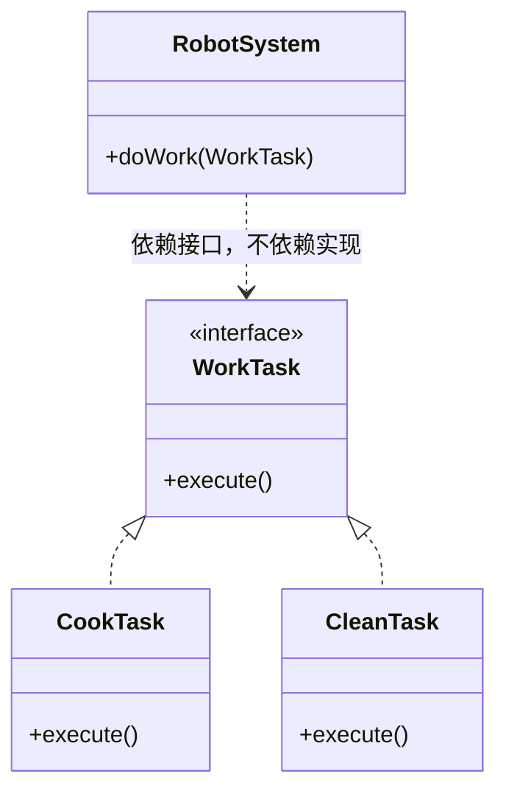
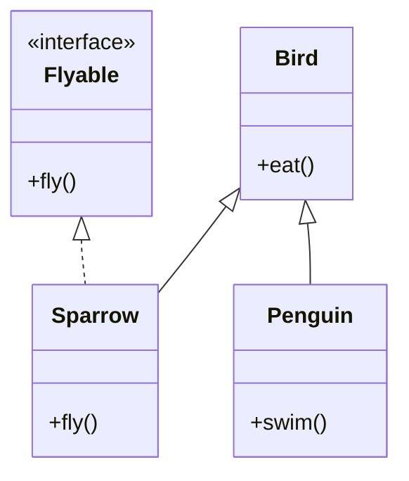
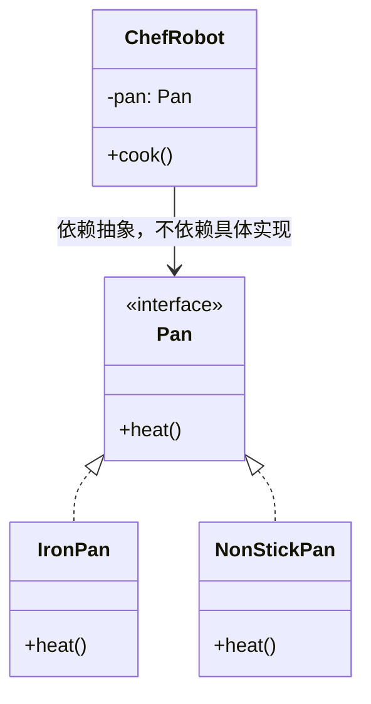

# 第1章：小白的烦恼与内功心法（SOLID 原则）

## 1. 小剧场：会炒菜的扫地机器人

某个周五的下午，阳光透过百叶窗洒在小白的工位上。距离下班还有半小时，小白正准备快乐地提交代码、打卡走人。

突然，“啪”地一声，一只骨节分明、常年敲击机械键盘的手拍在了小白的肩膀上。小白回头一看，是部门资深架构师——王哥。王哥发际线虽然有些危险，但眼神犀利，手里永远端着一杯冰美式。

**王哥**：“小白啊，你这个 `SuperRobot` 类的代码，是不是有点太长了？”

**小白**（挠挠头）：“嘿嘿，王哥。产品经理说要搞一个‘全能家政机器人’，我就写了一个类。它现在能炒菜、能扫地、还能带娃！不过刚刚加了个‘微波炉加热’的功能，不知为啥，一跑微波炉加热，扫地功能就报错了……”

**王哥**（长叹一口气，拉过一把椅子坐下）：“你这哪是写代码，你这是在揉面团啊！全都糊在一起了。来看看你的代码：”

```java
// 小白的“面团代码”
public class SuperRobot {
    public void cook() {
        System.out.println("机器人正在炒菜...");
        // 500行炒菜逻辑
    }
    
    public void sweepFloor() {
        System.out.println("机器人正在扫地...");
        // 400行扫地逻辑
    }
    
    public void babysit() {
        System.out.println("机器人正在唱儿歌带娃...");
        // 300行带娃逻辑
    }
    
    // 刚刚加的微波炉功能
    public void useMicrowave() {
        System.out.println("机器人正在用微波炉...");
        // 糟糕，这里的电流控制变量影响了扫地模块！
    }
}
```

**王哥**：“小白，你想象一下，如果你去餐厅吃饭，发现给你点菜的服务员，还要跑去后厨炒菜，炒完菜还要顺便去拖个地。一旦他拖地摔了一跤，这顿饭你就别想吃了。”

**小白**（恍然大悟）：“哦！所以这个类管的事儿太多了，容易互相影响？”

**王哥**：“没错。在学那些花里胡哨的设计模式之前，你得先打通任督二脉，掌握面向对象的‘内功心法’——**SOLID原则**。学会了它，你的代码才能从‘意大利面’变成‘乐高积木’。”

---

## 2. 核心概念：SOLID 内功心法

**王哥**喝了一口咖啡，在白板上写下了五个大字：**SOLID**。

### 1) 单一职责原则 (Single Responsibility Principle, SRP)

**王哥**：“刚刚说那个餐厅服务员的例子就是SRP。**一个类，最好只做一件事，只有一个引起它变化的原因**。”

**小白**：“所以我应该把机器人拆开？”

**王哥**：“对，我们可以把它拆分为不同的模块：”

```java
// 改造后：各司其职
public class CookModule {
    public void cook() { /* 炒菜逻辑 */ }
}

public class CleanModule {
    public void sweepFloor() { /* 扫地逻辑 */ }
}
```

**王哥**：“这样，你修改扫地逻辑的时候，绝不会让炒菜功能罢工！”

**小白**：“等等，那一开始那个一加微波炉功能、扫地就报错的诡异 Bug，到底是怎么回事啊？”

**王哥**：“现在能想明白了吧？之前所有功能都挤在 `SuperRobot` 一个类里，大概率共享了同一批成员变量（比如那个'电流控制变量'）。`useMicrowave()` 一执行，悄悄改了这个共享变量的值，`sweepFloor()` 读到的就是被污染的数据，于是莫名其妙就报错了。拆开之后，每个模块只管自己的那份数据，谁也碰不到谁的东西，这个诡异的 Bug 自然就消失了。”

**小白**：“好家伙，原来是'后厨的人不小心碰倒了前台的调料瓶'啊！这下彻底明白了。”

### 2) 开闭原则 (Open-Closed Principle, OCP)

**王哥**：“所谓开闭，就是**对扩展开放，对修改关闭**。想象一下你的电脑主板，如果你想加个显卡，你是会去拆焊锡修改主板电路呢，还是直接把显卡插到PCIe插槽上？”

**小白**：“肯定是插槽啊！谁敢动电烙铁啊。”

**王哥**：“代码也一样！如果有新需求，尽量通过增加新代码来实现，而不是去改老代码。”

```java
// 反面教材：每次增加新工作都要修改老代码
public class RobotSystem {
    public void doWork(String taskType) {
        if ("cook".equals(taskType)) {
            // 炒菜
        } else if ("clean".equals(taskType)) {
            // 扫地
        } // 以后再加个带娃，还得再写else if
    }
}

// 优秀做法：通过接口扩展
public interface WorkTask {
    void execute();
}

public class CookTask implements WorkTask {
    public void execute() { System.out.println("炒菜..."); }
}

public class CleanTask implements WorkTask {
    public void execute() { System.out.println("扫地..."); }
}

// 机器人系统不需要改动了
public class RobotSystem {
    public void doWork(WorkTask task) {
        task.execute(); // 来什么任务执行什么任务，完美插槽！
    }
}
```

**小白**：“这个 `WorkTask` 接口就像是 PCIe 插槽，`CookTask`、`CleanTask` 就是显卡、网卡，想插什么插什么？”

**王哥**：“一点就通！画个图你就更清楚了：”



**王哥**：“以后产品经理说要加个 `BabysitTask`，你只管新写一个实现类插上去，`RobotSystem` 这块'主板'连碰都不用碰。”

### 3) 里氏替换原则 (Liskov Substitution Principle, LSP)

**王哥**：“这个听起来很学术，但其实很简单：**子类必须能够替换掉它们的父类，且不引发错误**。就像你爹答应借别人一辆‘车’，他可以是借了一辆宝马（子类），也可以是借了一辆奔驰（子类）。但如果你给了别人一辆‘玩具车’，人家坐不进去，这就违背了里氏替换！”

**小白**：“哈哈，玩具车不行！那代码里怎么体现？”

**王哥**：“最经典的例子：企鹅也是鸟，但企鹅不会飞。”

```java
public class Bird {
    public void fly() {
        System.out.println("扑腾翅膀飞向蓝天！");
    }
}

public class Penguin extends Bird {
    @Override
    public void fly() {
        throw new UnsupportedOperationException("臣妾做不到啊，我是一只企鹅！");
    }
}
```

**王哥**：“如果有个方法接收 `Bird` 对象并调用 `fly()`，你传个企鹅进去就崩了。这就说明企鹅不适合继承‘会飞的鸟’，咱们应该把‘鸟’和‘飞行能力’拆开。”

**小白**：“那应该怎么拆呢？”

**王哥**：“把 `fly()` 从 `Bird` 里搬出去，单独做成一个 `Flyable` 接口。会飞的鸟就实现它，不会飞的鸟（企鹅、鸵鸟）压根不用管这个方法的事：”

```java
// 拆分后：飞行能力是“可选项”，不是所有鸟天生具备的
public interface Flyable {
    void fly();
}

public class Bird {
    public void eat() {
        System.out.println("啄食中...");
    }
}

// 会飞的鸟：额外实现 Flyable
public class Sparrow extends Bird implements Flyable {
    @Override
    public void fly() {
        System.out.println("扑腾翅膀飞向蓝天！");
    }
}

// 企鹅：老老实实只当一只鸟，压根没有 fly() 方法
public class Penguin extends Bird {
    public void swim() {
        System.out.println("企鹅潜水中...");
    }
}
```



**小白**：“这样的话，拿到一个 `Bird` 类型的变量，编译器压根不会让我调用 `fly()`，除非它同时是 `Flyable`。再也不会出现'企鹅突然被拉去表演飞行，当场摔个粉碎'的场面了！”

**王哥**：“正解。**子类不能瞎承诺父类没有的能力，但父类也不该把所有子类'可能拥有'的能力都塞给自己**。”

### 4) 接口隔离原则 (Interface Segregation Principle, ISP)

**王哥**：“小白，如果你去办一张健身卡，前台硬塞给你一个‘游泳+举重+瑜伽+拉丁舞’的超级无敌霸王条款卡，但你其实只会狗刨，你乐意吗？”

**小白**：“那肯定不行，浪费钱，还看着心烦。”

**王哥**：“这就是接口隔离。**不要强迫客户依赖他们不需要的方法**。接口要细化。”

```java
// 胖接口（不推荐）
public interface ISuperDevice {
    void print();
    void scan();
    void fax();
}

// 普通打印机被迫实现自己没有的功能
public class BasicPrinter implements ISuperDevice {
    public void print() { /* 打印 */ }
    public void scan() { /* 报错：不支持 */ }
    public void fax() { /* 报错：不支持 */ }
}

// 接口隔离（推荐）
public interface IPrinter { void print(); }
public interface IScanner { void scan(); }

// 普通打印机只需要实现 IPrinter
public class BasicPrinter implements IPrinter {
    public void print() { /* 打印 */ }
}
```

### 5) 依赖倒置原则 (Dependency Inversion Principle, DIP)

**王哥**：“最后一个，也是非常核心的一个。**高层模块不应该依赖底层模块，二者都应该依赖其抽象**。说人话就是：老板别直接管保安怎么锁门，老板应该定一个《安保规范》（接口），保安按照规范来做。”

**小白**：“拿咱们炒菜的例子怎么说？”

**王哥**：“比如炒菜机器人需要一口锅。”

```java
// 糟糕：严重依赖具体的“铁锅”
public class IronPan {
    public void heat() { System.out.println("铁锅加热"); }
}

public class ChefRobot {
    private IronPan pan = new IronPan(); // 机器人被铁锅绑死了
    public void cook() { pan.heat(); }
}
```

**王哥**：“如果哪天产品经理要求用‘不粘锅’炒菜，你就得把机器人的代码全改了。应该依赖‘抽象的锅’。”

```java
// 优秀：依赖接口
public interface Pan {
    void heat();
}

public class NonStickPan implements Pan {
    public void heat() { System.out.println("不粘锅加热，不糊底"); }
}

public class ChefRobot {
    private Pan pan;
    // 把锅从外面“塞”进来（依赖注入）
    public ChefRobot(Pan pan) {
        this.pan = pan;
    }
    public void cook() { pan.heat(); }
}
```

**王哥**：“看到了吗？现在机器人可以配铁锅，也可以配不粘锅，甚至未来还可以配空气炸锅，机器人的代码一行都不用改！”

**王哥**：“用一张图总结一下'依赖倒置'前后的区别：”



**王哥**：“高层模块（`ChefRobot`）和低层模块（`IronPan`、`NonStickPan`）现在都依赖中间的抽象（`Pan` 接口），谁也不直接认识谁。以前是 `ChefRobot` 的箭头直接指向 `IronPan`，现在两边都转头去指向接口——这就是'倒置'的含义。”

---

## 3. 课后总结与吐槽

**小白**（狂做笔记中）：“太强了王哥！这 SOLID 原则简直就是代码界的拔筋洗髓啊！
1. **S (单一职责)**：一个人别干所有活。
2. **O (开闭原则)**：主板加插槽，别动电烙铁。
3. **L (里氏替换)**：别拿玩具车糊弄人。
4. **I (接口隔离)**：别强卖全套健身卡。
5. **D (依赖倒置)**：规定好插座形状，别把线直接焊死在墙上。”

> [!NOTE]
> **动手试试**
> 1. 找出你最近写的一个类，数一数它有几个"变化的理由"。如果超过一个，试着按**单一职责**把它拆开。
> 2. 把本章 LSP 那个"企鹅不会飞"的例子，改用 `Flyable` 接口重写一遍，让 `Penguin` 编译期就不可能被要求 `fly()`。
> 3. **思考**：DIP 让 `ChefRobot` 依赖 `Pan` 接口而非具体锅。那"决定到底用铁锅还是不粘锅"这件事，现在落到谁头上了？（提示：这正是第4章工厂模式要解决的问题。）

**王哥**（满意地点点头）：“悟性不错。记住，设计原则就像道德规范，我们尽量遵守，但有时候为了快速交付和避免过度设计，也会偶尔‘违章’。不过，所有的**设计模式**，归根结底都是这五个原则的排列组合和实际应用。”

**王哥**起身，看了看表：“走吧，下班时间到了，我请你吃烧烤。顺便给你留个思考题……”

> [!TIP]
> **王哥的思考题**
> “小白，刚才讲的‘开闭原则’说不要修改老代码。但如果老代码里有 Bug，咱们是不是也得遵循开闭原则，只能新增代码来绕过 Bug，而不能去改老代码修复它呢？”

（小白愣在了原地，手里的键盘突然就不香了……）

---
*欲知后事如何，小白将如何回答，且听下回分解。*
