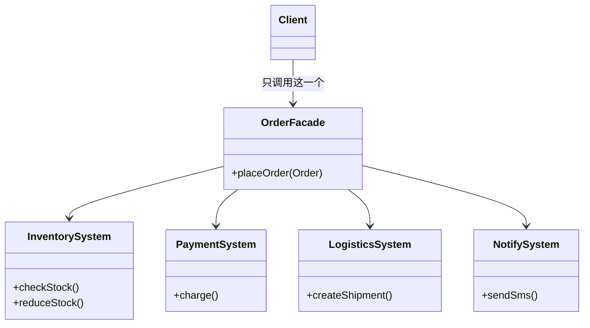

# 第10章：前台接待员——外观模式 (Facade)

## 1. 小剧场：调用方被一堆子系统逼疯了

周一，小白在做一个电商的下单功能。他发现，一个简单的"下单"动作，背后要调用一大堆子系统。

```java
// 调用方（前端控制器）被迫了解所有子系统的细节
public class OrderController {
    public void placeOrder(Order order) {
        // 1. 先查库存
        InventorySystem inventory = new InventorySystem();
        if (!inventory.checkStock(order.getItemId(), order.getCount())) {
            throw new RuntimeException("库存不足");
        }
        // 2. 扣减库存
        inventory.reduceStock(order.getItemId(), order.getCount());
        // 3. 调用支付系统
        PaymentSystem payment = new PaymentSystem();
        payment.charge(order.getUserId(), order.getAmount());
        // 4. 通知物流系统
        LogisticsSystem logistics = new LogisticsSystem();
        logistics.createShipment(order);
        // 5. 发送通知
        NotifySystem notify = new NotifySystem();
        notify.sendSms(order.getUserId(), "下单成功");
        // …… 调用方累成狗，还得记住每个子系统怎么用
    }
}
```

**王哥**：“小白，你这个 `OrderController` 是不是有点惨？它本来只想'下个单'，结果被迫认识了库存、支付、物流、通知**四五个子系统**，还得记住它们各自的调用顺序和方法。这就是上次思考题里的'看电影要操作七八个设备'。”

**小白**：“是啊王哥！而且更要命的是——商品详情页也要下单、购物车也要下单、秒杀也要下单，**这一大坨调用逻辑得复制到每个地方**。哪天下单流程一变，我得改 N 个地方。”

**王哥**：“这就需要一个'**一键观影**'的总开关。你去大公司办事，是自己一个个部门跑，还是先找**前台接待员**，跟她说'我要办 XX 业务'，她帮你协调好各个部门？”

**小白**：“当然找前台！省心。”

**王哥**：“这个'前台接待员'，在代码里就叫**外观模式（Facade）**。它对外提供一个**简单的统一入口**，把背后一堆子系统的复杂调用全藏起来。”

---

## 2. 核心概念：提供一个"统一接待窗口"

**王哥**：“外观模式的做法极其简单——**造一个 Facade 类，它内部协调所有子系统，对外只暴露几个'傻瓜式'的方法**。”

```java
// 外观类：电商下单的"前台接待员"
public class OrderFacade {
    private InventorySystem inventory = new InventorySystem();
    private PaymentSystem payment = new PaymentSystem();
    private LogisticsSystem logistics = new LogisticsSystem();
    private NotifySystem notify = new NotifySystem();

    // 对外只暴露这一个简单方法，内部把脏活全包了
    public void placeOrder(Order order) {
        if (!inventory.checkStock(order.getItemId(), order.getCount())) {
            throw new RuntimeException("库存不足");
        }
        inventory.reduceStock(order.getItemId(), order.getCount());
        payment.charge(order.getUserId(), order.getAmount());
        logistics.createShipment(order);
        notify.sendSms(order.getUserId(), "下单成功");
    }
}
```

**王哥**：“现在所有调用方都解放了，无论详情页、购物车还是秒杀，统统只需一行：”

```java
// ✅ 调用方只认识 Facade，不再关心背后的子系统
OrderFacade orderFacade = new OrderFacade();
orderFacade.placeOrder(order); // 一键下单，省心
```

**小白**（如释重负）：“太爽了！调用方现在只需要认识 `OrderFacade` 一个类，至于背后库存、支付、物流怎么联动，跟它一点关系都没有了。下单流程要改，我也只改 Facade 一处！”



**王哥**：“看这个图，外观模式把'多对多'的混乱依赖，变成了'**客户端 → 外观 → 子系统**'的清爽结构。这就是**迪米特法则（最少知道原则）**的最佳实践——一个对象应该对其他对象有最少的了解。”

---

## 3. 模式精讲：外观的边界与误区

**王哥**：“外观模式有几个要点你得记牢：

**1. 外观不是'万能上帝类'**。它只是个'协调员'，负责调度子系统，不该自己写一堆业务逻辑。如果你把所有逻辑都堆进 Facade，那它就变成了一个臃肿的'上帝对象'，比原来还烂。

**2. 外观不阻止你直接用子系统**。它只是提供一个'便捷通道'。如果某个高级用户就是想绕过前台、直接找子系统办特殊业务，外观模式并不拦着。它是'可选的简化层'，不是'强制的隔离墙'。”

**小白**：“那它跟代理模式有啥区别？感觉都是'中间加一层'。”

**王哥**：“区别在**数量和目的**：

| 模式 | 包装对象数量 | 目的 |
| --- | --- | --- |
| 代理 | 通常**一个**真实对象 | 控制对**单个**对象的访问 |
| 外观 | **一群**子系统 | **简化**对一整组复杂子系统的使用 |

代理是'**一对一**的替身'，外观是'**一对多**的接待员'。”

**王哥**：“现实中外观无处不在。你调用 SLF4J 打日志、用 Spring 的 `JdbcTemplate` 操作数据库,本质上都是外观——把底层一堆繁琐的 API 包成了几个简单方法。”

---

## 4. 课后总结与吐槽

小白用 `OrderFacade` 统一了下单入口，所有调用方代码瘦身一大半，下单流程的维护点也收敛到了一处。

**小白的笔记**：
1. **外观模式**：为一组复杂的子系统提供一个**统一的简单入口**，把调用方和子系统解耦。
2. 好处：调用方**只需认识外观**，子系统内部变化不影响调用方。
3. 注意：外观是**协调员**，不要把它写成堆满业务逻辑的"上帝类"。
4. 与代理的区别：代理是**一对一**控制访问，外观是**一对多**简化使用。

**王哥**（喝完最后一口冰美式）：“结构型模式的'入门四件套'——适配器、装饰器、代理、外观，你都拿下了。剩下还有三个进阶的硬骨头：桥接、组合、享元。”

> [!TIP]
> **王哥的思考题**
> “给你出个变态需求：现在要做手机，有'华为、小米、苹果'三个品牌，又有'游戏版、拍照版、商务版'三种型号。如果每一种组合都建一个类——华为游戏版、华为拍照版、小米游戏版……3 个品牌 × 3 种型号 = 9 个类。要是再加个品牌、加个型号，类的数量乘起来爆炸。这种'两个维度各自独立变化'的情况，有没有办法让它们**分开变化、自由组合**，而不是相乘？”

（小白又想起了第8章那个 2^5 的类爆炸噩梦，打了个寒颤……）

---
*下一章，桥接、组合、享元三大高级结构型模式集中亮相。*
