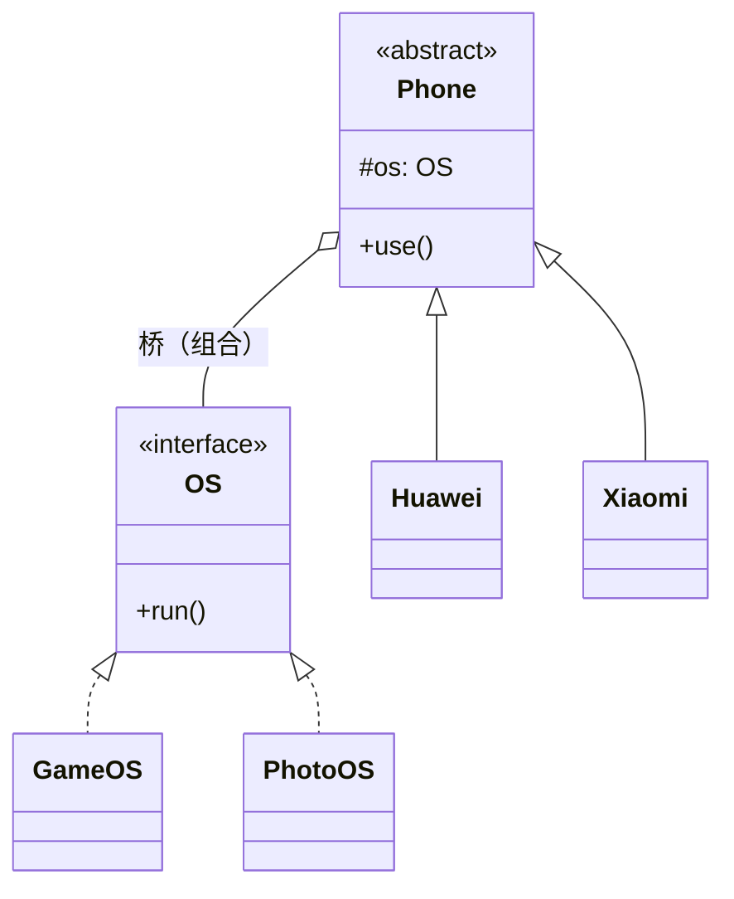

# 第11章：相乘变相加——桥接模式 (Bridge)

## 1. 小剧场：又一次类爆炸的预警

周二，小白拿着上次的思考题来找王哥：“王哥，那个'品牌 × 型号'的手机问题，我想了一晚上没想通。我本来是这么写的——”

```java
// 小白的写法：用继承同时表达"品牌"和"型号"两个维度
public abstract class Phone { }

public class HuaweiGamePhone extends Phone { }   // 华为 + 游戏版
public class HuaweiPhotoPhone extends Phone { }  // 华为 + 拍照版
public class XiaomiGamePhone extends Phone { }   // 小米 + 游戏版
public class XiaomiPhotoPhone extends Phone { }  // 小米 + 拍照版
// ……每多一个品牌或型号，类的数量就翻倍
```

**小白**：“3 个品牌 × 3 种型号就要 9 个类，要是 10 个品牌 10 种型号，那就是 **100 个类**，太可怕了。”

**王哥**：“你这个问题，正是**桥接模式**要解的。先别急，我问你——'品牌'和'型号'这两件事，本来是相互独立的吧？华为可以出游戏版也可以出拍照版，小米也一样。”

**小白**：“对啊，它俩谁也不挨着谁。”

**王哥**：“问题就在这。你用**继承**把这两个**本来独立的维度**死死焊在了一个类里。继承一焊，类的数量就只能是两个维度**相乘**。维度越多，爆炸越狠。”

---

## 2. 核心概念：把维度拆开，用组合搭一座"桥"

**王哥**：“桥接模式的思想就一句话——**把其中一个维度抽出来，做成独立的接口，让另一个维度去'持有'它，而不是'继承'它**。继承变组合，相乘就变成了相加。”

**小白**：“怎么个抽法？”

**王哥**：“把'型号/功能'这个维度抽成一个独立接口 `OS`，让'品牌' `Phone` 内部**握着**一个 `OS`。这个'握着'的引用，就是连接两个维度的'**桥**'。”

```java
// 维度一：功能实现（型号）—— 抽成独立接口
public interface OS {
    void run();
}
public class GameOS implements OS {
    public void run() { System.out.println("游戏模式：性能拉满"); }
}
public class PhotoOS implements OS {
    public void run() { System.out.println("拍照模式：影像优先"); }
}

// 维度二：品牌 —— 内部"桥接"一个 OS，而不是继承它
public abstract class Phone {
    protected OS os;                       // ← 这就是连接两个维度的"桥"
    public Phone(OS os) { this.os = os; }
    public abstract void use();
}

public class Huawei extends Phone {
    public Huawei(OS os) { super(os); }
    public void use() {
        System.out.print("华为手机 - ");
        os.run();                          // 委托给持有的 OS
    }
}

public class Xiaomi extends Phone {
    public Xiaomi(OS os) { super(os); }
    public void use() {
        System.out.print("小米手机 - ");
        os.run();
    }
}
```

```java
// 两个维度自由组合，不再相乘
Phone p1 = new Huawei(new GameOS());   // 华为游戏版
Phone p2 = new Huawei(new PhotoOS());  // 华为拍照版
Phone p3 = new Xiaomi(new GameOS());   // 小米游戏版
p1.use();  // 华为手机 - 游戏模式：性能拉满
p3.use();  // 小米手机 - 游戏模式：性能拉满
```

**小白**（恍然大悟）：“妙啊！现在加一个品牌，我只加一个 `Phone` 子类；加一个型号，只加一个 `OS` 实现。3 个品牌 + 3 个型号，**3+3=6 个类**就够了，还能随便组合！'相乘'真的变成了'相加'！”



---

## 3. 模式精讲：什么时候该想到桥接

**王哥**：“一句话总结桥接：**把抽象（品牌）和实现（型号）分离，用组合搭一座桥，让两个维度各自独立扩展**。这其实就是第1章'多用组合、少用继承'的终极体现。”

**小白**：“那我怎么判断一个场景该不该用桥接？”

**王哥**：“看一个信号——**当你发现一个类的变化原因有'两个或更多互相独立的方向'，并且你正打算用继承去硬扛它们时，就该想到桥接**。比如：

- **跨平台 GUI**：'形状'（圆/方）× '渲染方式'（矢量/光栅）。
- **消息发送**：'消息类型'（验证码/营销）× '发送渠道'（短信/邮件/App 推送）。
- **JDBC**：Java 的 `java.sql` 是稳定的抽象，各家数据库的 `Driver` 是可替换的实现——你的代码桥接到不同 Driver，换数据库不用改业务。
- **日志门面**：SLF4J 是抽象接口，Logback / Log4j 是具体实现，两边各自演进——这就是一座经典的桥。”

**王哥**：“记住：桥接和适配器（第7章）容易混。**适配器是'事后补救'**——两个已经存在、却对不上的接口，硬塞个转换头。**桥接是'事前规划'**——你预见到两个维度都会独立膨胀，提前把它们拆开。”

---

## 4. 课后总结与吐槽

小白把手机类按"品牌 / 系统"两个维度一拆，类的数量从'相乘'变回了'相加'，新增品牌或型号都只动一个类。

**小白的笔记**：
1. **桥接模式**：把两个独立变化的维度，用**组合**连接（而非继承），让它们各自扩展，把"相乘"变"相加"。
2. 适用信号：一个类有**两个以上互相独立的变化方向**，且你正想用继承硬扛。
3. 与适配器的区别：适配器是**事后补救**对不上的接口，桥接是**事前规划**两个会膨胀的维度。
4. 实战：JDBC 的 Driver、SLF4J 日志门面、跨平台 GUI。

> [!NOTE]
> **动手试试**
> 1. 把"消息系统"用桥接实现：维度一是 `MessageType`（`UrgentMessage` / `NormalMessage`），维度二是 `MessageSender`（`SmsSender` / `EmailSender`）。组合出"紧急短信""普通邮件"等，验证新增一个渠道时不用动任何消息类型类。
> 2. 数一数：如果用继承，`2 种类型 × 3 种渠道` 要几个类？用桥接呢？把这个对比写进注释。
> 3. **思考**：桥接里的两个维度，谁该当"抽象"、谁该当"实现"？如果选反了会怎样？（提示：通常把"更稳定、更面向使用者"的那个维度当抽象。）

**王哥**：“桥接是把'两个维度'拆开。下一个结构型模式，对付的是另一种结构——'**一棵树**'——”

> [!TIP]
> **王哥的思考题**
> “你要做一个文件管理器：文件夹里可以放文件，也可以放子文件夹，子文件夹里又可以放文件和更深的文件夹……这是一棵能无限嵌套的树。现在要算'某个文件夹占用的总大小'，你是不是得写一堆 `if (这是文件夹) { 递归进去 } else if (这是文件) { 直接加 }`，到处判断'这玩意儿到底是文件还是文件夹'？有没有办法让'文件'和'文件夹'对外**长得一样**，我调用 `size()` 时根本不用关心它是哪种，它自己会算？”

（小白看了看自己电脑里那层层叠叠的项目目录，陷入了沉思……）

---
*下一章，组合模式将教小白如何把"个体"和"群体"一视同仁地处理。*
