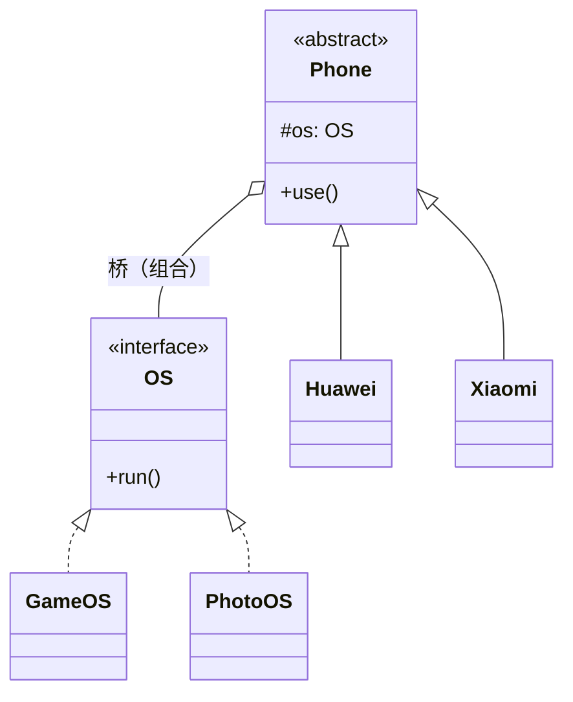

# 第11章：高级结构型三剑客——桥接、组合、享元

## 1. 小剧场：又一个类爆炸的预警

周二，小白拿着上次的思考题来找王哥：“王哥，那个'品牌 × 型号'的手机问题，我想了一晚上没想通。3×3 就 9 个类，要是 10 个品牌 10 种型号，那就是 100 个类，太可怕了。”

**王哥**：“今天我一口气给你讲三个进阶的结构型模式，专治各种'结构性疑难杂症'。先从你这个问题开始——它该用**桥接模式**。”

---

## 2. 桥接模式 (Bridge)：让两个维度各自变化

**王哥**：“你的错误在于，把'品牌'和'型号'这两个**本来独立的维度**用继承死死绑在了一起。继承一绑，就只能相乘。桥接模式的思想是——**把其中一个维度抽出来，用'组合'代替'继承'**。”

**小白**：“怎么抽？”

**王哥**：“把'型号/功能'抽成一个独立的接口，让'品牌'**持有**它，而不是继承它。”

```java
// 维度一：功能实现（型号）—— 抽成独立接口
public interface OS {
    void run();
}
public class GameOS implements OS {
    public void run() { System.out.println("游戏模式：性能拉满"); }
}
public class PhotoOS implements OS {
    public void run() { System.out.println("拍照模式：影像优先"); }
}

// 维度二：品牌 —— 内部"桥接"一个 OS，而不是继承
public abstract class Phone {
    protected OS os; // 这就是连接两个维度的"桥"
    public Phone(OS os) { this.os = os; }
    public abstract void use();
}

public class Huawei extends Phone {
    public Huawei(OS os) { super(os); }
    public void use() {
        System.out.print("华为手机 - ");
        os.run(); // 委托给持有的 OS
    }
}
```

```java
// 自由组合，不再相乘
Phone p1 = new Huawei(new GameOS());   // 华为游戏版
Phone p2 = new Huawei(new PhotoOS());  // 华为拍照版
```

**小白**（恍然大悟）：“妙啊！现在加一个品牌，我只加一个 `Phone` 子类；加一个型号，只加一个 `OS` 实现。3+3=6 个类就够了，而且自由组合！'相乘'变成了'相加'！”



**王哥**：“一句话总结桥接：**抽象（品牌）和实现（型号）分离，用组合搭一座桥，让它们各自独立扩展**。这其实就是第1章'多用组合，少用继承'的终极体现。”

---

## 3. 组合模式 (Composite)：把"个体"和"群体"一视同仁

**王哥**：“第二个，组合模式。场景是**树形结构**——比如公司的组织架构，有'部门'，部门下面有'子部门'和'员工'。或者文件系统，'文件夹'里有'子文件夹'和'文件'。”

**小白**：“这种递归嵌套的，处理起来确实麻烦，得不停判断'这是文件夹还是文件'。”

**王哥**：“组合模式的精髓就是——**让'单个对象'和'对象组合'实现同一个接口，对外表现一致，调用方不需要区分它们**。”

```java
// 统一接口：无论是文件还是文件夹，都能"显示"和"算大小"
public interface Node {
    void show(String prefix);
    int size();
}

// 叶子节点：文件
public class File implements Node {
    private String name;
    private int size;
    public File(String name, int size) { this.name = name; this.size = size; }
    public void show(String prefix) { System.out.println(prefix + name); }
    public int size() { return size; }
}

// 组合节点：文件夹，内部装着一堆 Node（可能是文件，也可能是子文件夹）
public class Folder implements Node {
    private String name;
    private List<Node> children = new ArrayList<>();
    public Folder(String name) { this.name = name; }
    public void add(Node node) { children.add(node); }

    public void show(String prefix) {
        System.out.println(prefix + name + "/");
        for (Node child : children) {
            child.show(prefix + "  "); // 递归：不管子节点是文件还是文件夹，一视同仁
        }
    }
    public int size() {
        int total = 0;
        for (Node child : children) total += child.size(); // 递归求和
        return total;
    }
}
```

```java
Folder root = new Folder("根目录");
root.add(new File("readme.txt", 10));
Folder sub = new Folder("子目录");
sub.add(new File("photo.jpg", 200));
root.add(sub);

root.show("");           // 递归打印整棵树
System.out.println(root.size()); // 210，自动递归求和
```

**小白**：“太优雅了！我调用 `root.show()` 或 `root.size()`，完全不用关心里面到底是文件还是文件夹，它自己会递归处理。**个体和群体被我用同一种方式对待了**！”

**王哥**：“对。组合模式的关键词是**树形结构 + 统一对待**。Java 里的 `View`（安卓界面）、各种菜单树、组织架构，全是它。”

---

## 4. 享元模式 (Flyweight)：共享对象，省内存

**王哥**：“最后一个，享元模式，专门解决**内存浪费**。场景：一个文档里有几十万个字符，难道要为每个字符都 new 一个对象？比如有 10 万个字母 'a'，它们的字体、大小可能都一样。”

**小白**：“那确实浪费，10 万个 'a' 对象，内存吃不消。”

**王哥**：“享元的思想是——**把对象的状态分成'内部状态'和'外部状态'。内部状态（能共享的，比如字符 'a' 本身、它的字形）做成共享对象，全局只存一份；外部状态（每个位置不同的，比如坐标）由外部传入**。”

```java
// 享元：字符对象，只存"能共享的内部状态"（字符本身）
public class CharFlyweight {
    private final char c; // 内部状态：共享
    public CharFlyweight(char c) { this.c = c; }
    // 外部状态（位置）通过参数传入，不存在对象里
    public void display(int x, int y) {
        System.out.println("字符 " + c + " 显示在 (" + x + "," + y + ")");
    }
}

// 享元工厂：保证同一个字符全局只造一个，重复利用
public class CharFactory {
    private static Map<Character, CharFlyweight> pool = new HashMap<>();

    public static CharFlyweight get(char c) {
        // 池子里有就直接给，没有才新建——这是享元的核心
        return pool.computeIfAbsent(c, CharFlyweight::new);
    }
}
```

```java
CharFlyweight a1 = CharFactory.get('a');
CharFlyweight a2 = CharFactory.get('a');
System.out.println(a1 == a2); // true！10万个'a'共享同一个对象
```

**小白**：“原来如此！相同的字符全局只造一个，反复共享，10 万个 'a' 内存里只有 1 个对象。Java 的 `Integer` 缓存（-128~127）、String 常量池，是不是就是这个原理？”

**王哥**：“正是！你 `Integer.valueOf(100)` 拿到的永远是同一个对象，就是享元。它的关键词是**共享细粒度对象、分离内外状态**。”

---

## 5. 课后总结与吐槽

**小白的笔记**：
1. **桥接模式**：两个独立维度用**组合**连接，让它们各自扩展，把"相乘"变"相加"。
2. **组合模式**：让**个体和群体**实现同一接口，统一处理**树形结构**。
3. **享元模式**：分离**内部状态（共享）和外部状态（外传）**，复用对象省内存。

**王哥**：“至此，结构型模式全部通关！'怎么把对象拼装成更大的结构'，你算是出师了。下一部分，咱们进入最后一块、也是最精彩的一块——**行为型模式**，研究对象之间'怎么交流协作'。”

> [!TIP]
> **王哥的思考题**
> “商场搞促销：会员打 9 折、超级会员打 8 折、节假日满减、新人首单立减……这些优惠算法五花八门，而且经常变。如果你在结算方法里写一大坨 `if (会员) {...} else if (超级会员) {...} else if (节假日) {...}`，那这个方法会变成一坨没人敢动的'屎山'。有没有办法把每种优惠算法独立封装，想用哪个就'换'哪个，像换装备一样灵活？”

（小白默默关掉了那个已经有 500 行 `if-else` 的结算方法……）

---
*下一部分进入行为型模式，第一招——策略模式，专治"算法满天飞的 if-else"。*
