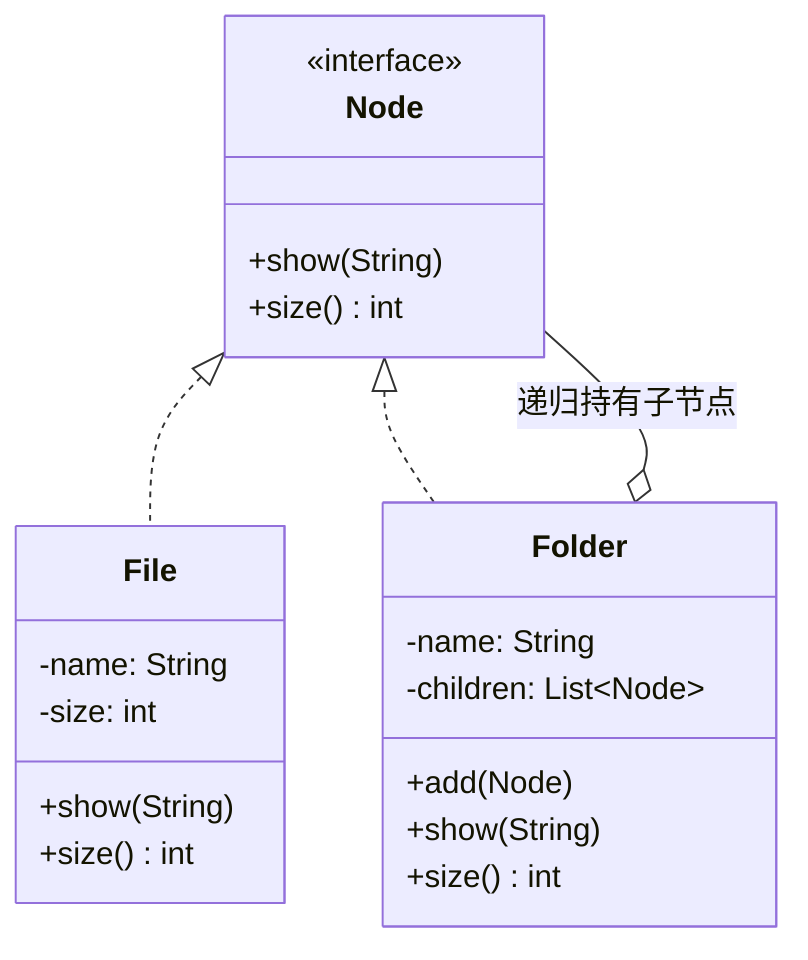

# 第12章：个体与群体一视同仁——组合模式 (Composite)

## 1. 小剧场：满屏的"它到底是文件还是文件夹？"

周三，小白在做上次思考题里的文件管理器。要统计一个文件夹占用的总大小，他写出了这样的代码：

```java
// 小白的写法：到处判断"这是文件还是文件夹"
public int calcSize(Object node) {
    if (node instanceof File) {                 // 是文件
        return ((File) node).getSize();
    } else if (node instanceof Folder) {        // 是文件夹
        int total = 0;
        for (Object child : ((Folder) node).getChildren()) {
            total += calcSize(child);           // 递归，里面又要 instanceof 一遍
        }
        return total;
    }
    return 0;
}
```

**王哥**：“小白，这就是上次说的树形结构。你看你这段——每处理一个节点，都得先 `instanceof` 判断它'到底是文件还是文件夹'，然后分两套逻辑。不光 `calcSize` 这样，你的 `show()`、`delete()`、`count()` 每个方法都得重复这套判断。”

**小白**：“是啊，烦死了。而且哪天再加一种节点类型，比如'快捷方式'，我得把所有方法里的 `if-else` 都补一遍。”

**王哥**：“问题的根子是——你**把'个体'（文件）和'群体'（文件夹）当成了两种东西**，于是处处要区分它们。换个思路：**如果让文件和文件夹对外长得**一模一样**——都实现同一个接口，调用方根本不需要区分它们呢**？这就是**组合模式（Composite）**。”

---

## 2. 核心概念：让"叶子"和"容器"共用一个接口

**王哥**：“组合模式的精髓就一句话——**让'单个对象'（叶子）和'对象的组合'（容器）实现同一个接口，对外表现一致**。容器内部装着一堆同类型的接口对象，处理时**递归**展开，调用方完全无感。”

```java
// 统一接口：无论是文件还是文件夹，都能"显示"和"算大小"
public interface Node {
    void show(String prefix);
    int size();
}

// 叶子节点：文件（没有子节点）
public class File implements Node {
    private String name;
    private int size;
    public File(String name, int size) { this.name = name; this.size = size; }

    public void show(String prefix) { System.out.println(prefix + name); }
    public int size() { return size; }
}

// 组合节点：文件夹，内部装着一堆 Node（可能是文件，也可能是子文件夹）
public class Folder implements Node {
    private String name;
    private List<Node> children = new ArrayList<>();
    public Folder(String name) { this.name = name; }

    public void add(Node node) { children.add(node); }   // 往里塞，不管塞的是文件还是文件夹

    public void show(String prefix) {
        System.out.println(prefix + name + "/");
        for (Node child : children) {
            child.show(prefix + "  ");   // 递归：子节点是文件还是文件夹，一视同仁
        }
    }
    public int size() {
        int total = 0;
        for (Node child : children) total += child.size();  // 递归求和
        return total;
    }
}
```

```java
Folder root = new Folder("根目录");
root.add(new File("readme.txt", 10));

Folder sub = new Folder("子目录");
sub.add(new File("photo.jpg", 200));
root.add(sub);                          // 文件夹里塞文件夹，自然嵌套

root.show("");                          // 递归打印整棵树
System.out.println(root.size());        // 210，自动递归求和，全程没有一个 instanceof
```

**小白**（如释重负）：“太优雅了！我调用 `root.size()`，**完全不用关心里面到底是文件还是文件夹**，它自己会递归处理。`instanceof` 全没了！个体和群体被我用同一种方式对待了！”



---

## 3. 模式精讲：树形结构 + 统一对待

**王哥**：“组合模式的两个关键词：**树形结构**和**统一对待**。只要你的数据天然是'部分-整体'的递归嵌套，并且你希望'对单个节点'和'对整棵子树'用同一套操作，就该想到它。”

**小白**：“实战里哪些地方在用？”

**王哥**：“多了去了：

- **文件系统**：文件 / 文件夹（刚写的）。
- **GUI 控件树**：一个 `Button` 是叶子，一个 `Panel` 是容器，容器里还能放容器——安卓的 `View` / `ViewGroup`、前端的 DOM 树，全是组合模式。`panel.render()` 会递归渲染所有子控件。
- **公司组织架构**：员工是叶子，部门是容器，算'某部门总人数'就是递归。
- **菜单 / 多级分类**：一级菜单下挂二级、三级。”

**王哥**：“它和上一章桥接的区别很清楚——**桥接是把'两个维度'拆开（横向），组合是把'整体和部分'统一（纵向递归）**。一个治'相乘爆炸'，一个治'到处 instanceof'。”

**王哥**：“一个小提醒：`add()`/`remove()` 这种'管理子节点'的方法，只有容器（Folder）才有意义，叶子（File）是没有的。要不要把它们也塞进统一接口 `Node`，是组合模式里一个经典的取舍——塞进去调用方更统一，但叶子得给个空实现或抛异常；不塞则更安全，但调用方有时又得判断类型。没有标准答案，看你更看重'透明'还是'安全'。”

---

## 4. 课后总结与吐槽

小白把文件管理器用组合模式重写，`size()`、`show()`、`count()` 里的 `instanceof` 判断全部消失，后来加"快捷方式"节点也只是多实现了一个 `Node`。

**小白的笔记**：
1. **组合模式**：让**叶子（个体）和容器（群体）实现同一接口**，对外表现一致，调用方无需区分。
2. 容器内部递归持有子节点，操作时**递归**展开，干掉满屏的 `instanceof`。
3. 适用：一切**树形 / 部分-整体**结构（文件系统、GUI 控件树、组织架构、多级菜单）。
4. 取舍：管理子节点的方法要不要放进统一接口——"透明"还是"安全"，二选一。

> [!NOTE]
> **动手试试**
> 1. 给 `Node` 加一个 `count()` 方法：文件返回 1，文件夹返回"子孙文件的总数"。验证你只需在两个类里各写一个递归/返回，调用方一行 `instanceof` 都不用。
> 2. 新增一个叶子类型 `Shortcut`（快捷方式，`size()` 固定返回 0），把它 `add` 进任意文件夹，确认整棵树的统计逻辑不受影响。
> 3. **思考**：如果要支持"在某文件夹下按名字查找文件"，这个递归方法该写在 `Node` 接口里，还是写成一个外部的工具方法？结合上一章——这其实是给"组合"再叠加一个"访问操作"，留个印象，第23章访问者模式会专门聊这件事。

**王哥**：“组合解决了'树怎么统一处理'。但树一大，节点一多，又冒出个新麻烦——**内存**。下一个模式专治这个——”

> [!TIP]
> **王哥的思考题**
> “你在做一个文字编辑器，要渲染一篇 10 万字的文档。如果你给每一个字符都 `new` 一个对象，里面存着这个字、字体、字号……10 万个对象，内存一下就吃满了。可仔细想想，这 10 万个字符里，光是字母 'a' 可能就出现了几千次，它们的'字形'其实**完全一样**。有没有办法让这些**长得一样的对象共享同一份**，而不是傻乎乎地造几千个一模一样的 'a'？”

（小白看着编辑器里那一大段重复的文字，若有所思……）

---
*下一章，享元模式将教小白如何"共享对象、节省内存"。*
