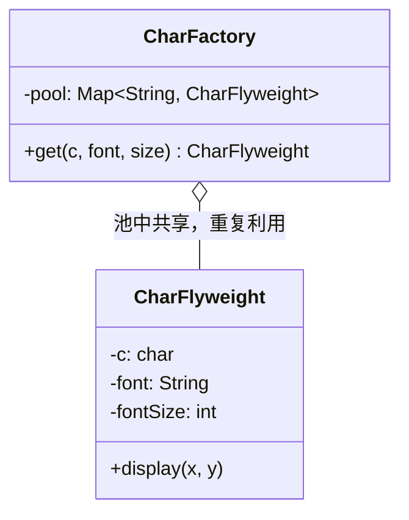

# 第13章：共享省内存——享元模式 (Flyweight)

## 1. 小剧场：10 万个字符撑爆了内存

周四，小白在做上次思考题里的文字编辑器。他给每个字符都造了一个对象：

```java
// 小白的写法：每个字符都 new 一个完整对象
public class Character {
    private char c;          // 字符本身
    private String font;     // 字体
    private int fontSize;    // 字号
    private int x, y;        // 在页面上的位置

    public Character(char c, String font, int fontSize, int x, int y) {
        this.c = c; this.font = font; this.fontSize = fontSize;
        this.x = x; this.y = y;
    }
}

// 渲染 10 万字的文档
List<Character> doc = new ArrayList<>();
for (int i = 0; i < 100000; i++) {
    doc.add(new Character('a', "宋体", 14, ...));  // 10 万个对象，内存告急
}
```

**王哥**：“小白，这就是上次说的内存问题。你给 10 万个字符各造了一个对象，可你仔细看——这里头光是 'a'，配着'宋体、14 号'，可能重复了几千上万次。这几千个 'a' 对象，**除了位置 `(x, y)` 不同，其它字段一模一样**。你等于把同样的'宋体 14 号的 a'在内存里复制了几千份。”

**小白**：“确实……那怎么办？位置又确实是每个字符各不相同的，没法省啊。”

**王哥**：“关键就在这句话——你得把对象的状态**分两半看**：哪些是'**能共享的**'，哪些是'**每个都不同的**'。这就是**享元模式（Flyweight）**的核心。”

---

## 2. 核心概念：分离"内部状态"与"外部状态"

**王哥**：“享元模式把对象的状态拆成两部分：

- **内部状态（Intrinsic）**：**能共享**的、不随场景变的部分。比如'字符 a 本身 + 字体 + 字号'——这套东西全文档共用一份就够了。
- **外部状态（Extrinsic）**：**每次都不同**的部分。比如'坐标 (x, y)'——这个不存进对象里，而是**用到的时候从外部传进来**。

把内部状态做成**共享对象、全局只存一份**；外部状态由调用方传入。这样 10 万个字符，内存里其实只有几十个不同的'字形对象'。”

```java
// 享元：只存"能共享的内部状态"（字符 + 字体 + 字号）
public class CharFlyweight {
    private final char c;        // 内部状态
    private final String font;   // 内部状态
    private final int fontSize;  // 内部状态

    public CharFlyweight(char c, String font, int fontSize) {
        this.c = c; this.font = font; this.fontSize = fontSize;
    }

    // 外部状态（位置）通过参数传进来，不存在对象里
    public void display(int x, int y) {
        System.out.println("字符 " + c + "(" + font + " " + fontSize + "号) 显示在 (" + x + "," + y + ")");
    }
}
```

```java
// 享元工厂：保证"同样的内部状态"全局只造一个，重复利用
public class CharFactory {
    private static final Map<String, CharFlyweight> pool = new HashMap<>();

    public static CharFlyweight get(char c, String font, int fontSize) {
        String key = c + "-" + font + "-" + fontSize;     // 用内部状态拼出唯一 key
        // 池子里有就直接给，没有才新建——这是享元的核心
        return pool.computeIfAbsent(key, k -> new CharFlyweight(c, font, fontSize));
    }
}
```

```java
CharFlyweight a1 = CharFactory.get('a', "宋体", 14);
CharFlyweight a2 = CharFactory.get('a', "宋体", 14);
System.out.println(a1 == a2);    // true！两次拿到的是同一个对象

// 10 万个 'a'，内存里只有 1 个 CharFlyweight，位置在渲染时传入
a1.display(0, 0);
a2.display(8, 0);
```

**小白**（瞪大眼睛）：“原来如此！相同字形的字符全局只造一个，反复共享。10 万个 'a' 在内存里只剩 1 个对象，位置在渲染那一刻才传进去。内存一下就降下来了！”



**小白**：“王哥，Java 里 `Integer` 的缓存（-128~127）、字符串常量池，是不是就是这个原理？”

**王哥**：“一点没错！你 `Integer.valueOf(100)` 拿到的永远是同一个对象，`"abc"` 字面量也全程共享一份——都是享元。它的关键词是：**分离内外状态，共享细粒度对象**。”

---

## 3. 模式精讲：享元的代价与适用边界

**王哥**：“享元威力大，但它不是免费的。用之前先掂量三点：

1. **必须分得清内外状态**。如果一个对象的字段几乎全是'每个都不同'的，硬拆没意义——根本共享不起来。
2. **共享对象必须是只读的**。共享的内部状态绝不能被某个调用方改掉，否则一改就影响所有人。所以享元字段通常都是 `final`。
3. **用'空间换……复杂度'**。它省了内存，但代价是代码变绕（多了工厂、多了内外状态的拆分），还可能引入线程安全问题（共享池要考虑并发）。”

**小白**：“所以它适合'**同一种对象被大量重复创建、且大部分状态可共享**'的场景。”

**王哥**：“对。游戏里的地图瓦片、子弹、树木，编辑器里的字符，连接池里的连接，本质都是享元思想——**别为重复的东西重复买单**。但如果你的对象本来就没几个、或者各不相同，强行套享元就是过度设计。”

---

## 4. 课后总结与吐槽

小白用享元模式重构编辑器，把字符的'字形'抽成共享对象、'位置'作为外部状态传入，10 万字文档的内存占用直降一个数量级。

**小白的笔记**：
1. **享元模式**：把对象状态拆成**内部状态（可共享、只读）**和**外部状态（每次传入）**，让大量重复对象共享同一份内部状态。
2. 靠一个**享元工厂 + 缓存池**保证"相同内部状态全局只造一个"。
3. Java 的 `Integer` 缓存、字符串常量池就是活生生的享元。
4. 代价：分离内外状态让代码变绕、共享对象必须只读、并发要小心——对象不多就别用。

> [!NOTE]
> **动手试试**
> 1. 在 `CharFactory` 里加一个 `poolSize()` 方法，渲染一段含大量重复字符的文本后打印池子大小，直观感受"10 万次 get，池里只有几十个对象"。
> 2. 把字符的 `font` 改成可变并提供 setter，然后想一想：如果某处代码改了共享对象的 font，会发生什么灾难？这就是"享元必须只读"的原因。
> 3. **进阶**：用享元思想给一个小游戏的"树木"建模——内部状态是'树的种类 + 贴图'，外部状态是'每棵树的坐标'。对比"每棵树一个完整对象"和"享元"两种写法的内存差异。

**王哥**（放下冰美式）：“至此，**结构型模式全部通关**！适配器、装饰器、代理、外观、桥接、组合、享元——'怎么把对象拼装成更大的结构'，你算是出师了。接下来咱们进入最后一块、也是最精彩的一块——**行为型模式**，研究对象之间'怎么交流协作'。第一招就专治你最头疼的那种代码——”

> [!TIP]
> **王哥的思考题**
> “商场搞促销：会员打 9 折、超级会员打 8 折、节假日满减、新人首单立减……这些优惠算法五花八门，而且经常变。如果你在结算方法里写一大坨 `if (会员) {...} else if (超级会员) {...} else if (节假日) {...}`，那这个方法会变成一坨没人敢动的'屎山'。有没有办法把每种优惠算法独立封装，想用哪个就'换'哪个，像换装备一样灵活？”

（小白默默关掉了那个已经有 500 行 `if-else` 的结算方法……）

---
*下一部分进入行为型模式，第一招——策略模式，专治"算法满天飞的 if-else"。*
