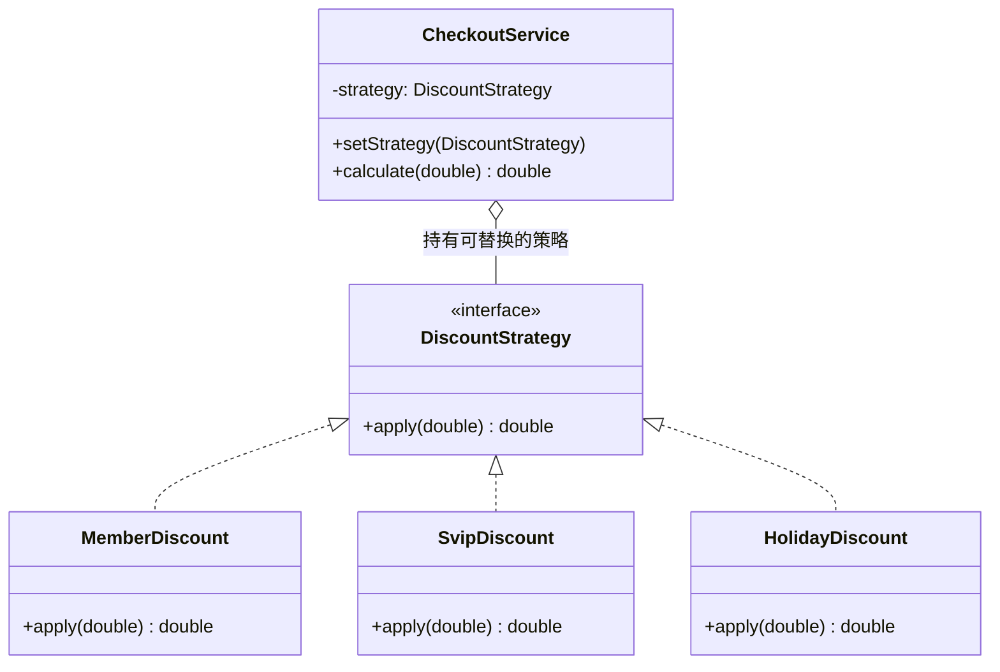

# 第14章：诸葛亮的锦囊妙计——策略模式 (Strategy)

## 1. 小剧场：500 行的结算方法

周三，小白对着一个结算方法发愁。这个方法已经被历代程序员塞进了各种优惠逻辑，膨胀到了 500 行。

```java
// 一坨没人敢动的"屎山"
public class CheckoutService {
    public double calculate(String userType, double price, boolean isHoliday) {
        if ("member".equals(userType)) {
            return price * 0.9;            // 会员 9 折
        } else if ("svip".equals(userType)) {
            return price * 0.8;            // 超级会员 8 折
        } else if (isHoliday) {
            return price - 50;            // 节假日满减
        } else if ("newbie".equals(userType)) {
            return price - 20;            // 新人立减
        }
        // …… 以后还有双十一、618、店铺券、平台券，继续往里塞 else if
        return price;
    }
}
```

**王哥**：“这就是你上次思考题里的'屎山'。每加一种优惠，你就往这个方法里塞一个 `else if`。这个方法会越来越长、越来越没人敢动，违背了**开闭原则**——每次都得改它。”

**小白**：“可优惠规则就是这么多啊，不写 `if-else` 怎么区分？”

**王哥**：“诸葛亮给赵云三个锦囊，告诉他'到了某地拆某个'。每个锦囊里装着一套**独立的应对策略**。赵云不需要把所有计谋都背在脑子里，他只需要在合适的时机，**拿出对应的锦囊**就行。”

**小白**：“所以……把每种优惠算法，单独装进一个'锦囊'？”

**王哥**：“对喽！把每个算法封装成一个独立的策略类，用的时候**像换装备一样切换**。这就是**策略模式（Strategy）**。”

---

## 2. 核心概念：把每个算法装进独立的"锦囊"

**王哥**：“策略模式三步走：定义一个策略接口，把每种算法实现成一个策略类，再让上下文'持有'一个策略、随时可替换。”

### 1) 定义策略接口，每种优惠一个锦囊

```java
// 策略接口：所有优惠算法的统一规范
public interface DiscountStrategy {
    double apply(double price);
}

// 锦囊一：会员 9 折
public class MemberDiscount implements DiscountStrategy {
    public double apply(double price) { return price * 0.9; }
}

// 锦囊二：超级会员 8 折
public class SvipDiscount implements DiscountStrategy {
    public double apply(double price) { return price * 0.8; }
}

// 锦囊三：节假日满减
public class HolidayDiscount implements DiscountStrategy {
    public double apply(double price) { return price - 50; }
}
```

### 2) 上下文持有策略，随时切换

```java
// 上下文：它不关心具体算法，只持有一个策略
public class CheckoutService {
    private DiscountStrategy strategy;

    // 想用哪个锦囊，就塞哪个进来（还记得第1章的依赖注入吗）
    public void setStrategy(DiscountStrategy strategy) {
        this.strategy = strategy;
    }

    public double calculate(double price) {
        return strategy.apply(price); // 委托给当前策略，自己不写任何 if
    }
}
```

```java
CheckoutService service = new CheckoutService();
service.setStrategy(new SvipDiscount()); // 拆开"超级会员"锦囊
System.out.println(service.calculate(100)); // 80.0

service.setStrategy(new HolidayDiscount()); // 换成"节假日"锦囊
System.out.println(service.calculate(100)); // 50.0
```

**小白**（眼前一亮）：“`calculate` 方法里一个 `if` 都没有了！它只管调用当前策略。以后加'双十一优惠'，我只需**新增**一个 `Double11Discount` 类，结算方法一个字都不用改——这就是开闭原则！”



### 3) 用 Map 干掉最后一个 if

**小白**：“可是王哥，决定'用哪个策略'的地方，是不是还得有个 `if` 来选？”

**王哥**：“好问题。最后这个'选择'的 `if`，可以用一个 `Map` 优雅地干掉：”

```java
// 把"类型→策略"的映射关系放进 Map，启动时注册一次
private static final Map<String, DiscountStrategy> STRATEGIES = Map.of(
    "member", new MemberDiscount(),
    "svip",   new SvipDiscount(),
    "holiday", new HolidayDiscount()
);

// 选策略不再用 if-else，直接查表
DiscountStrategy strategy = STRATEGIES.get(userType);
```

**小白**：“漂亮！连选择的 `if-else` 都变成了一行查表，加优惠只需往 Map 里加一项。”

---

## 3. 模式精讲：策略模式的本质

**王哥**：“策略模式的本质，就是**把'变化的算法'从'稳定的流程'里抽离出来，封装成可替换的对象**。它和我们第1章学的两个原则一脉相承：
- **开闭原则**：加算法靠新增类，不改老代码。
- **依赖倒置**：上下文依赖'策略接口'这个抽象，不依赖具体算法。”

**小白**：“王哥，这跟前面学的工厂模式有点像啊，都是面向接口、有一堆实现类。”

**王哥**：“结构像，但**关注点不同**：
- **工厂模式**关注'**创建**'——帮你 new 出一个对象。
- **策略模式**关注'**行为**'——帮你执行一段可替换的算法。

工厂是'生孩子'的，策略是'干活'的。实战中俩经常配合：用工厂创建策略，再用策略执行。”

**王哥**：“JDK 里 `Comparator` 就是策略模式的活化石——你给 `Collections.sort()` 传不同的 `Comparator`，就是在传不同的'排序策略'。”

---

## 4. 课后总结与吐槽

小白把 500 行的结算屎山拆成了一个个清爽的策略类 + 一张 Map，新同事终于敢碰这块代码了。

**小白的笔记**：
1. **策略模式**：把每种算法封装成独立的策略类，运行时**自由切换**。
2. 专治'**一个方法里塞满 if-else 算法**'的屎山。
3. 上下文**持有策略接口**，把具体执行委托出去，自己不写算法。
4. 配合 **Map** 可以连'选择策略'的 if-else 都干掉。

> [!NOTE]
> **动手试试**
> 1. 新增一个"**第一单立减 10 元**"的新人折扣策略 `NewUserDiscount`，把它注册进那张策略 Map。验证：你是否完全没有改动 `CheckoutService` 和其他策略类？
> 2. 用 JDK 自带的 `Comparator` 体会策略模式：对一个 `List<String>` 先按字典序、再按字符串长度排序——给 `list.sort(...)` 传两个不同的 `Comparator`，感受"传入不同策略"。
> 3. **思考**：如果某个折扣策略需要读取"当前用户等级"才能计算，你会把这个参数放进策略接口的方法签名里，还是放进策略对象的构造器里？两种做法各有什么取舍？

**王哥**：“策略是'一个对象换着法子干活'。但有一类问题是'**一个对象一变，要通知一大群对象**'——”

> [!TIP]
> **王哥的思考题**
> “你订阅了一个公众号。它一发新文章，**所有订阅了它的粉丝**都应该收到推送。粉丝可能有几万个，而且随时有人关注、有人取关。难道公众号要把每个粉丝的地址都硬编码在自己代码里，发文章时挨个手动通知？粉丝一变就改公众号代码？有没有办法让'发布者'和'订阅者'松耦合——发布者只管'我更新了'，自动就能通知到所有订阅者？”

（小白想起了第2章那个 B 站 UP 主的例子，感觉似曾相识……）

---
*下一章，观察者模式将正式登场，揭秘"发布-订阅"的奥秘。*
