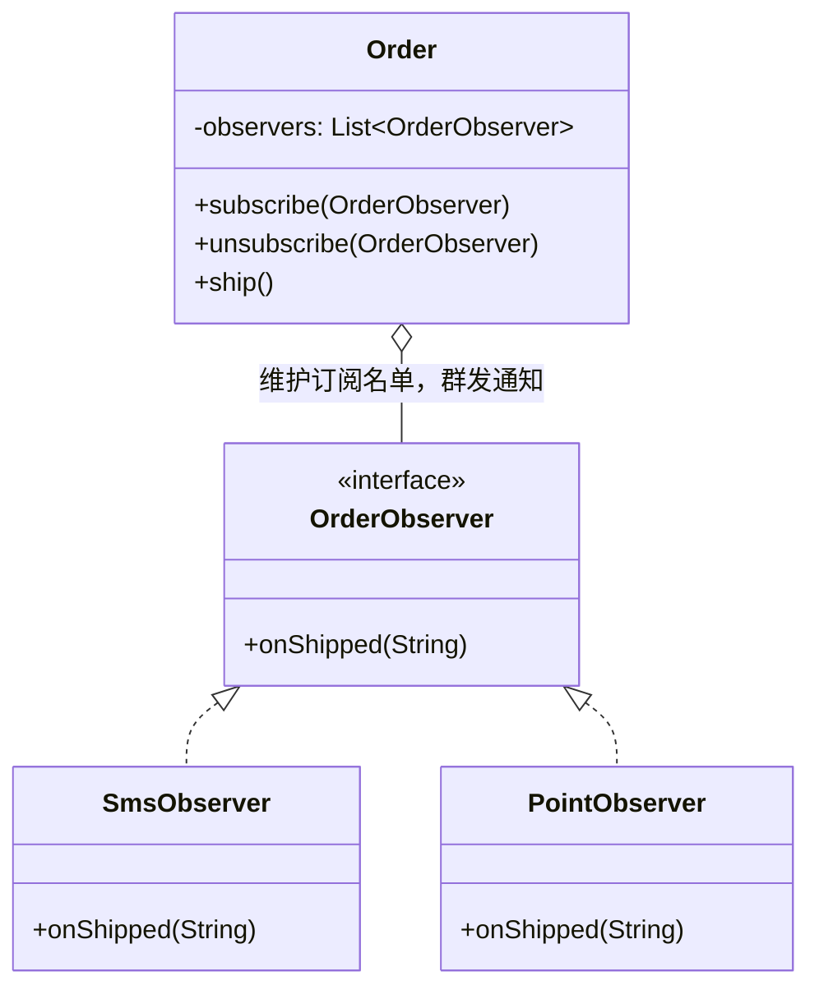

# 第15章：微信公众号的推送——观察者模式 (Observer)

## 1. 小剧场：硬编码的通知地狱

周四，小白在做一个'订单状态变更通知'功能。订单一旦发货，要同时干好几件事：给用户发短信、给用户发 App 推送、更新积分、通知数据分析系统。

```java
// 小白把所有通知逻辑硬编码进了订单类
public class Order {
    public void ship() {
        System.out.println("订单已发货");
        // 发货后要通知一大堆人，全写死在这里
        new SmsService().send("您的订单已发货");
        new PushService().push("订单已发货");
        new PointService().addPoints();
        new AnalyticsService().record("订单发货事件");
        // 哪天产品说"再加个发邮件"，我又得回来改 Order
    }
}
```

**王哥**：“小白，这就是你上次思考题里的'公众号硬编码粉丝'。你的 `Order` 类本来只该管订单，结果现在它认识了短信、推送、积分、分析**四个八竿子打不着的系统**，而且耦合得死死的。产品每加一个通知，你就得改 `Order`。”

**小白**：“是啊，`Order` 越来越臃肿。可发货后就是要通知这么多系统啊。”

**王哥**：“你订阅公众号是怎么回事？公众号知道你是谁、你手机号多少吗？”

**小白**：“不知道，我就是点了个'关注'。它一发文章，我自动就收到了。”

**王哥**：“关键就在这——**公众号根本不认识具体的粉丝，它只维护一个'订阅者名单'。一有更新，就遍历名单挨个通知**。粉丝关注/取关，只是在名单上加一行/删一行，公众号代码纹丝不动。这就是**观察者模式（Observer）**，又叫发布-订阅模式。”

---

## 2. 核心概念：发布者维护一份"订阅名单"

**王哥**：“观察者模式有两个角色：
- **主题（Subject / 被观察者）**：就是那个'公众号'，它维护订阅者列表，有事就群发通知。
- **观察者（Observer / 订阅者）**：就是'粉丝'，它实现一个统一的'收到通知后该干啥'的方法。”

### 1) 定义观察者接口

```java
// 观察者接口：所有"想被通知的人"都实现它
public interface OrderObserver {
    void onShipped(String orderId);
}

// 各个具体观察者，各干各的事，互不知道对方存在
public class SmsObserver implements OrderObserver {
    public void onShipped(String orderId) {
        System.out.println("[短信] 订单" + orderId + "已发货");
    }
}
public class PointObserver implements OrderObserver {
    public void onShipped(String orderId) {
        System.out.println("[积分] 为订单" + orderId + "增加积分");
    }
}
```

### 2) 主题维护名单 + 群发通知

```java
public class Order {
    private String orderId;
    // 订阅者名单：Order 只认识"观察者接口"，不认识具体是谁
    private List<OrderObserver> observers = new ArrayList<>();

    // 关注 / 取关，只是在名单上增删
    public void subscribe(OrderObserver o) { observers.add(o); }
    public void unsubscribe(OrderObserver o) { observers.remove(o); }

    public void ship() {
        System.out.println("订单" + orderId + "已发货");
        // 群发：遍历名单，挨个通知，不关心他们具体是谁
        for (OrderObserver o : observers) {
            o.onShipped(orderId);
        }
    }
}
```

```java
Order order = new Order("NO.1001");
order.subscribe(new SmsObserver());   // 短信来订阅
order.subscribe(new PointObserver()); // 积分来订阅
order.ship();
// 输出：订单已发货 → 短信通知 → 积分通知
```

**小白**（豁然开朗）：“`Order` 现在彻底解脱了！它根本不知道短信、积分这些系统的存在，只管对着'名单'喊一声'我发货了'。产品要加'发邮件'，我只需写个 `EmailObserver` 然后 `subscribe` 一下，`Order` 一个字都不用改！”



---

## 3. 模式精讲：观察者的要点与坑

**王哥**：“观察者模式的精髓，是把'**一对多的通知关系**'解耦——发布者和订阅者之间，只通过一个接口打交道。它完美体现了**开闭原则**（加订阅者不改发布者）和**依赖倒置**（发布者依赖观察者接口，不依赖具体实现）。”

**王哥**：“但有几个坑你得知道：

**1. 通知顺序不要依赖**。别假设 A 一定比 B 先收到通知，否则就埋下隐患。

**2. 小心'同步阻塞'**。如果某个观察者处理得很慢（比如发短信卡了 3 秒），会拖累整个发货流程。实战中常用**异步**（消息队列）来解耦，这就是 **Kafka、RabbitMQ 这些消息中间件的思想源头**。

**3. 防止内存泄漏**。观察者用完不取消订阅，主题会一直持有它的引用，导致它无法被回收。”

**小白**：“原来 MQ、事件总线、各种 `addListener`、Spring 的 `@EventListener`，底层都是观察者模式啊！”

**王哥**：“没错。GUI 里的按钮点击监听、Vue/React 的响应式更新，全是这个套路。它是整个软件世界里**应用最广泛**的模式之一。”

---

## 4. 课后总结与吐槽

小白把订单通知改成观察者模式，`Order` 类瘦身一大半，后续陆续加的邮件、企业微信通知都没再动过订单代码。

**小白的笔记**：
1. **观察者模式**：发布者维护一份**订阅者名单**，状态一变就遍历名单群发通知。
2. 发布者只认识**观察者接口**，与具体订阅者彻底解耦。
3. 加订阅者只需新增 Observer + `subscribe`，发布者代码不动。
4. 注意坑：通知顺序、同步阻塞（可用异步/MQ）、内存泄漏（记得取消订阅）。

> [!NOTE]
> **动手试试**
> 1. 给公众号再加一个"**数据统计**"观察者（文章发布时记录一条埋点日志），验证你不需要改动 `Order`/发布者的任何代码。
> 2. 实现 `unsubscribe`（取消订阅），并写一个小例子：粉丝 A 收到一篇推送后取关，下一篇就不该再收到。
> 3. **进阶**：把"群发通知"改成**异步**——发布者把通知任务丢进线程池，不再同步等待每个观察者执行完。想想这解决了什么问题、又带来了什么新问题（比如通知顺序、异常处理）？

**王哥**：“观察者解决了'通知'。再给你看一类问题——'**把一个请求/操作本身，变成一个可以传递、排队、撤销的对象**'——”

> [!TIP]
> **王哥的思考题**
> “你家的智能遥控器上有一排按钮，你想给每个按钮自由绑定功能：1 号键开灯、2 号键开空调、3 号键开窗帘。而且你还想要一个'撤销'键，能把上一步操作反着执行回去。如果把'开灯'这个动作直接写死在按钮的点击事件里，那按钮和电灯就绑死了，也没法撤销。有没有办法把'开灯'这个**请求本身**封装成一个对象，让按钮和电灯彻底解耦，甚至能存进队列、支持撤销？”

（小白看着手里那个按键功能写死、还总按错的老遥控器，来了兴趣……）

---
*下一章，命令模式将教小白如何把"请求"变成一个可自由摆布的对象。*
