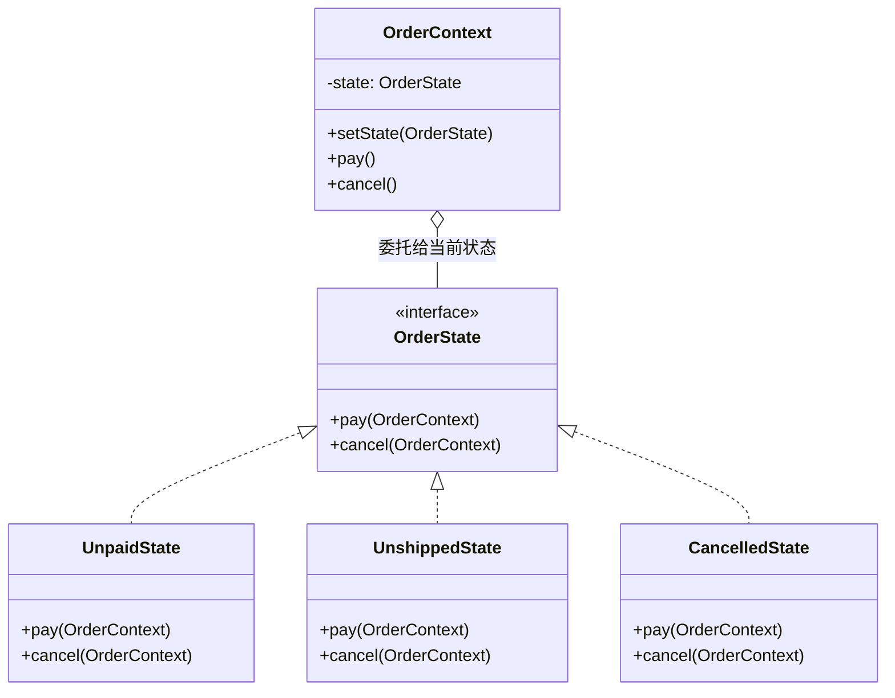

# 第16章：人有悲欢离合——状态模式 (State)

## 1. 小剧场：被状态 if-else 淹没的订单

周二，小白在维护订单系统。每个操作方法里都塞满了状态判断，他已经快被淹没了。

```java
// 小白的"状态 if-else 地狱"
public class Order {
    private String state; // 待付款 / 待发货 / 已完成 / 已取消

    public void pay() {
        if ("待付款".equals(state)) {
            System.out.println("支付成功");
            state = "待发货";
        } else if ("待发货".equals(state)) {
            System.out.println("已经付过款了");
        } else if ("已完成".equals(state)) {
            System.out.println("订单已完成，无需支付");
        } // ……每个状态都得判断
    }

    public void cancel() {
        if ("待付款".equals(state)) {
            System.out.println("直接取消");
            state = "已取消";
        } else if ("待发货".equals(state)) {
            System.out.println("先退款，再取消");
            state = "已取消";
        } else if ("已完成".equals(state)) {
            System.out.println("已完成，不能取消");
        } // ……又是一大坨
    }
    // ship()、confirm() ……每个方法都重复这套状态判断
}
```

**王哥**：“小白，这就是上次思考题的'状态 if-else 地狱'。你的每个方法——`pay`、`cancel`、`ship`——里面都重复着同一套 `if (state == ...)` 判断。状态一多，每个方法都臃肿不堪，加一个新状态要改**所有方法**，简直是噩梦。”

**小白**：“是啊王哥，我现在改一个状态逻辑，得在五六个方法里来回找。太容易漏了。”

**王哥**：“问题的本质是——你把'状态'当成一个**字符串标记**，然后到处用 `if` 去判断它。换个思路：**如果让每个状态都变成一个独立的对象，由这个状态对象自己决定'在我这个状态下，各种操作该怎么做'**，会怎样？这就是**状态模式（State）**。”

---

## 2. 核心概念：让状态自己当家做主

**王哥**：“状态模式的核心：**把每一个状态抽象成一个类，每个状态类自己实现'在该状态下各种操作的行为'。订单（上下文）只持有一个当前状态对象，把操作统统委托给它**。状态切换，就是替换这个状态对象。”

### 1) 定义状态接口

```java
// 状态接口：规定了在任意状态下都可能发生的操作
public interface OrderState {
    void pay(OrderContext ctx);
    void cancel(OrderContext ctx);
}

// 具体状态：待付款
public class UnpaidState implements OrderState {
    public void pay(OrderContext ctx) {
        System.out.println("支付成功");
        ctx.setState(new UnshippedState()); // 付款后切换到"待发货"
    }
    public void cancel(OrderContext ctx) {
        System.out.println("直接取消");
        ctx.setState(new CancelledState());
    }
}

// 具体状态：待发货
public class UnshippedState implements OrderState {
    public void pay(OrderContext ctx) {
        System.out.println("已经付过款了"); // 在这个状态下重复付款的处理
    }
    public void cancel(OrderContext ctx) {
        System.out.println("先退款，再取消"); // 同样是 cancel，行为却不同
        ctx.setState(new CancelledState());
    }
}

// 具体状态：已取消（终态，啥也不能干）
public class CancelledState implements OrderState {
    public void pay(OrderContext ctx) { System.out.println("订单已取消，无法支付"); }
    public void cancel(OrderContext ctx) { System.out.println("订单已经取消了"); }
}
```

### 2) 上下文把操作委托给当前状态

```java
// 订单上下文：只持有当前状态，把操作全委托出去
public class OrderContext {
    private OrderState state = new UnpaidState(); // 初始状态：待付款

    public void setState(OrderState state) { this.state = state; }

    // 注意：这里一个 if 都没有！全甩给当前状态对象
    public void pay() { state.pay(this); }
    public void cancel() { state.cancel(this); }
}
```

```java
OrderContext order = new OrderContext();
order.pay();    // 当前是"待付款"：支付成功 → 自动切到"待发货"
order.cancel(); // 当前是"待发货"：先退款，再取消 → 切到"已取消"
order.pay();    // 当前是"已取消"：订单已取消，无法支付
```

**小白**（眼睛瞪大）：“神了！`OrderContext` 里一个 `if` 都没有！同样调用 `cancel()`，因为当前状态对象不同，行为就自动不同——'待付款'是直接取消，'待发货'是先退款再取消。状态切换也清清楚楚，就是换一个状态对象！”



---

## 3. 模式精讲：状态模式 vs 策略模式

**王哥**：“状态模式最大的好处，是把'**散落在各个方法里的状态判断**'，收拢成了'**每个状态一个类**'。加一个新状态（比如'退货中'），你只需新增一个状态类，**不用去改其他状态**。这就是开闭原则。”

**小白**：“王哥，这结构跟策略模式简直一模一样啊！都是一个接口、一堆实现、上下文持有一个！”

**王哥**：“结构确实是双胞胎，但**意图和灵魂完全不同**：

| 维度 | 策略模式 | 状态模式 |
| --- | --- | --- |
| 谁来切换 | **客户端**主动选策略 | **状态自己**切换到下一个状态 |
| 之间关系 | 各策略**互相独立**，不知道彼此 | 各状态**知道**自己会转到哪个状态 |
| 关注点 | 用哪种算法 | 对象处在哪个生命周期阶段 |

策略模式里，是**你**决定'用会员折扣还是节日折扣'；状态模式里，是**状态对象自己**决定'付完款后我该变成待发货'。一个是外部选,一个是内部流转。”

**小白**：“懂了！策略是'我换装备'，状态是'我升级进化'——升级是自动触发的、有顺序的。”

---

## 4. 课后总结与吐槽

小白把订单系统用状态模式重构，每个操作方法里的状态 if-else 全部消失，新增'退货中'状态时其他代码毫发无损。

**小白的笔记**：
1. **状态模式**：把每个状态封装成一个类，由状态对象自己决定'在该状态下各操作的行为'。
2. 上下文**只持有当前状态**，把操作**委托**给它，自己不写状态 if-else。
3. 状态切换 = 替换状态对象，常由状态自己触发。
4. 与策略的区别：策略是**客户端选算法**，状态是**状态自动流转**。

**王哥**：“行为型模式就剩最后一招了。给你看个场景——'**一个请求，要依次经过好几个处理者,每个处理者决定自己处理还是往后传**'——”

> [!TIP]
> **王哥的思考题**
> “公司报销审批：你提交一张发票，500 块以下组长就能批；500 到 5000 要经理批；5000 以上得总监批。如果你在提交方法里写 `if (金额 < 500) 找组长 else if (金额 < 5000) 找经理 else 找总监`，那这套金额规则又散落成了 if-else，而且审批层级一变就得改。有没有办法把这些审批者串成一条链，请求自己'击鼓传花'地往下传，直到遇到能处理它的人？”

（小白想起了上周那张被打回三次的报销单，深有体会……）

---
*终章，责任链模式将教小白如何让请求在处理者链条上"击鼓传花"。*
