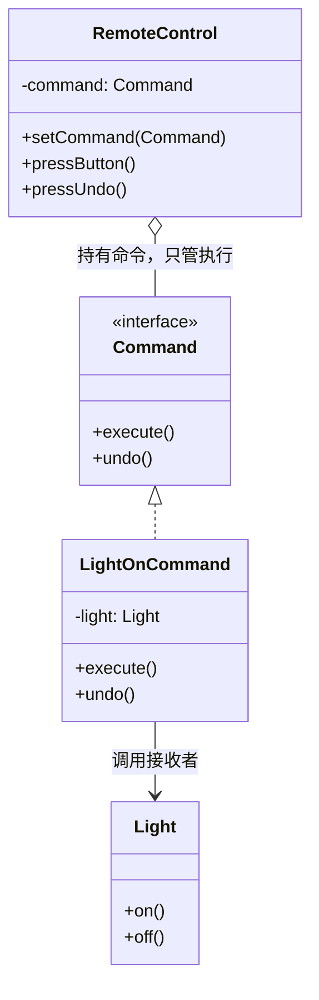

# 第16章：把请求变成对象——命令模式 (Command)

## 1. 小剧场：按钮和电灯绑死了

周五，小白在做一个智能家居的遥控器界面。他一开始把每个按钮的功能直接写死了。

```java
// 小白的写法：按钮和具体设备死死绑在一起
public class RemoteControl {
    private Light light = new Light();
    private AirConditioner ac = new AirConditioner();

    public void onButton1Click() {
        light.on();   // 1 号键和电灯绑死
    }
    public void onButton2Click() {
        ac.start();   // 2 号键和空调绑死
    }
    // 想换按钮功能？想加撤销？想录个"一键全开"的宏？统统做不到
}
```

**王哥**：“小白，这就是上次思考题的问题。你的遥控器和具体设备**焊死**了。现在我要三个新需求：第一，按钮功能要能**随意配置**；第二，要支持**撤销**；第三，要能录制一串操作做成'**一键宏**'。你这写法，一个都满足不了。”

**小白**：“是啊，全写死了。要改只能去抠 `onButtonXClick` 里的代码。”

**王哥**：“问题的根源是——你把'**做什么**'（开灯）和'**谁来触发**'（按钮）耦合在了一起。如果我们把'开灯'这个**请求本身，打包成一个独立的对象**呢？按钮只管'执行我手里这个命令对象',至于命令是开灯还是开空调，它不关心。这就是**命令模式（Command）**。”

---

## 2. 核心概念：把"请求"封装成对象

**王哥**：“命令模式有四个角色，听起来多，其实就是把'下命令'这件事拆开了：
- **命令（Command）**：把一个请求封装成对象，提供 `execute()`（执行）和 `undo()`（撤销）。
- **接收者（Receiver）**：真正干活的人，比如电灯、空调。
- **调用者（Invoker）**：发起命令的人，比如按钮、遥控器。它只持有命令，不关心细节。
- **客户端**：负责把命令和接收者组装起来。”

### 1) 定义命令接口

```java
// 命令接口：能执行，也能撤销
public interface Command {
    void execute();
    void undo();
}

// 接收者：真正干活的电灯
public class Light {
    public void on() { System.out.println("电灯打开"); }
    public void off() { System.out.println("电灯关闭"); }
}

// 具体命令：开灯命令，内部持有"接收者"
public class LightOnCommand implements Command {
    private Light light;
    public LightOnCommand(Light light) { this.light = light; }

    public void execute() { light.on(); }  // 执行：开灯
    public void undo() { light.off(); }    // 撤销：反过来关灯
}
```

### 2) 调用者只管执行命令

```java
// 调用者（遥控器）：只持有命令，完全不知道接收者是谁
public class RemoteControl {
    private Command command;
    private Command lastCommand; // 记住上一个命令，用于撤销

    public void setCommand(Command command) { this.command = command; }

    public void pressButton() {
        command.execute();
        lastCommand = command; // 存起来
    }

    public void pressUndo() {
        if (lastCommand != null) lastCommand.undo(); // 撤销上一步
    }
}
```

```java
Light light = new Light();
RemoteControl remote = new RemoteControl();

remote.setCommand(new LightOnCommand(light)); // 给按钮绑定"开灯命令"
remote.pressButton();  // 电灯打开
remote.pressUndo();    // 电灯关闭（撤销！）
```

**小白**（恍然大悟）：“神了！遥控器现在只认识 `Command` 接口，我想让按钮开灯就塞开灯命令，想开空调就塞开空调命令——**按钮功能可以随意配置**了！而且因为每个命令都自带 `undo()`，撤销也轻轻松松实现了！”



### 3) 第三个需求：一键宏命令

**王哥**：“既然命令是对象，那把一串命令装进一个列表，不就成了'宏命令'？”

```java
// 宏命令：内部装着一串命令，一次性全执行
public class MacroCommand implements Command {
    private List<Command> commands;
    public MacroCommand(List<Command> commands) { this.commands = commands; }

    public void execute() {
        for (Command c : commands) c.execute(); // 挨个执行
    }
    public void undo() {
        // 撤销要倒着来
        for (int i = commands.size() - 1; i >= 0; i--) commands.get(i).undo();
    }
}
```

**小白**：“'一键回家'——同时开灯、开空调、拉窗帘，全装进一个宏命令！三个需求全搞定了！”

---

## 3. 模式精讲：命令模式的威力

**王哥**：“命令模式把'请求'变成了一等公民对象，于是请求就能像数据一样被**传递、存储、排队、记录、撤销**。这解锁了一堆高级玩法：

1. **撤销/重做**：每个命令存 `undo()`，搞个命令历史栈，就能实现 Word 那样的撤销重做。
2. **任务队列**：把命令对象扔进队列，让线程池慢慢消费——这就是**线程池里 `Runnable` 的本质**（`Runnable` 就是个只有 `run()` 的命令）。
3. **操作日志**：把执行过的命令记下来，系统崩溃后可以**重放**恢复。

| 角色 | 职责 | 例子 |
| --- | --- | --- |
| Command | 封装请求 | 开灯命令 |
| Receiver | 真正干活 | 电灯 |
| Invoker | 触发命令 | 遥控器 |

核心一句话：**命令模式把'方法调用'本身变成了一个对象**。”

---

## 4. 课后总结与吐槽

小白用命令模式重写遥控器，按钮可随意配置、支持撤销、还能录宏，产品经理直呼专业。

**小白的笔记**：
1. **命令模式**：把一个请求封装成对象，使调用者与接收者**解耦**。
2. 四角色：命令、接收者、调用者、客户端。
3. 解锁高级能力：**撤销重做、任务队列、操作日志重放**。
4. `Runnable`、线程池任务，本质都是命令模式。

> [!NOTE]
> **动手试试**
> 1. 写一个 `AirConditionerOnCommand`，让遥控器的 2 号键绑定它。验证：你只新增了一个命令类，没有改动 `RemoteControl`。
> 2. 把 `RemoteControl` 的"撤销"从"只能撤一步"升级为"**能连续撤销**"——用一个 `Deque<Command>` 当历史栈，每次 `pressUndo` 弹出最近一条 `undo()`。
> 3. **进阶**：录制一个"一键离家"宏命令（关灯 + 关空调 + 关窗帘），并验证它的 `undo()` 是**倒序**执行的（先开窗帘、再开空调、最后开灯）。想想为什么撤销必须倒序。

**王哥**：“命令是'把请求对象化'。接下来看一个更接地气的——'**流程骨架固定，只有几步细节不同**'的情况——”

> [!TIP]
> **王哥的思考题**
> “泡茶和泡咖啡，流程几乎一模一样：烧水 → 冲泡 → 倒进杯子 → 加调料。唯一不同的是'冲泡'那一步（一个放茶叶、一个放咖啡粉）和'加调料'那一步（一个加柠檬、一个加糖奶）。如果你为泡茶和泡咖啡各写一个完整方法，那'烧水''倒杯子'这些**重复的步骤**就被你抄了两遍。有没有办法把'相同的流程骨架'固定下来、只让子类去填'冲泡''加料'这几个**变化的空格'**？”

（小白看了看手边那杯泡了一半的茶，若有所思……）

---
*下一章，模板方法模式将教小白如何"固定骨架、填空变化"。*
