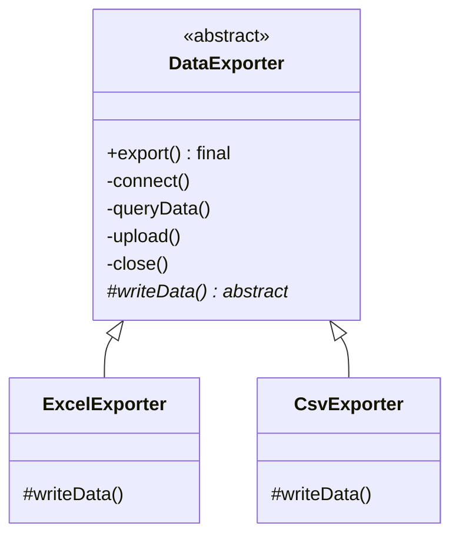

# 第17章：填空题——模板方法模式 (Template Method)

## 1. 小剧场：复制粘贴出来的流程

周一，小白在做数据导出功能。他要导出 Excel 和 CSV 两种格式，于是写了两个方法。

```java
// 导出 Excel
public class ExcelExporter {
    public void export() {
        System.out.println("1. 连接数据库");      // 重复
        System.out.println("2. 查询数据");        // 重复
        System.out.println("3. 写成 Excel 格式");  // 不同
        System.out.println("4. 上传到服务器");     // 重复
        System.out.println("5. 关闭连接");        // 重复
    }
}

// 导出 CSV —— 跟上面几乎一模一样，只有第3步不同
public class CsvExporter {
    public void export() {
        System.out.println("1. 连接数据库");      // 又抄了一遍
        System.out.println("2. 查询数据");        // 又抄了一遍
        System.out.println("3. 写成 CSV 格式");    // 不同
        System.out.println("4. 上传到服务器");     // 又抄了一遍
        System.out.println("5. 关闭连接");        // 又抄了一遍
    }
}
```

**王哥**：“小白，这就是上次思考题里的'泡茶泡咖啡'。你看这两个 `export`，5 步里有 4 步**一模一样**，只有第 3 步不同。你却把整套流程抄了两遍。哪天'上传到服务器'这步逻辑要改，你得改几个地方？”

**小白**：“两个……要是有 PDF、XML 导出，那就是四个、五个。改一处忘一处，准出 bug。”

**王哥**：“问题在于，你把'**固定的流程骨架**'和'**变化的那一步**'混在一起，导致骨架被反复复制。正确的做法是——**把骨架固定在一个地方，只把变化的那几步留成'空格'让子类去填**。这就是**模板方法模式（Template Method）**。”

---

## 2. 核心概念：父类定骨架，子类填空格

**王哥**：“模板方法模式的做法：在**父类**里定义一个'模板方法'，它规定好整个流程的**步骤和顺序**（骨架）。其中**不变的步骤**直接写好，**变化的步骤**定义成抽象方法，留给**子类**去实现。”

```java
// 抽象父类：定义流程骨架
public abstract class DataExporter {

    // 模板方法：规定死了流程的顺序，用 final 防止子类篡改骨架
    public final void export() {
        connect();        // 固定步骤
        queryData();      // 固定步骤
        writeData();      // 变化步骤 —— 留给子类填的"空格"
        upload();         // 固定步骤
        close();          // 固定步骤
    }

    // 固定步骤：父类统一实现，子类不用管
    private void connect() { System.out.println("1. 连接数据库"); }
    private void queryData() { System.out.println("2. 查询数据"); }
    private void upload() { System.out.println("4. 上传到服务器"); }
    private void close() { System.out.println("5. 关闭连接"); }

    // 变化步骤：定义成抽象方法，强制子类去填
    protected abstract void writeData();
}
```

```java
// 子类只需填"写数据"这一个空格
public class ExcelExporter extends DataExporter {
    protected void writeData() { System.out.println("3. 写成 Excel 格式"); }
}

public class CsvExporter extends DataExporter {
    protected void writeData() { System.out.println("3. 写成 CSV 格式"); }
}
```

```java
DataExporter exporter = new ExcelExporter();
exporter.export();
// 自动按 1→2→3(Excel)→4→5 完整流程执行
```

**小白**（如释重负）：“太清爽了！连接、查询、上传、关闭这些重复步骤，现在只在父类写**一遍**。子类只需填'写成什么格式'这一个空格。以后要改'上传'逻辑，我只改父类一处，所有子类全部生效！”



---

## 3. 模式精讲：钩子方法与"好莱坞原则"

**王哥**：“模板方法还有一个进阶技巧——**钩子方法（Hook）**。它是父类里一个有默认实现的方法（通常返回布尔值），子类可以选择性地覆盖它，来'微调'流程要不要执行某步。”

```java
public abstract class DataExporter {
    public final void export() {
        connect();
        queryData();
        writeData();
        if (needUpload()) {  // 钩子：要不要上传，子类说了算
            upload();
        }
        close();
    }
    // 钩子方法：默认要上传，子类可覆盖
    protected boolean needUpload() { return true; }
}

// 某个子类：导出后不上传，存本地就行
public class LocalCsvExporter extends DataExporter {
    protected void writeData() { System.out.println("写 CSV"); }
    protected boolean needUpload() { return false; } // 覆盖钩子，跳过上传
}
```

**王哥**：“模板方法体现了一个著名的设计思想——'**好莱坞原则**'：'**别打电话给我们，我们会打给你**'（Don't call us, we'll call you）。也就是说，**父类控制整个流程，在需要的时候反过来调用子类填的方法**。控制权在父类手里，子类只是被回调。”

**小白**：“这跟策略模式有点像啊，都是'有一部分逻辑是变化的'。”

**王哥**：“区别很关键：
- **模板方法**用**继承**——父类是骨架，子类填空。变化的步骤是'流程的一部分'。
- **策略模式**用**组合**——上下文持有一个完整的、可替换的算法对象。变化的是'整个算法'。

模板方法是'填空题'，策略是'选择题'。Spring 的 `JdbcTemplate`、各种框架的 `AbstractXxx` 基类、Java 的 `AbstractList`，全是模板方法的典范。”

---

## 4. 课后总结与吐槽

小白把导出功能用模板方法重构，重复的流程代码消失了，后来加的 PDF、XML 导出都只写了一个 `writeData` 方法。

**小白的笔记**：
1. **模板方法模式**：父类用 `final` 模板方法**固定流程骨架**，把变化的步骤留成**抽象方法**给子类填。
2. **钩子方法**：父类提供默认实现，子类可选择性覆盖，微调流程。
3. 体现'**好莱坞原则**'：父类控制流程，反过来回调子类。
4. 与策略的区别：模板方法靠**继承填空**，策略靠**组合换算法**。

> [!NOTE]
> **动手试试**
> 1. 新增一个 `PdfExporter`，只实现 `writeData()` 一个方法。验证：连接、查询、上传、关闭这些步骤你一行都没重写。
> 2. 给 `LocalCsvExporter` 覆盖 `needUpload()` 返回 `false`，运行后确认"上传"那步被跳过了——体会**钩子方法**怎么微调流程。
> 3. **思考**：模板方法用 `final` 修饰 `export()`，是为了防止子类篡改流程骨架。如果不加 `final`，某个子类重写了 `export()` 打乱了步骤顺序，会带来什么后果？这和"好莱坞原则"有什么关系？

**王哥**：“模板方法是'流程固定，步骤变化'。但还有一种变化更刁钻——'**对象的行为，随着它自己内部状态的改变而彻底改变**'——”

> [!TIP]
> **王哥的思考题**
> “一个订单有很多状态：待付款、待发货、待收货、已完成、已取消。同一个'取消'操作，在'待付款'时可以直接取消，在'待发货'时要先退款再取消，在'已完成'时则根本不允许取消。如果你用 `if (status == 待付款) {...} else if (status == 待发货) {...}` 来写每一个操作，那每个方法里都得塞一大坨状态判断，状态一多就乱成一锅粥。有没有办法让'状态'自己决定'在这个状态下该怎么做'，干掉这些满天飞的状态 if-else？”

（小白看着订单系统里那密密麻麻的 `if (status == ...)`，头皮发麻……）

---
*下一章，状态模式将教小白如何让对象"随状态切换行为"。*
