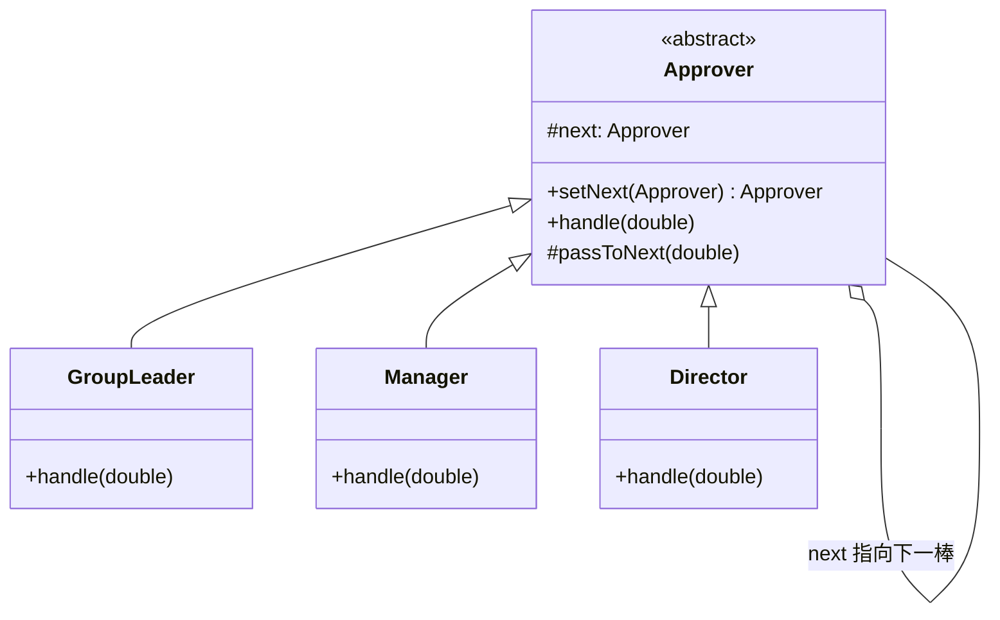

# 第17章：击鼓传花——责任链模式 (Chain of Responsibility)

## 1. 小剧场：审批金额的 if-else 又回来了

周三，小白在做报销审批系统。审批规则按金额分级，他又一次写出了那种熟悉的 `if-else`。

```java
// 小白的审批方法
public class ApprovalService {
    public void approve(double amount) {
        if (amount < 500) {
            System.out.println("组长审批通过");
        } else if (amount < 5000) {
            System.out.println("经理审批通过");
        } else if (amount < 50000) {
            System.out.println("总监审批通过");
        } else {
            System.out.println("CEO 审批通过");
        }
    }
}
```

**王哥**：“小白，又是 `if-else`。这套审批规则现在全焊死在一个方法里。哪天加一级'副总监'，或者金额门槛一调，你又得来抠这个方法。而且每个审批者的逻辑都挤在一起，根本没法独立复用。”

**小白**：“是啊，我也觉得别扭。但审批就是有层级的呀。”

**王哥**：“层级正是关键。你提交报销单，是不是先到组长手里？组长一看'超过我权限了'，就**往上递给经理**；经理一看还是超了，**再往上递给总监**……每个人只做一个判断：'我能批吗？能就批，不能就传给下一个'。这就是**击鼓传花**——请求在一条**处理者链**上传递，直到有人接住。这就是**责任链模式（Chain of Responsibility）**。”

---

## 2. 核心概念：把处理者串成一条链

**王哥**：“责任链的做法：**每个处理者都持有'下一个处理者'的引用。它先判断自己能不能处理，能就处理掉；不能就调用下一个处理者，把请求往下传**。”

### 1) 定义处理者抽象

```java
// 抽象处理者
public abstract class Approver {
    protected Approver next; // 持有"下一棒"的引用

    // 设置链上的下一个处理者
    public Approver setNext(Approver next) {
        this.next = next;
        return next; // 返回 next 方便链式串联
    }

    // 处理请求（模板方法的味道）
    public abstract void handle(double amount);

    // 传给下一棒的通用逻辑
    protected void passToNext(double amount) {
        if (next != null) {
            next.handle(amount);
        } else {
            System.out.println("没人能审批这笔 " + amount + " 元的报销！");
        }
    }
}
```

### 2) 各级审批者：只管自己那一档

```java
public class GroupLeader extends Approver {
    public void handle(double amount) {
        if (amount < 500) {
            System.out.println("组长审批通过：" + amount);
        } else {
            passToNext(amount); // 超权限，往上递
        }
    }
}

public class Manager extends Approver {
    public void handle(double amount) {
        if (amount < 5000) {
            System.out.println("经理审批通过：" + amount);
        } else {
            passToNext(amount);
        }
    }
}

public class Director extends Approver {
    public void handle(double amount) {
        if (amount < 50000) {
            System.out.println("总监审批通过：" + amount);
        } else {
            passToNext(amount);
        }
    }
}
```

### 3) 串好链子，扔进请求

```java
// 组装责任链：组长 → 经理 → 总监
Approver leader = new GroupLeader();
leader.setNext(new Manager()).setNext(new Director());

leader.handle(300);   // 组长审批通过
leader.handle(3000);  // 组长传给经理 → 经理审批通过
leader.handle(40000); // 组长→经理→总监 → 总监审批通过
```

**小白**（拍腿）：“妙啊！每个审批者只关心'我自己这一档'，超了就往下传，完全不知道整条链有多长。我要加一级'副总监'，只需写个新类、串进链子里对应位置，**其他审批者一个字都不用改**！金额门槛调整也只改对应那一个类！”



---

## 3. 模式精讲：责任链的两种姿态

**王哥**：“责任链有两种常见姿态：

1. **'纯'责任链**：请求只被**一个**处理者处理，处理完就结束（像审批，找到能批的人就停）。
2. **'链式'处理**：请求**依次流过每个处理者**，每个都做点加工(不一定终止)。比如 **Servlet 的 Filter 链、Spring 的拦截器、各种中间件**——一个请求进来，依次过登录校验、限流、日志、权限……每一环都处理一下再放行。”

**小白**：“原来 Web 开发里的'过滤器链''拦截器链'就是责任链啊！每加一个过滤器，不用动其他的。”

**王哥**：“正是。责任链的核心价值，是**把'请求的发送者'和'一连串可能的处理者'解耦**——发送者只管把请求扔给链头，根本不知道、也不关心最后是谁处理的，链有多长。它再次完美体现了**开闭原则**：增删处理者、调整顺序，都不影响其他部分。”

**王哥**：“一个小提醒：要防止链**断掉**（请求传到末尾没人处理）或**成环**（无限循环），所以末尾的兜底处理别忘了写。”

---

## 4. 课后总结与吐槽

小白用责任链重写了审批系统，每个审批者独立成类，加减层级、调整门槛都轻松无比。他合上笔记本，长舒一口气——23 种设计模式，终于全部学完了。

**小白的笔记**：
1. **责任链模式**：把处理者串成一条链，请求沿链传递，直到被处理。
2. 每个处理者**只管自己的职责**，处理不了就**传给下一棒**。
3. 两种姿态：'纯'责任链（一人处理）、'链式'处理（依次加工，如 Filter 链）。
4. 解耦请求发送者与处理者，增删处理者符合开闭原则。

---

## 5. 全书终章：王哥的临别赠言

夕阳西下，王哥端着今天第三杯冰美式，靠在椅背上。

**王哥**：“小白，从 SOLID 原则到 23 种模式，咱们一路走来。最后我送你三句心里话：”

**第一句：模式是'果',原则是'因'**。“所有设计模式，归根结底都是 SOLID 原则的具体应用。你回头看——工厂、策略、状态都在贯彻'开闭原则'；几乎所有模式都在用'依赖倒置'面向接口编程；'组合优于继承'更是贯穿始终。**记不住模式没关系，吃透原则，你自己都能'推导'出模式来**。”

**第二句：不要为了用模式而用模式**。“设计模式是用来**解决问题**的，不是用来炫技的。三行能搞定的事，你非要套个抽象工厂 + 责任链,那叫**过度设计**,比'屎山'还可怕。记住第1章 CLAUDE 给的忠告——**简单优先**。等你真切感受到'痛'了（需求频繁变化、代码改一处崩一片），再请出对应的模式。”

**第三句：模式是死的,人是活的**。“别死记硬背 UML 类图。要理解每个模式**'解决了什么痛点'、'代价是什么'**。很多模式可以变形、组合使用。框架源码（Spring、MyBatis、JDK）是最好的模式教科书,多去读。”

**小白**郑重地合上笔记本：“王哥，谢谢你这一路的'比喻教学'。从扫地机器人、CEO、婚介所、咖啡加料到击鼓传花……我感觉这些模式再也不是冷冰冰的概念,而是一个个鲜活的生活场景了。”

**王哥**（笑着拍拍他肩膀）：“走吧,出师了。今晚我请客,烧烤管够。不过——”

> [!TIP]
> **王哥最后的思考题**
> “明天产品经理又要来加新需求了。这一次,你能不能在动手写第一行代码之前,先想清楚:**哪里是稳定的,哪里是会变的?把'变化'隔离出去,这就是一切设计模式的终极奥义**。”

（小白望向窗外的晚霞,第一次觉得,写代码原来是一件如此优雅的事。）

---

**—— 全书完 ——**

> 后记：23 种设计模式只是起点。真正的功力,藏在日复一日对'变化'的洞察里。愿你我都能写出让三年后的自己,以及接手的同事,会心一笑的代码。
