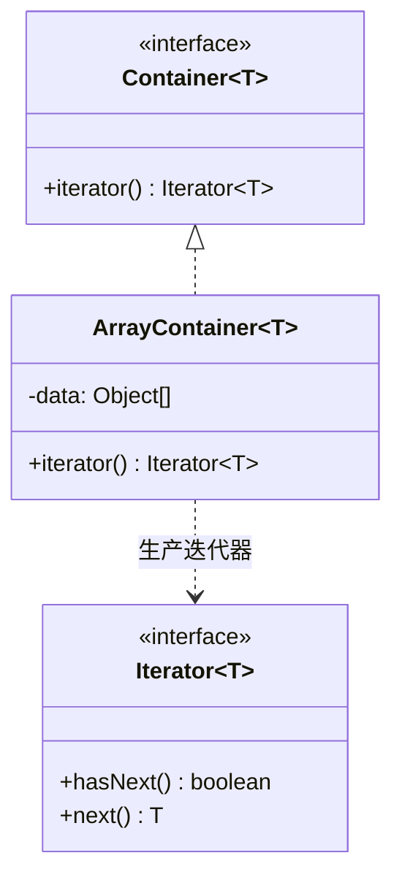
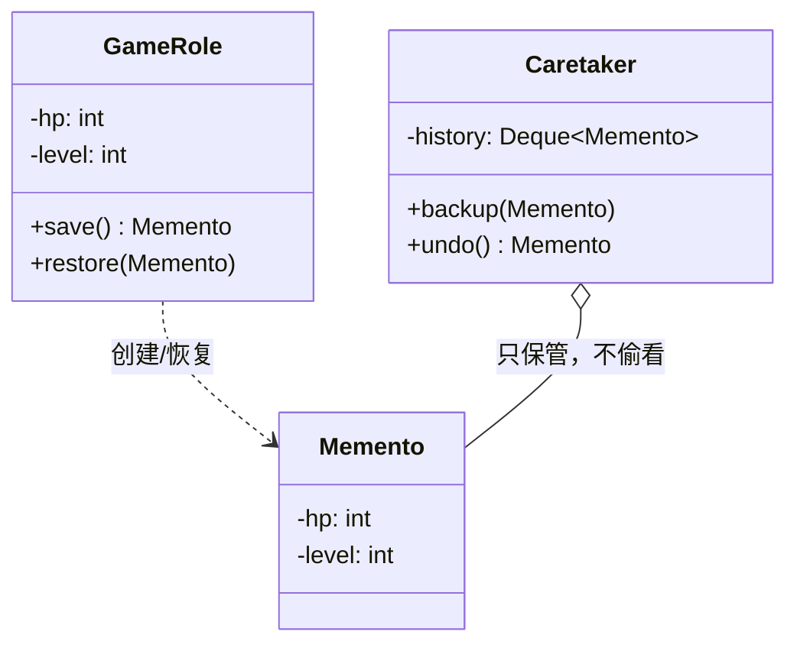
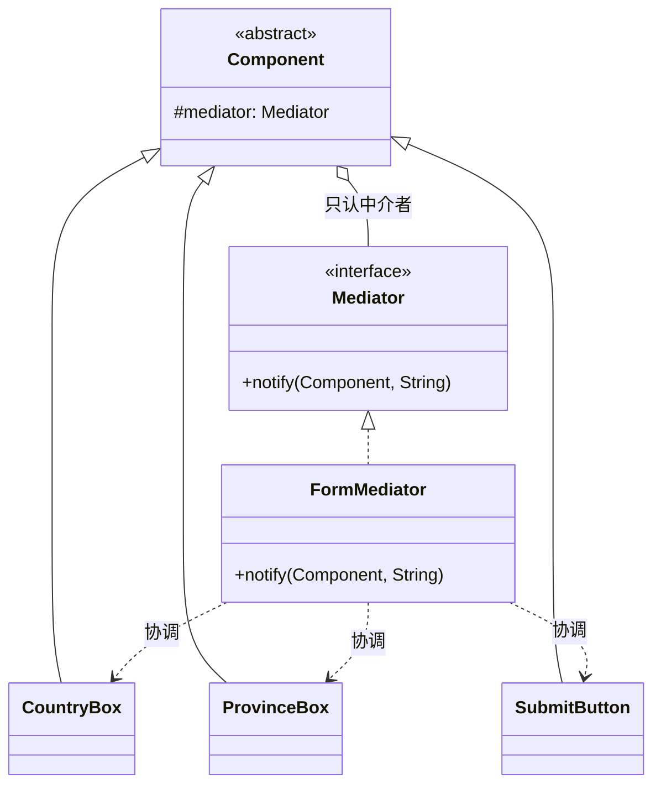

# 第18章：收尾三式与终章——迭代器、备忘录、中介者

## 1. 小剧场：天天写的 for-each，竟是个模式

周四，小白拿着上次的思考题来找王哥：“王哥，我想了想 `for-each`。同样一句 `for (X x : 集合)`，能遍历 `ArrayList`、`HashSet`、`LinkedList`……我猜，是不是有个什么'统一接口'在背后撑着？”

**王哥**（赞许地点头）：“悟性见长啊。今天是最后一课，我一口气把 GoF 收尾的三个模式给你讲透——**迭代器、备忘录、中介者**。它们国民度都很高，你天天在用，只是没意识到。先从你这个 `for-each` 说起，它背后就是**迭代器模式**。”

---

## 2. 迭代器模式 (Iterator)：统一"遍历"这件事

**王哥**：“一个 `ArrayList` 内部是数组，按下标取；一个 `LinkedList` 内部是链表，顺着指针走；红黑树又是另一套。如果让**调用方**自己去遍历，那他就得知道每种集合的内部结构，写法五花八门，集合内部一改，遍历代码全得跟着崩。”

**小白**：“对，而且把内部结构暴露给外面，封装也破坏了。”

**王哥**：“迭代器模式的核心就是——**把'遍历'这个职责单独抽出来，封装成一个迭代器对象。集合只负责'生产'一个迭代器，调用方只认 `hasNext()` / `next()` 两个方法，根本不关心内部是数组还是链表**。”

```java
// 迭代器接口：只暴露"还有没有下一个""取下一个"
public interface Iterator<T> {
    boolean hasNext();
    T next();
}

// 容器接口：我不关心你内部怎么存的，只要你能"造"一个迭代器出来
public interface Container<T> {
    Iterator<T> iterator();
}
```

```java
// 一个内部用数组的集合
public class ArrayContainer<T> implements Container<T> {
    private Object[] data;
    private int count;
    public ArrayContainer(Object[] data, int count) { this.data = data; this.count = count; }

    public Iterator<T> iterator() {
        // 把遍历逻辑封装进一个内部类，外部完全看不到 data 数组
        return new Iterator<T>() {
            private int cursor = 0;                       // 遍历状态藏在迭代器里
            public boolean hasNext() { return cursor < count; }
            @SuppressWarnings("unchecked")
            public T next() { return (T) data[cursor++]; }
        };
    }
}
```

```java
Container<String> c = new ArrayContainer<>(new Object[]{"王哥", "小白"}, 2);
Iterator<String> it = c.iterator();
while (it.hasNext()) {
    System.out.println(it.next()); // 王哥、小白
}
```

**小白**（恍然大悟）：“我懂了！遍历的'游标'状态藏在迭代器内部，集合本身一点不脏。我换一个内部用链表的集合，只要它也能 `iterator()` 出一个一样的迭代器，**我这套 `while (hasNext())` 一个字都不用改**！”



**王哥**：“这就是 Java 集合框架的根基。`java.util.Iterator`、你能用 `for-each` 是因为集合实现了 `Iterable` 接口（背后就是 `iterator()`）。一句话——**迭代器模式：把遍历职责从集合里抽出来，让你用统一的方式遍历任何集合，还不暴露内部结构**。”

---

## 3. 备忘录模式 (Memento)：给对象拍个"存档照"

**王哥**：“第二个，备忘录模式，专治'**后悔**'。还记得第14章命令模式的撤销吗？那是'反向执行一步'。但有些场景反向执行很难——比如游戏存档、编辑器 Ctrl+Z、事务回滚。最干脆的办法是：**在某个时刻，把对象的完整状态'拍张照'存起来，要回退时直接把这张照片'冲洗'回去**。”

**小白**：“就像游戏里的存档点，读档就回到当时的状态。”

**王哥**：“正是。但这里有个讲究：拍照不能破坏对象的封装，不能把对象的私有字段全掏出来给外面。所以备忘录模式有三个角色——**原发器（Originator，被拍照的对象）、备忘录（Memento，那张照片）、管理者（Caretaker，存照片的相册）**。关键是：**只有原发器能读写备忘录的内容，管理者只负责保管，看不到里面**。”

```java
// 备忘录：一张"状态快照"，只对原发器透明
public class Memento {
    private final String state; // 私有，外人拿不到
    public Memento(String state) { this.state = state; }
    private String getState() { return state; } // 包级/内部可见，仅供原发器恢复用
}
```

为了让"只有原发器能读"更地道，实战中常把备忘录做成原发器的**内部类**：

```java
// 原发器：游戏角色，负责"拍照"和"读档"
public class GameRole {
    private int hp;
    private int level;

    public void play(int hp, int level) {
        this.hp = hp; this.level = level;
        System.out.println("当前状态 → HP:" + hp + " 等级:" + level);
    }

    // 拍照：把当前状态打包进备忘录
    public Memento save() { return new Memento(hp, level); }

    // 读档：从备忘录恢复状态
    public void restore(Memento m) {
        this.hp = m.hp; this.level = m.level;
        System.out.println("已读档 → HP:" + hp + " 等级:" + level);
    }

    // 内部类备忘录：只有 GameRole 能访问它的字段，外部完全黑盒
    public static class Memento {
        private final int hp;
        private final int level;
        private Memento(int hp, int level) { this.hp = hp; this.level = level; }
    }
}
```

```java
// 管理者：只管保存，看不见里面是什么
public class Caretaker {
    private final Deque<GameRole.Memento> history = new ArrayDeque<>();
    public void backup(GameRole.Memento m) { history.push(m); }
    public GameRole.Memento undo() { return history.pop(); }
}
```

```java
GameRole role = new GameRole();
Caretaker album = new Caretaker();

role.play(100, 1);
album.backup(role.save());   // 存档点1

role.play(30, 5);            // 打了个 BOSS，残血了
role.restore(album.undo());  // 读档！回到 HP:100 等级:1
```

**小白**：“妙！备忘录把'快照'包得严严实实，管理者只是个'相册'，根本看不到角色的血量等级，封装一点没破坏。Ctrl+Z、游戏存档、Spring 事务的回滚点，原来都是这个套路！”



**王哥**：“一句话——**备忘录模式：在不破坏封装的前提下，捕获对象状态并存到外部，以便随时恢复**。它和命令模式的 `undo()` 是撤销的'两条腿'：命令是'反着做一遍'，备忘录是'直接复原'。”

---

## 4. 中介者模式 (Mediator)：别让对象们织成一张网

**王哥**：“最后一个，中介者模式。场景：一堆对象**互相**引用、互相调用。比如一个复杂表单——'国家'下拉框一变，'省份'框要刷新，'提交'按钮要重新校验，'提示语'要更新……如果让每个控件都直接持有、调用其他所有控件，会怎样？”

**小白**：“那就乱套了。N 个控件两两关联，连线是 N²级别的，活像一团乱麻。加一个控件，得改一堆别的控件。”

**王哥**：“这就是'**网状结构**'的噩梦。中介者模式的思路是——**把这张网改成'星形'：所有对象都不直接联系，而是只跟一个中央的'中介者'打交道。对象有事就通知中介者，由中介者去协调其他对象**。就像同事之间不直接对接，全走项目经理；飞机之间不直接通话，全听塔台指挥。”

```java
// 中介者接口：同事们有事都来通知它
public interface Mediator {
    void notify(Component sender, String event);
}

// 抽象同事：只持有中介者，不持有其他同事
public abstract class Component {
    protected Mediator mediator;
    public Component(Mediator mediator) { this.mediator = mediator; }
}
```

```java
// 具体同事们：各干各的，要联动就喊中介者
public class CountryBox extends Component {
    public CountryBox(Mediator m) { super(m); }
    public void onChange() {
        System.out.println("国家变了");
        mediator.notify(this, "countryChanged"); // 不直接碰省份框，只通知中介者
    }
}
public class ProvinceBox extends Component {
    public ProvinceBox(Mediator m) { super(m); }
    public void reload() { System.out.println("省份列表已刷新"); }
}
public class SubmitButton extends Component {
    public SubmitButton(Mediator m) { super(m); }
    public void refreshState() { System.out.println("提交按钮重新校验"); }
}
```

```java
// 具体中介者：唯一知道"谁联动谁"的地方，协调逻辑全收口在这
public class FormMediator implements Mediator {
    private ProvinceBox province;
    private SubmitButton submit;
    public void setProvince(ProvinceBox p) { this.province = p; }
    public void setSubmit(SubmitButton s) { this.submit = s; }

    public void notify(Component sender, String event) {
        if ("countryChanged".equals(event)) {
            province.reload();      // 国家一变，中介者负责刷新省份
            submit.refreshState();  // 顺带让提交按钮重新校验
        }
    }
}
```

```java
FormMediator mediator = new FormMediator();
CountryBox country = new CountryBox(mediator);
ProvinceBox province = new ProvinceBox(mediator);
SubmitButton submit = new SubmitButton(mediator);
mediator.setProvince(province);
mediator.setSubmit(submit);

country.onChange();
// 输出：国家变了 → 省份列表已刷新 → 提交按钮重新校验
```

**小白**：“清爽多了！每个控件只认识中介者，控件之间互不相识。所有'谁联动谁'的复杂逻辑，全收口到中介者一个地方。加控件、改联动规则，只动中介者！”



**王哥**：“关键词——**中介者模式：用一个中介对象封装一系列对象的交互，把'网状'依赖变成'星形'依赖**。MVC 里的 Controller、各种事件总线（EventBus）、聊天室服务器，本质都是中介者。不过要小心：中介者自己别变成一个无所不知的'上帝类',那又是另一种屎山了。”

---

## 5. 终章附录：两个"面试会问、实战少见"的模式

**王哥**：“GoF 23 种，到这就只剩两个了——**访问者**和**解释器**。我把它们单独拎出来，是因为它俩在日常 CRUD 业务里**几乎用不到**，但面试官爱问。我给你讲清'它解决什么、为什么少见'就够了，你不必强行往项目里塞——硬塞就是过度设计。”

### 1) 访问者模式 (Visitor)：数据结构稳定，操作总在变

**痛点**：一组对象结构很**稳定**（比如 AST 语法树的节点类型几乎不变），但要对它们做的**操作**老在加（求值、打印、类型检查、代码生成……）。如果每加一个操作就去改每个节点类，违反开闭原则。

**思路**：把"操作"抽成一个**访问者**对象，让每个元素 `accept(visitor)`，再由元素**回调** `visitor.visit(自己)`。加新操作 = 写一个新访问者，**不动元素类**。

```java
// 元素接口：接受访问者
interface Node { void accept(Visitor v); }
class NumberNode implements Node {
    int value;
    public void accept(Visitor v) { v.visit(this); } // 回调，把自己传给访问者
}
class AddNode implements Node {
    Node left, right;
    public void accept(Visitor v) { v.visit(this); }
}

// 访问者：一个操作一个访问者。加"打印""求值"都只是新增访问者
interface Visitor {
    void visit(NumberNode n);
    void visit(AddNode n);
}
```

**为什么实战少见**：它的代价是——**元素类型一旦要新增（比如加个 `MultiplyNode`），所有访问者都得改**。也就是说，Visitor 只在"操作频繁变、元素类型基本不变"时才划算。普通业务里元素类型恰恰常变，所以它主要活在**编译器、AST 遍历、序列化框架**这些角落。

### 2) 解释器模式 (Interpreter)：给一个小语言写"翻译官"

**痛点**：你有一种**自定义的简单语言/规则**要反复解析执行——比如 `1 + 2 + 3` 这样的表达式、一套规则引擎的 DSL、SQL 的 WHERE 条件。

**思路**：为这门小语言的**每条语法规则**定义一个类，把一句话解析成一棵"**抽象语法树**"，然后递归地 `interpret()` 求值。

```java
interface Expression { int interpret(); }
class Number implements Expression {
    int n; Number(int n){ this.n = n; }
    public int interpret() { return n; }
}
class Add implements Expression {
    Expression left, right;
    Add(Expression l, Expression r){ left=l; right=r; }
    public int interpret() { return left.interpret() + right.interpret(); } // 递归求值
}
// (1 + 2) → new Add(new Number(1), new Number(2)).interpret() == 3
```

**为什么实战少见**：语法稍微复杂一点，手写解释器就会**类爆炸 + 难维护**。真要做语言解析，工程上一般直接上 **ANTLR、正则、现成的表达式引擎（如 Aviator、QLExpress）**，没人从零手搓解释器。所以它更多是一种**思想**——你用过的正则引擎、SpEL、MyBatis 的动态 SQL，底层都有它的影子。

**小白**：“懂了。这俩与其说是'要我去用'，不如说是'让我看懂别人为什么这么设计'。王哥你这么一讲，我反而更理解'**不要为了用模式而用模式**'这句话了。”

---

## 6. 课后总结与吐槽

**小白的笔记**：
1. **迭代器模式**：把遍历职责从集合抽出来，用统一的 `hasNext/next` 遍历任何集合，不暴露内部结构（`for-each` 的本质）。
2. **备忘录模式**：不破坏封装地给对象状态"拍快照"，存到外部以便随时恢复（存档/Ctrl+Z）。
3. **中介者模式**：用中介对象收口交互，把"网状"依赖变"星形"（MVC、事件总线）。
4. **访问者**（操作常变、结构稳定才用）、**解释器**（小语言求值，实战多用现成引擎）——了解思想即可，别硬塞。

至此，**GoF 全部 23 种设计模式，连同 SOLID 原则，全部讲完了**。

---

## 7. 全书终章：王哥的临别赠言

夕阳西下，王哥端着今天第三杯冰美式，靠在椅背上。

**王哥**：“小白，从 SOLID 原则到 23 种模式，咱们一路走来。最后我送你三句心里话：”

**第一句：模式是'果',原则是'因'**。“所有设计模式，归根结底都是 SOLID 原则的具体应用。你回头看——工厂、策略、状态都在贯彻'开闭原则'；几乎所有模式都在用'依赖倒置'面向接口编程；'组合优于继承'更是贯穿始终。**记不住模式没关系，吃透原则，你自己都能'推导'出模式来**。”

**第二句：不要为了用模式而用模式**。“设计模式是用来**解决问题**的，不是用来炫技的。三行能搞定的事，你非要套个抽象工厂 + 责任链,那叫**过度设计**,比'屎山'还可怕。记住第1章 CLAUDE 给的忠告——**简单优先**。等你真切感受到'痛'了（需求频繁变化、代码改一处崩一片），再请出对应的模式。刚才那两个冷门模式，就是最好的提醒——**知道有这么个东西，但绝不强行往项目里塞**。”

**第三句：模式是死的,人是活的**。“别死记硬背 UML 类图。要理解每个模式**'解决了什么痛点'、'代价是什么'**。很多模式可以变形、组合使用。框架源码（Spring、MyBatis、JDK）是最好的模式教科书,多去读。”

**小白**郑重地合上笔记本：“王哥，谢谢你这一路的'比喻教学'。从扫地机器人、CEO、婚介所、咖啡加料、击鼓传花到游戏存档……我感觉这些模式再也不是冷冰冰的概念,而是一个个鲜活的生活场景了。”

**王哥**（笑着拍拍他肩膀）：“走吧,出师了。今晚我请客,烧烤管够。不过——”

> [!TIP]
> **王哥最后的思考题**
> “明天产品经理又要来加新需求了。这一次,你能不能在动手写第一行代码之前,先想清楚:**哪里是稳定的,哪里是会变的?把'变化'隔离出去,这就是一切设计模式的终极奥义**。”

（小白望向窗外的晚霞,第一次觉得,写代码原来是一件如此优雅的事。）

---

**—— 全书完 ——**

> 后记：23 种设计模式只是起点。真正的功力,藏在日复一日对'变化'的洞察里。愿你我都能写出让三年后的自己,以及接手的同事,会心一笑的代码。
