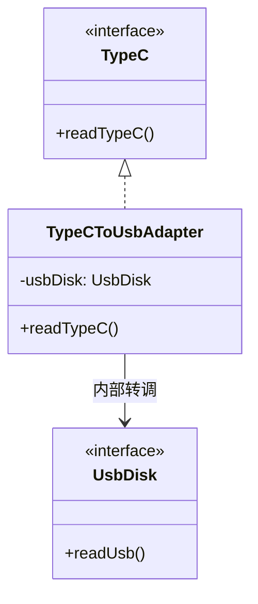
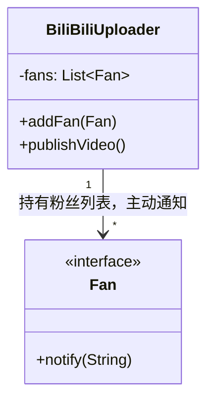

# 第2章：为什么我们需要设计模式？（程序员的黑话）

## 1. 小剧场：昨天留下的思考题

周一的早晨，小白顶着乱蓬蓬的头发，手里拿着两个包子冲进了办公室。刚坐下没多久，王哥端着他标志性的冰美式慢悠悠地走了过来。

**王哥**：“哟，小白，早啊。周末有没有想我给你留的那个问题？‘既然开闭原则说不要修改老代码，那如果老代码里有 Bug，咱们是不是也只能新增代码，不能改老代码？’”

**小白**（咽下一口包子，得意地笑了笑）：“王哥，我回去查了资料，还真想明白了！开闭原则针对的是**需求变更和功能扩展**。Bug 是什么？Bug 是原本就该实现但没实现对的东西，是咱们的失误！修复 Bug 属于‘纠错’，不属于‘扩展’。所以修 Bug 直接改老代码完全没毛病！”

**王哥**（满意地点点头）：“不错不错，没被绕进去。原则是死的，人是活的。那咱们今天进入正题，聊聊**设计模式**。小白，你觉得什么是设计模式？”

**小白**：“嗯……就是一些大神写代码的套路？能让代码看起来特别高大上，顺便能多拿点年终奖？”

**王哥**（差点喷出咖啡）：“庸俗！不过你说的‘套路’倒是挺贴切。来，我给你举个生活中的例子。”

---

## 2. 核心概念：设计模式到底是个啥？

### 1) 它是前人总结的“经典菜谱”

**王哥**：“假设你现在要给女朋友做一道‘西红柿炒鸡蛋’。如果是你第一次做，你可能会面临很多问题：先放西红柿还是先放鸡蛋？放几勺盐？要不要加糖？”

**小白**：“对对对，我上次先放的西红柿，结果炒成了一锅糊糊。”

**王哥**：“这就是你在乱写代码。但是，如果你去翻一翻《中华小当家菜谱》，上面清清楚楚地写着：‘热锅凉油，先炒散鸡蛋盛出；再起锅炒软西红柿出汁；最后倒入鸡蛋翻匀，加一勺盐半勺糖’。你只要照着做，味道绝对差不了。”

**王哥敲了敲白板**：“**设计模式，就是软件开发里的《经典菜谱》**。无数前辈在写代码时踩了无数的坑，最后总结出了在某种特定场景下，最优雅、最不容易出错的代码写法（套路）。你遇到类似问题，直接抄这个‘菜谱’就行了。”

**王哥**顺手在白板上写了两段代码：“你看，如果你不懂菜谱，你的代码就像左边这样全糊在一起；如果你懂菜谱（比如使用了未来要学的‘模板方法模式’），你的代码结构就会非常清晰，想犯错都难。”

```java
// ❌ 小白的初学代码（糊在一起，极容易漏掉步骤）
public class BadCook {
    public void cookTomatoEgg() {
        System.out.println("倒油...");
        System.out.println("放西红柿..."); // 糟了，还没炒鸡蛋呢！
        System.out.println("加盐出锅...");
    }
}

// ✅ 经典菜谱（设计模式套路：把做菜的骨架步骤固定下来）
public abstract class CookRecipePattern {
    // 这是一个标准的“模板方法”，规定死了做菜的顺序，绝不会乱
    public final void cook() {
        pourOil();
        fryIngredients();
        addSeasoning();
    }
    
    protected abstract void pourOil();
    protected abstract void fryIngredients();
    protected abstract void addSeasoning();
}
```

**小白**：“哇，下面这个写法，把做菜的骨架都定死了，我只需要去实现具体的炒菜动作就行了，连少放一味调料都不会发生，简直是手残党福音啊！”

### 2) 它是程序员沟通的“高级黑话”

**王哥**：“除了是菜谱，设计模式更重要的是一种**沟通的语言**。小白，你平时打《英雄联盟》或者《王者荣耀》吗？”

**小白**：“打啊！我国服第一亚索！”

**王哥**：“那我问你，如果团战打起来了，你想让队友过来帮你抓人，你会怎么喊？你会喊：‘兄弟们，请你们控制你们的英雄，沿着这条弯曲的小路，走到草丛里躲起来，等敌人出来的时候，我们一起释放技能攻击他’吗？”

**小白**（大笑）：“当然不会！我直接大喊一声：‘**打野来 Gank！**’或者‘**中单快 TP（传送）！**’，他们就全懂了呀。”

**王哥**：“没错！‘Gank’ 和 ‘TP’ 就是玩家之间的黑话，能把一大段复杂的战术动作浓缩成一个词。**设计模式也是程序员的黑话**。”

**王哥接着说**：“如果我们在过需求，我跟你说：‘小白，这里有个问题，由于这个对象的创建过程太复杂了，而且会有很多种变体。你能不能写一个单独的类，专门负责帮我们生产这个对象，别让业务逻辑直接去 new 它了？’”

**小白**：“听着好啰嗦啊……”

**王哥**：“对！但如果大家都懂设计模式，我只需要对你说四个字：‘**用工厂模式（Factory Pattern）**’。你一听就秒懂，回去咔咔咔把工厂类建好就完事了。这就是效率！”

---

## 3. 设计模式的三大门派

**王哥**拿出一支红色的白板笔：“既然是武功套路，那自然分门派。GoF（四人帮，提出设计模式的四位大神）把常见的 23 种设计模式分成了三大类。我用通俗的话给你翻译翻译。”

### 门派一：创建型模式 (Creational Patterns) —— 怎么生孩子的问题

**王哥**：“这类模式关心的是**如何优雅地创建对象（new 对象）**。”
- **生活场景**：如果你想找对象（找伴侣），你可以自己去大街上盲目地搭讪（自己在代码里到处 `new`）。但你也可以找个高端的婚介所（**工厂模式**），你只要告诉婚介所你要“温柔的”还是“霸道的”，婚介所直接把人带到你面前。
```java
// ❌ 自己盲目 new 对象（代码耦合度高）
Girlfriend gf = new GentleGirlfriend();

// ✅ 找婚介所（工厂）代劳（想要什么传参数即可）
Girlfriend gf = MatchmakerFactory.getGirlfriend("温柔");
```
- **代表武功**：单例模式、工厂方法模式、抽象工厂模式、建造者模式、原型模式。

### 门派二：结构型模式 (Structural Patterns) —— 怎么搭积木的问题

**王哥**：“这类模式关心的是**如何把多个类或者对象，像搭积木一样拼装成更大的结构**。”
- **生活场景**：你买了一台最新的苹果电脑，只有 Type-C 接口，但你的老旧 U 盘是 USB 接口的。怎么办？总不能把 U 盘扔了吧？于是你买了一个“Type-C 转 USB 转换器（扩展坞）”。这个转换器在代码里就叫**适配器模式 (Adapter)**。
```java
// 老旧的 USB 接口
interface UsbDisk { void readUsb(); }
// 苹果电脑的 Type-C 接口
interface TypeC { void readTypeC(); }

// ✅ 适配器登场：把 USB 包装成 Type-C 给电脑用
class TypeCToUsbAdapter implements TypeC {
    private UsbDisk usbDisk; // 内部拿着真正的USB
    public void readTypeC() {
        usbDisk.readUsb(); // 表面插的是Type-C，实际读的是USB
    }
}
```



**小白**：“原来适配器就是'表面一套接口，内部转调另一套接口'的中间商啊！”

- **代表武功**：适配器模式、装饰器模式、代理模式、外观模式、桥接模式、组合模式、享元模式。

### 门派三：行为型模式 (Behavioral Patterns) —— 它们之间怎么交流的问题

**王哥**：“这类模式关心的是**对象之间如何分工、如何通信交流**。”
- **生活场景**：你想及时知道你关注的 B站 UP主有没有更新视频。如果你每天去他的主页刷新 100 遍（轮询），那会累死。聪明的做法是，你点一下“关注”按钮。等他一发视频，B站系统就会主动发一条消息推送给你。这就叫**观察者模式 (Observer)**。
```java
// ✅ 观察者模式：UP主一更新，自动通知所有粉丝
class BiliBiliUploader {
    List<Fan> fans = new ArrayList<>();
    
    public void addFan(Fan fan) {
        fans.add(fan); // 粉丝点下“关注”按钮
    }
    
    public void publishVideo() {
        System.out.println("发布新视频！");
        for (Fan fan : fans) {
            fan.notify("你关注的UP主更新啦！"); // 遍历列表，主动推送消息
        }
    }
}
```



**小白**：“被观察的UP主（`BiliBiliUploader`）手里攥着一份粉丝（`Fan`）名单，有动静就一个个去敲门通知，谁都不用傻等轮询。”

- **代表武功**：策略模式、观察者模式、命令模式、状态模式、模板方法模式、责任链模式等。

**王哥**：“最后，给你一张'门派分布图'，把 GoF 23 种武功的归属整理一下，以后晕了就回来看看：”

```mermaid
graph TD
    GoF[GoF 23种设计模式] --> A[创建型：怎么生孩子]
    GoF --> B[结构型：怎么搭积木]
    GoF --> C[行为型：它们怎么交流]

    A --> A1[单例 Singleton]
    A --> A2[工厂方法/抽象工厂 Factory]
    A --> A3[建造者 Builder]
    A --> A4[原型 Prototype]

    B --> B1[适配器 Adapter]
    B --> B2[装饰器 Decorator]
    B --> B3[代理 Proxy]
    B --> B4[外观 Facade]
    B --> B5[桥接 Bridge]
    B --> B6[组合 Composite]
    B --> B7[享元 Flyweight]

    C --> C1[策略 Strategy]
    C --> C2[观察者 Observer]
    C --> C3[命令 Command]
    C --> C4[模板方法 Template Method]
    C --> C5[状态 State]
    C --> C6[责任链 Chain of Responsibility]
    C --> C7[迭代器 Iterator]
    C --> C8[备忘录 Memento]
    C --> C9[中介者 Mediator]
    C --> C10[访问者 Visitor]
    C --> C11[解释器 Interpreter]
```



---

## 4. 课后总结与吐槽

**小白**的笔记上写满了感叹号：
- 设计模式不是炫技，而是前人踩坑总结出的**标准解法（菜谱）**。
- 掌握设计模式，就能和高级开发人员进行高效率的**黑话交流**。
- 三大门派：**创建型**（负责造）、**结构型**（负责拼）、**行为型**（负责聊）。

> [!NOTE]
> **动手试试**
> 1. 不看上面的'门派分布图'，自己默写：23 种模式里，哪些是创建型、哪些是结构型、哪些是行为型？写完再回来对答案。
> 2. 回想你做过的项目，找出一处"明明可以用某个模式、却写成了一坨 if-else"的代码，先记下来——读到对应章节时回头重构它。
> 3. **思考**：本章说"设计模式是黑话/菜谱"。那为什么不能无脑地见坑就上模式？（提示：留着这个问题，到最后一章王哥的临别赠言里找答案。）

**小白**：“王哥，我已经热血沸腾了！咱们赶紧学第一招吧！第一招学哪个？”

**王哥**（喝完最后一口咖啡，把纸杯扔进垃圾桶）：“第一招，我们来学整个武林中最简单、但也是面试官最爱考的一招——**单例模式 (Singleton)**。”

> [!TIP]
> **王哥的思考题**
> “小白，如果我们的系统配置、全局连接池等对象创建非常昂贵，每次用的时候都去 `new` 一个，会导致什么后果？如果我们想在全局锁死，让这些对象在整个系统运行期间**有且仅有一个**，绝对不允许别人在外部调用 `new` 关键字去多造出来，在语法层面上该怎么做？”
