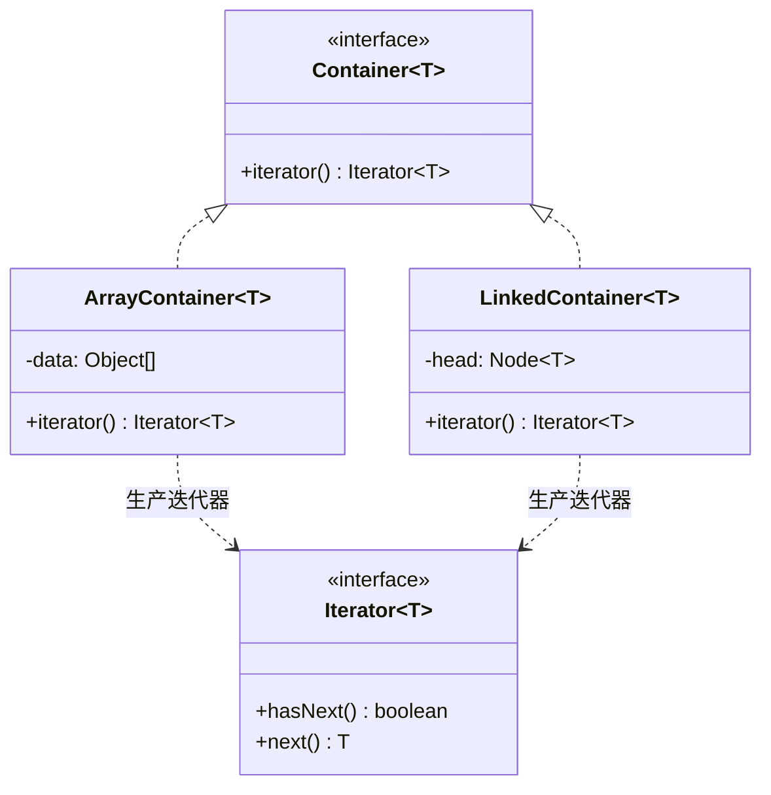

# 第20章：天天写的 for-each——迭代器模式 (Iterator)

## 1. 小剧场：换个集合，遍历代码就崩了

周四，小白拿着上次的思考题来找王哥：“王哥，我想了想那个 `for-each`。同样一句 `for (X x : 集合)`，能遍历 `ArrayList`、`HashSet`、`LinkedList`……我猜，是不是有个什么'统一接口'在背后撑着？”

**王哥**（赞许地点头）：“悟性见长。你先看看，如果**没有**这个统一接口，会是什么惨状。假设你自己写了个数组集合，遍历得这样：”

```java
// 调用方被迫知道集合内部是"数组 + 个数"
MyArrayList list = ...;
for (int i = 0; i < list.getCount(); i++) {
    System.out.println(list.getData()[i]);   // 直接戳人家内部的 data 数组
}
```

**王哥**：“这里有两个要命的问题：第一，调用方**被迫知道**集合内部是数组、要用下标取——封装被你戳破了。第二，哪天集合内部从数组换成链表，`getData()[i]` 这种写法**全得崩**，所有遍历它的代码都要重写。”

**小白**：“对……而且我有数组集合、链表集合、树集合，每种遍历写法都不一样，根本没法用一套代码统一处理。”

**王哥**：“这就是**迭代器模式（Iterator）**要解决的。核心思路——**把'遍历'这个职责从集合里单独抽出来，封装成一个迭代器对象。集合只负责'生产'一个迭代器，调用方只认 `hasNext()` / `next()` 两个方法，根本不关心你内部是数组还是链表**。”

---

## 2. 核心概念：把"遍历"封装成一个独立对象

```java
// 迭代器接口：只暴露"还有没有下一个""取下一个"
public interface Iterator<T> {
    boolean hasNext();
    T next();
}

// 容器接口：我不关心你内部怎么存，只要你能"造"一个迭代器出来
public interface Container<T> {
    Iterator<T> iterator();
}
```

```java
// 实现一：内部用数组的集合
public class ArrayContainer<T> implements Container<T> {
    private Object[] data;
    private int count;
    public ArrayContainer(Object[] data, int count) { this.data = data; this.count = count; }

    public Iterator<T> iterator() {
        // 把遍历逻辑封装进一个内部类，外部完全看不到 data 数组
        return new Iterator<T>() {
            private int cursor = 0;                       // 遍历状态藏在迭代器里
            public boolean hasNext() { return cursor < count; }
            @SuppressWarnings("unchecked")
            public T next() { return (T) data[cursor++]; }
        };
    }
}
```

```java
// 实现二：内部用链表的集合 —— 内部结构完全不同
public class LinkedContainer<T> implements Container<T> {
    private static class Node<T> { T val; Node<T> next; Node(T v){ val = v; } }
    private Node<T> head, tail;

    public void add(T v) {
        Node<T> n = new Node<>(v);
        if (head == null) head = tail = n;
        else { tail.next = n; tail = n; }
    }

    public Iterator<T> iterator() {
        return new Iterator<T>() {
            private Node<T> cur = head;                   // 游标是"当前节点"，不是下标
            public boolean hasNext() { return cur != null; }
            public T next() { T v = cur.val; cur = cur.next; return v; }
        };
    }
}
```

```java
// 调用方：同一套遍历代码，喂给两种内部结构完全不同的集合
static <T> void printAll(Container<T> c) {
    Iterator<T> it = c.iterator();
    while (it.hasNext()) {
        System.out.println(it.next());     // 完全不知道、也不关心内部是数组还是链表
    }
}

printAll(new ArrayContainer<>(new Object[]{"王哥", "小白"}, 2));
LinkedContainer<String> lk = new LinkedContainer<>();
lk.add("张三"); lk.add("李四");
printAll(lk);                              // 同一个 printAll，照样跑
```

**小白**（恍然大悟）：“我懂了！遍历的'游标'状态——数组是下标 `cursor`、链表是当前节点 `cur`——都**藏在各自的迭代器内部**，集合本身一点不脏。而 `printAll` 只认 `hasNext/next`，**换什么集合都不用改一个字**！”



---

## 3. 模式精讲：你早就在用它了

**王哥**：“这套东西，就是 **Java 集合框架的根基**。`java.util.Iterator` 就是上面那个接口；你之所以能写 `for (String s : list)`，是因为所有集合都实现了 `Iterable` 接口——而 `Iterable` 里就一个方法 `iterator()`。`for-each` 只是编译器帮你把它翻译成了 `while (it.hasNext())` 而已。”

**小白**：“怪不得 `ArrayList`、`HashSet`、`LinkedList` 能用同一句 `for-each`！那它还有什么讲究？”

**王哥**：“几个实战点你记一下：

1. **职责分离**：集合管'存数据'，迭代器管'怎么遍历'。两件事解耦，所以同一个集合甚至能有多种迭代器（正序、逆序）。
2. **不暴露内部**：调用方永远拿不到内部的 `data` 数组或链表节点，封装稳如泰山。
3. **fail-fast**：Java 的集合迭代器有个保护机制——遍历过程中你要是直接 `list.remove(x)` 改了结构，它会抛 `ConcurrentModificationException`。想边遍历边删，得用迭代器自己的 `it.remove()`。这是个高频面试题，也是高频 bug。”

**王哥**：“一句话——**迭代器模式：把遍历职责从集合里抽出来，让你用统一的方式遍历任何集合，还不暴露其内部结构**。”

---

## 4. 课后总结与吐槽

小白给自己的两种集合都实现了 `Iterator`，从此一套 `while (hasNext())` 通吃，再也不用为每种集合写一套遍历。

**小白的笔记**：
1. **迭代器模式**：把"遍历"封装成独立对象，集合只负责`iterator()`生产它，调用方只认 `hasNext()/next()`。
2. 遍历状态（下标 / 当前节点）藏在迭代器里，不暴露集合内部结构。
3. `for-each` 的本质：集合实现 `Iterable`，编译器翻译成迭代器循环。
4. 坑：边遍历边改结构会触发 **fail-fast**（`ConcurrentModificationException`），删元素要用 `it.remove()`。

> [!NOTE]
> **动手试试**
> 1. 给 `ArrayContainer` 再写一个**逆序**迭代器 `reverseIterator()`（游标从 `count-1` 递减到 0）。验证同一个集合可以有两种遍历方式，而集合本身的存储一点没动。
> 2. 让你的 `Container` 接口去 `extends java.lang.Iterable`，把方法名对齐成标准的 `iterator()`，然后直接用 `for (x : container)` 遍历——亲手验证 `for-each` 就是迭代器。
> 3. **复现 fail-fast**：用 `ArrayList` 写一个 `for (Integer i : list) { if (i==2) list.remove(i); }`，观察它抛 `ConcurrentModificationException`；再改用 `Iterator.remove()` 让它正常工作。

**王哥**：“迭代器管'怎么把元素一个个取出来'。接下来这个模式，管的是'怎么把一个对象的状态**存起来、再倒回去**'——”

> [!TIP]
> **王哥的思考题**
> “你在做一个画图工具，用户狂按 Ctrl+Z 想撤销。第16章的命令模式能'反向执行一步'，但有些操作反向很难——比如用户一次性改了图形的颜色、大小、位置好几个属性，你很难精确地'反着推'回去。有没有一种更干脆的办法：在每步操作前，直接给对象的状态**拍一张快照**存着，撤销时把快照'冲洗'回去，一步到位地还原到那一刻？”

（小白想起自己昨天误删了半张图、又找不回来的崩溃瞬间，来了精神……）

---
*下一章，备忘录模式将教小白如何给对象状态"拍快照、可回档"。*
