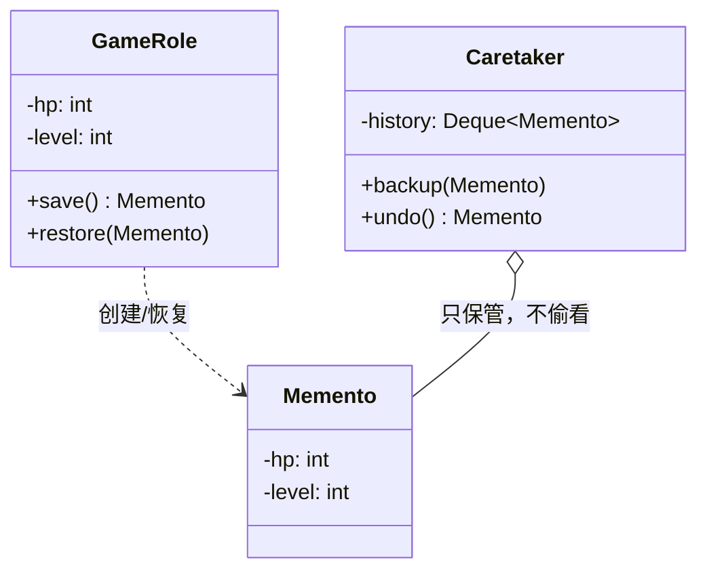

# 第21章：给对象拍快照——备忘录模式 (Memento)

## 1. 小剧场：撤销，反着推太难了

周五，小白在给画图工具做"撤销"。他想起第16章的命令模式，于是给每个操作写 `undo()`，可写着写着就卡住了。

```java
// 用户一次"美化"操作，同时改了好几个属性
public void beautify(Shape s) {
    s.setColor("红色");
    s.setWidth(200);
    s.setX(50);
    // 那 undo() 怎么写？要把 color、width、x 一个个反着记下来再设回去……
    // 属性一多就乱成一锅粥，还容易记漏
}
```

**王哥**：“小白，这就是上次思考题的难处。命令模式的 `undo()` 是'**反着做一遍**'——开灯的反操作是关灯，简单。可你这个'美化'一次改了三个属性，你得把每个旧值都记下来、再逐个设回去，属性越多越容易出错。”

**小白**：“是啊，太繁琐了。有没有更干脆的办法？”

**王哥**：“有。**别去'反推'，直接'拍快照'**。在操作前，把对象当时的完整状态'咔嚓'拍一张存起来；要撤销时，把这张快照整个'冲洗'回去，一步还原。这就是**备忘录模式（Memento）**。它和命令模式的 `undo()` 是撤销的'两条腿'：命令是'反着做一遍'，备忘录是'直接复原'。”

---

## 2. 核心概念：三个角色，各管一摊

**王哥**：“拍快照有个讲究：**不能为了拍照就把对象的私有字段全掏出来给外面看**，那封装就破了。所以备忘录模式安排了三个角色：

- **原发器（Originator）**：被拍照的对象（你的图形 / 游戏角色）。只有它能'拍'和'读'自己的快照。
- **备忘录（Memento）**：那张快照本身，把状态包得严严实实。
- **管理者（Caretaker）**：存快照的'相册'。它只负责保管，**看不到快照里面是什么**。”

为了让"只有原发器能读快照"这件事落地，实战中常把备忘录做成原发器的**内部类**：

```java
// 原发器：游戏角色，负责"拍照"和"读档"
public class GameRole {
    private int hp;
    private int level;

    public void play(int hp, int level) {
        this.hp = hp; this.level = level;
        System.out.println("当前状态 → HP:" + hp + " 等级:" + level);
    }

    // 拍照：把当前状态打包进备忘录
    public Memento save() { return new Memento(hp, level); }

    // 读档：从备忘录恢复状态
    public void restore(Memento m) {
        this.hp = m.hp; this.level = m.level;
        System.out.println("已读档 → HP:" + hp + " 等级:" + level);
    }

    // 内部类备忘录：private 字段只有外层 GameRole 能访问，外部完全黑盒
    public static class Memento {
        private final int hp;
        private final int level;
        private Memento(int hp, int level) { this.hp = hp; this.level = level; }
    }
}
```

```java
// 管理者：只管保存，看不见里面是什么
public class Caretaker {
    private final Deque<GameRole.Memento> history = new ArrayDeque<>();
    public void backup(GameRole.Memento m) { history.push(m); }   // 入栈
    public GameRole.Memento undo() { return history.pop(); }      // 出栈，回到上一个存档
    public boolean hasBackup() { return !history.isEmpty(); }
}
```

```java
GameRole role = new GameRole();
Caretaker album = new Caretaker();

role.play(100, 1);
album.backup(role.save());      // 存档点 1

role.play(30, 5);               // 打了个 BOSS，残血了
album.backup(role.save());      // 存档点 2

role.restore(album.undo());     // 读档 → 回到 HP:30 等级:5（最近一次存档）
role.restore(album.undo());     // 再读档 → 回到 HP:100 等级:1
```

**小白**：“妙！备忘录把'快照'包得严严实实，`Caretaker` 只是个'相册'，**根本看不到角色的血量等级**，封装一点没破坏。撤销时直接整张快照还原，再也不用一个个属性反着推了！”



---

## 3. 模式精讲：到处都是它的影子

**王哥**：“备忘录的核心就一句——**在不破坏封装的前提下，捕获对象状态并存到外部，以便随时恢复**。你平时见到的这些，本质都是它：

- **编辑器的 Ctrl+Z / Ctrl+Y**：每步操作前存快照，撤销重做就是在快照栈里前后跳。
- **游戏存档 / 读档**：存档文件就是一张大快照。
- **数据库事务的回滚点（Savepoint）**、Spring 的 `@Transactional` 回滚——先记下状态，出错就还原。”

**王哥**：“用的时候注意两个代价：

1. **内存**：如果对象很大、存档又频繁，快照会吃内存。常见优化是只存'增量'（差异），而不是每次都存整个对象。
2. **深拷贝陷阱**：快照里如果存的是对象引用（比如一个 `List`），那只是浅拷贝——原对象改了，快照也跟着变，等于没存。这点和第6章原型模式的'深浅拷贝'是同一个坑。存可变对象时要拷贝一份。”

---

## 4. 课后总结与吐槽

小白用备忘录给画图工具实现了多步撤销：每步操作前 `save()` 一张快照丢进栈，Ctrl+Z 就 `pop` 出来 `restore()`，干净利落。

**小白的笔记**：
1. **备忘录模式**：操作前给对象状态"拍快照"存到外部，撤销时整张还原——比命令模式"反向执行"更适合"一次改一堆属性"的场景。
2. 三角色：**原发器**（拍/读快照）、**备忘录**（快照本体）、**管理者**（只保管不偷看）。
3. 把备忘录做成原发器的**内部类**，可保证只有原发器能读写它，不破坏封装。
4. 代价：存档吃内存（可存增量）、存可变对象当心**浅拷贝**陷阱（同第6章）。

> [!NOTE]
> **动手试试**
> 1. 给 `Caretaker` 再加一个 `redo()`：撤销后还能"重做"。提示——需要再维护一个"重做栈"，撤销时把弹出的快照压进重做栈。
> 2. 把 `GameRole` 里加一个 `List<String> bag`（背包）字段，让 `save()` 时**深拷贝**这个 list。然后验证：存档后往背包里加东西，再读档，背包能正确回到存档时的样子（如果用浅拷贝会怎样？）。
> 3. **思考**：如果要存 1000 个存档点、每个对象又很大，全量快照会爆内存。查一查"增量快照 / 命令模式做 undo"两种思路，说说各自适合什么场景。

**王哥**：“备忘录管的是'一个对象自己的状态'。下一个模式，治的是'一堆对象之间乱成一团的关系'——”

> [!TIP]
> **王哥的思考题**
> “你做一个复杂的注册表单：'国家'下拉框一变，'省份'框要跟着刷新、'提交'按钮要重新校验、底部的'提示语'也要更新。如果让每个控件都**直接持有并调用**其它所有控件——国家框里写省份框、提交按钮、提示语的代码——那 N 个控件两两关联，连线多到像一团乱麻，加一个新控件就要去改一堆旧控件。有没有办法让这些控件**互相不认识**，所有联动逻辑都交给一个'协调中心'来管？”

（小白看着自己那个控件之间互相调用、改一处崩三处的表单，头都大了……）

---
*下一章，中介者模式将教小白如何把"网状"依赖收成"星形"。*
