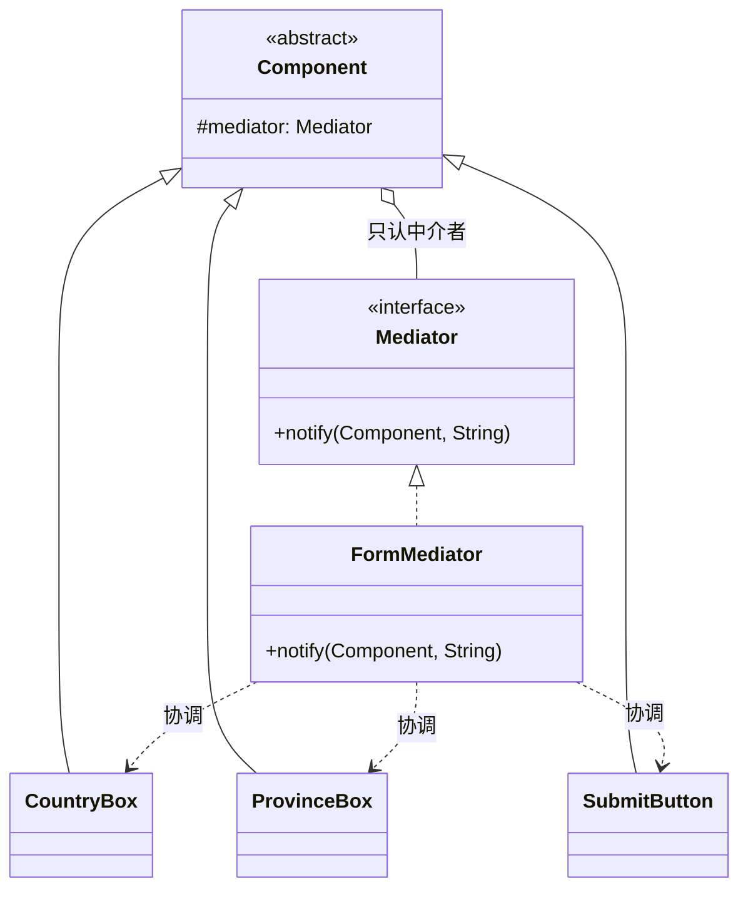

# 第22章：把乱麻收成星形——中介者模式 (Mediator)

## 1. 小剧场：控件们织成了一张网

周一，小白在做上次思考题里的注册表单。控件之间互相调用，他写出了这样的代码：

```java
// 国家下拉框：内部直接持有并调用其它所有控件
public class CountryBox {
    private ProvinceBox province;     // 认识省份框
    private SubmitButton submit;      // 认识提交按钮
    private Tip tip;                  // 认识提示语
    // ……以后再加控件，这里还得继续加字段

    public void onChange() {
        province.reload();            // 手动通知每一个相关控件
        submit.refreshState();
        tip.update();
    }
}
```

**王哥**：“小白，这就是上次说的'网状结构'噩梦。你看 `CountryBox`，为了联动，它**直接认识**了省份框、提交按钮、提示语。同样地，省份框可能又认识别的控件……N 个控件两两关联，连线是 N² 级别的，活像一团乱麻。”

**小白**：“是啊，我加一个'城市'控件，得回头改国家框、省份框好几个地方。而且这些控件之间耦合得死死的，根本没法单独复用。”

**王哥**：“根子在于——**控件之间直接互相引用**。中介者模式的思路很简单：**把这张网改成'星形'。所有控件都不直接联系，而是只跟一个中央的'中介者'打交道。控件有事就通知中介者，由中介者去协调其他控件**。就像同事之间不直接对接、全走项目经理，飞机之间不直接通话、全听塔台指挥。”

---

## 2. 核心概念：所有人只认中介者

```java
// 中介者接口：同事们有事都来通知它
public interface Mediator {
    void notify(Component sender, String event);
}

// 抽象同事：只持有中介者，不持有其他任何同事
public abstract class Component {
    protected Mediator mediator;
    public Component(Mediator mediator) { this.mediator = mediator; }
}
```

```java
// 具体同事们：各干各的，要联动就喊中介者，彼此互不相识
public class CountryBox extends Component {
    public CountryBox(Mediator m) { super(m); }
    public void onChange() {
        System.out.println("国家变了");
        mediator.notify(this, "countryChanged");   // 不直接碰别的控件，只通知中介者
    }
}
public class ProvinceBox extends Component {
    public ProvinceBox(Mediator m) { super(m); }
    public void reload() { System.out.println("省份列表已刷新"); }
}
public class SubmitButton extends Component {
    public SubmitButton(Mediator m) { super(m); }
    public void refreshState() { System.out.println("提交按钮重新校验"); }
}
```

```java
// 具体中介者：唯一知道"谁联动谁"的地方，协调逻辑全收口在这
public class FormMediator implements Mediator {
    private ProvinceBox province;
    private SubmitButton submit;
    public void setProvince(ProvinceBox p) { this.province = p; }
    public void setSubmit(SubmitButton s) { this.submit = s; }

    public void notify(Component sender, String event) {
        if ("countryChanged".equals(event)) {
            province.reload();          // 国家一变，中介者负责刷新省份
            submit.refreshState();      // 顺带让提交按钮重新校验
        }
        // 以后加联动规则，只在这里加分支，控件本身一个字不用改
    }
}
```

```java
FormMediator mediator = new FormMediator();
CountryBox country = new CountryBox(mediator);
ProvinceBox province = new ProvinceBox(mediator);
SubmitButton submit = new SubmitButton(mediator);
mediator.setProvince(province);
mediator.setSubmit(submit);

country.onChange();
// 输出：国家变了 → 省份列表已刷新 → 提交按钮重新校验
```

**小白**：“清爽多了！每个控件只认识中介者，**控件之间互不相识**。所有'谁联动谁'的复杂逻辑，全收口到 `FormMediator` 一个地方。加控件、改联动规则，只动中介者！”



---

## 3. 模式精讲：星形的好处与"上帝类"的风险

**王哥**：“中介者的核心——**用一个中介对象封装一系列对象的交互，把'网状'依赖变成'星形'依赖**。好处很直接：

- **解耦**：同事之间互不引用，每个都能单独测试、单独复用。
- **集中管控**：所有交互逻辑收口一处，想看'这个表单到底有哪些联动'，看中介者就够了。”

**小白**：“实战里哪些是中介者？”

**王哥**：“非常多：

- **MVC / MVP 里的 Controller / Presenter**：View 和 Model 不直接对话，全经过它。
- **消息中间件 / 事件总线（EventBus）**：发布者和订阅者互不认识，全靠总线转发。
- **聊天室服务器**：用户 A 不直接给用户 B 发消息，而是发给服务器，由服务器转发——这是中介者最经典的教科书例子。”

**王哥**（话锋一转）：“但它有个**致命风险**你必须知道：**中介者自己容易膨胀成一个无所不知、无所不管的'上帝类'**。所有交互都往里塞，它就会变成一坨新的屎山。所以要控制好它的边界——它只该管'协调谁和谁联动'，不该把每个控件的业务逻辑也抢过来。”

**小白**：“懂了。它和第15章的观察者有点像，都是'解耦通信'？”

**王哥**：“像，但不一样。**观察者是'一对多广播'**——发布者不在乎谁在听，无脑群发。**中介者是'多对多协调'**——它清楚地知道'A 变了要联动 B 和 C'，里头是有**编排逻辑**的。一个是喇叭，一个是调度台。”

---

## 4. 课后总结与吐槽

小白用中介者重构表单，控件之间的相互引用全部斩断，每个控件只认 `Mediator`，新增"城市"联动也只是在中介者里加了一个分支。

**小白的笔记**：
1. **中介者模式**：用中介对象收口一群对象的交互，把"网状"依赖（N²连线）变成"星形"依赖。
2. 同事之间**互不引用**，只认中介者；所有联动逻辑集中在中介者里。
3. 实战：MVC 的 Controller、事件总线、聊天室服务器。
4. 风险：中介者别膨胀成"上帝类"。与观察者的区别：观察者是**一对多广播**，中介者是**多对多协调（带编排逻辑）**。

> [!NOTE]
> **动手试试**
> 1. 给表单新增一个"城市"控件 `CityBox`，让"省份变化"联动刷新城市。验证：你只在 `FormMediator` 里加了一个 `provinceChanged` 分支，没有改动任何已有控件。
> 2. 写一个迷你聊天室：`User` 发消息只调用 `chatRoom.send(this, msg)`，由 `ChatRoom`（中介者）转发给其他所有用户。体会"用户之间互不持有引用"。
> 3. **思考**：如果联动规则越来越多，`notify` 里的 `if-else` 也会膨胀。回想第14章策略模式——你能不能用一张 `Map<事件, 处理逻辑>` 把这堆 `if-else` 也干掉？

**王哥**：“到这儿，常用的行为型模式就讲完了。最后还剩两个'听起来高大上、但你日常 CRUD 基本用不到'的——它们更多是让你**看懂别人的设计**。先看第一个，专治'数据结构稳定、但操作老在加'的情况——”

> [!TIP]
> **王哥的思考题**
> “你有一棵稳定的对象树——比如订单里的各种条目：商品、运费、优惠券，类型基本固定不变。但要对它做的**操作**越来越多：算总价、生成对账单、导出 JSON、做风控校验……每加一个操作，你就得跑到**每一个条目类**里加一个方法，改得到处都是，违反开闭原则。有没有办法把'操作'从'数据结构'里彻底抽出来，**加新操作时一个条目类都不用动**？”

（小白看着自己那几个被加了十几个方法、越来越臃肿的条目类，皱起了眉……）

---
*下一章，访问者模式将教小白如何"给稳定结构外挂可扩展的操作"。*
