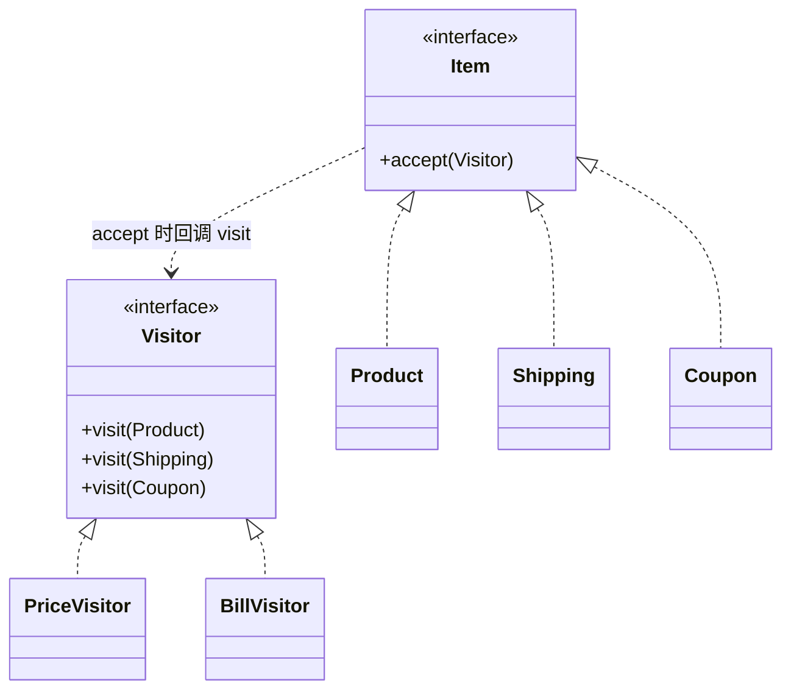

# 第23章：给稳定结构外挂操作——访问者模式 (Visitor)

> 本章和下一章是两个"听起来高大上、日常 CRUD 却很少手写"的模式。王哥讲它们，重点不在"让你去用"，而在"让你看懂别人为什么这么设计"。

## 1. 小剧场：条目类被操作撑肿了

周二，小白在做订单系统。订单里有几种固定的条目：商品、运费、优惠券。一开始还好，可产品的需求一个接一个：

```java
// 一开始，条目类还算干净
public class Product {
    String name; double price; int qty;
    double amount() { return price * qty; }     // 算金额
}

// 然后产品要"导出对账单"，于是每个条目类都得加一个方法
public class Product {
    String name; double price; int qty;
    double amount() { return price * qty; }
    String toBill() { ... }                     // 加：对账单
    String toJson() { ... }                     // 又加：导出 JSON
    boolean riskCheck() { ... }                 // 再加：风控校验
    // ……每来一个新操作，Product / Shipping / Coupon 三个类全都要改一遍
}
```

**王哥**：“小白，这就是上次思考题的痛点。你的**条目类型是稳定的**——就商品、运费、优惠券这几种，几乎不变。可你要对它们做的**操作却越来越多**：算钱、对账单、导 JSON、风控……每加一个操作，你都得把三个条目类挨个改一遍。改得到处都是，还违反开闭原则。”

**小白**：“对，我现在最怕产品说'再加个导出格式'，一加就得动所有条目类。”

**王哥**：“关键判断来了——你这是'**数据结构稳定、操作频繁变**'。对付这种，有个专门的模式：**访问者模式（Visitor）**。它的思路是——**把'操作'从'数据结构'里抽出来，做成一个独立的'访问者'对象。加新操作，就写一个新访问者，一个条目类都不用动**。”

---

## 2. 核心概念：accept + visit 的"双分派"

**王哥**：“访问者模式有个稍微绕的地方，叫'**双分派（double dispatch）**'，我带你一步步看。

先约定两件事：
- 每个条目（元素）提供一个 `accept(visitor)` 方法，意思是'我接受一个访问者来处理我'。
- 每个访问者提供一组 `visit(具体条目)` 方法，意思是'我知道怎么处理每一种条目'。

`accept` 里只做一件事：把'我自己'回传给访问者——`visitor.visit(this)`。就这一下回调，完成了'**先确定是哪种元素，再确定是哪种操作**'的两次分派。”

```java
// 元素接口：接受访问者
public interface Item {
    void accept(Visitor v);
}

public class Product implements Item {
    String name; double price; int qty;
    public Product(String name, double price, int qty) { this.name=name; this.price=price; this.qty=qty; }
    public void accept(Visitor v) { v.visit(this); }   // 回调：把"我是Product"这个信息交给访问者
}

public class Shipping implements Item {
    double fee;
    public Shipping(double fee) { this.fee = fee; }
    public void accept(Visitor v) { v.visit(this); }
}

public class Coupon implements Item {
    double discount;
    public Coupon(double discount) { this.discount = discount; }
    public void accept(Visitor v) { v.visit(this); }
}
```

```java
// 访问者接口：声明"我能处理每一种条目"
public interface Visitor {
    void visit(Product p);
    void visit(Shipping s);
    void visit(Coupon c);
}
```

```java
// 具体访问者一：算总价。所有"算钱"的逻辑集中在这一个类里
public class PriceVisitor implements Visitor {
    private double total = 0;
    public void visit(Product p)  { total += p.price * p.qty; }
    public void visit(Shipping s) { total += s.fee; }
    public void visit(Coupon c)   { total -= c.discount; }       // 优惠券是减钱
    public double getTotal() { return total; }
}

// 具体访问者二：导出对账单。新增这个操作，没有动任何 Item 类！
public class BillVisitor implements Visitor {
    private StringBuilder sb = new StringBuilder();
    public void visit(Product p)  { sb.append("商品 ").append(p.name).append(" x").append(p.qty).append("\n"); }
    public void visit(Shipping s) { sb.append("运费 ").append(s.fee).append("\n"); }
    public void visit(Coupon c)   { sb.append("优惠 -").append(c.discount).append("\n"); }
    public String getBill() { return sb.toString(); }
}
```

```java
List<Item> order = List.of(
    new Product("机械键盘", 299, 1),
    new Shipping(12),
    new Coupon(50)
);

// 算总价：让算价访问者逐个访问
PriceVisitor price = new PriceVisitor();
for (Item item : order) item.accept(price);
System.out.println("应付：" + price.getTotal());   // 299 + 12 - 50 = 261

// 导对账单：换一个访问者，条目类一个字没改
BillVisitor bill = new BillVisitor();
for (Item item : order) item.accept(bill);
System.out.print(bill.getBill());
```

**小白**（盯着代码）：“我捋一下——`item.accept(v)` 先确定了'我是哪种条目'（Product 还是 Shipping），然后 `v.visit(this)` 又根据访问者的类型确定了'要做哪种操作'（算钱还是对账单）。**两个维度交叉**，靠这一次回调就对上了。而且我要加'导出 JSON'，只需写一个 `JsonVisitor`，三个条目类一个都不用动！”



---

## 3. 模式精讲：为什么它实战少见

**王哥**：“访问者把'操作'变成了可自由扩展的访问者，**加操作非常爽**。但它有个**致命的对称代价**——你看出来了吗？”

**小白**（想了想）：“……如果我要加一种**新条目类型**，比如'赠品 Gift'，那所有访问者（`PriceVisitor`、`BillVisitor`、`JsonVisitor`……）都得加一个 `visit(Gift)` 方法？”

**王哥**：“一针见血！这就是访问者的命门：

| 变化方向 | 访问者模式的反应 |
| --- | --- |
| 加一个**操作**（新访问者） | 爽，一个元素类都不用动 ✅ |
| 加一个**元素类型**（新条目） | 惨，所有访问者全都要改 ❌ |

所以访问者**只在一种情况下划算：元素类型基本稳定、但操作频繁增加**。这在日常业务里恰恰是少数——业务里'数据类型'往往比'操作'变得更勤。所以你在 CRUD 项目里很少手写它。

它真正的主场是：**编译器 / AST 语法树遍历**（节点类型固定，但要做求值、类型检查、代码生成、格式化等无数种操作）、**序列化框架**、字节码处理工具（如 ASM）。你以后读到这些源码，看到一堆 `visitXxx`，就知道是它了。”

---

## 4. 课后总结与吐槽

小白没有真的在订单系统里上访问者——他算了一下，订单条目类型其实也会变（以后要加赠品、加运费险），用了反而更僵。但他彻底搞懂了它的取舍。

**小白的笔记**：
1. **访问者模式**：把"操作"从"数据结构"里抽成独立的访问者对象，加新操作不用动元素类。
2. 靠 **accept + visit 的双分派**：先定元素类型，再定操作类型。
3. **命门**：加操作爽，但加**元素类型**时所有访问者都得改——只适合"结构稳定、操作常变"。
4. 主场是编译器 / AST 遍历、序列化框架，日常业务少见。**判断不划算就别用，这本身就是一种成熟**。

> [!NOTE]
> **动手试试**
> 1. 新增一个 `JsonVisitor`，把订单条目导出成 JSON 字符串。验证：你没有改动 `Product`/`Shipping`/`Coupon` 任何一个。
> 2. 现在反过来：给订单加一个新条目类型 `Gift`（赠品）。亲手感受一下——你被迫去改了几个访问者类？这就是访问者的代价。
> 3. **思考**：结合第12章组合模式——如果订单条目是一棵**树**（套餐里还含子条目），访问者要怎么在 `accept` 里递归地访问子节点？写写看。

**王哥**：“访问者是'结构稳定、操作扩展'。最后一个模式，更小众，但思想很有意思——'**给一段自定义的小规则，写一个能读懂它的翻译官**'——”

> [!TIP]
> **王哥的思考题**
> “产品要做一个'优惠规则引擎'，让运营在后台自己配规则，比如 `满100 且 是会员`、`周末 或 新人`。这些规则是运营敲进去的**字符串**，你得在运行时把它解析、求值成 true / false。如果你用 if-else 去硬编码每一种规则组合，运营天马行空地一组合，你根本扛不住。有没有办法把这种'自定义的小规则语言'，解析成一棵能**递归求值**的结构？”

（小白想起产品那句"让运营随便配"，后背一凉……）

---
*下一章，解释器模式将教小白如何"给一门小语言写求值器"，并为全书画上句号。*
