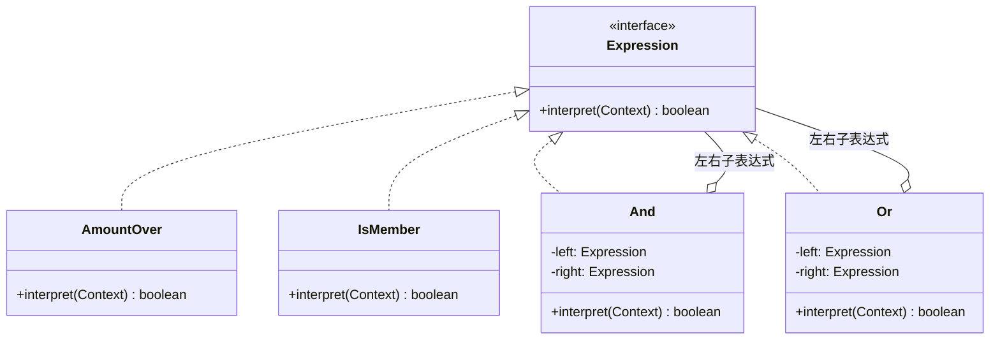

# 第24章：给小语言写翻译官——解释器模式 (Interpreter)

## 1. 小剧场：运营要"随便配"优惠规则

周三，小白对着产品给的需求发呆：运营要在后台自己配优惠规则，像 `满100 且 是会员`、`周末 或 新人`。他第一反应是用 if-else 硬扛：

```java
// 小白的写法：把每一种规则组合都写死
public boolean match(String rule, Order order) {
    if (rule.equals("满100且是会员")) {
        return order.amount >= 100 && order.isMember;
    } else if (rule.equals("周末或新人")) {
        return order.isWeekend || order.isNewUser;
    }
    // 运营再配一个"满200且周末且不是新人"……我就得再加一个 else if
    // 组合是无穷的，这方法迟早爆炸
    return false;
}
```

**王哥**：“小白，这就是上次思考题的死路。运营的规则是**他自己现配的字符串**，组合无穷无尽，你不可能把每种组合都写一个 `else if`。”

**小白**：“那这种'让用户自己写规则'的需求，到底该怎么接？”

**王哥**：“你得换个角度看——运营配的这些规则，其实是一门**很小的语言**：有'值'（满100、是会员），有'运算'（且、或）。你要做的，是给这门小语言写一个'**翻译官**'，把规则字符串解析成一棵**表达式树**，再**递归地求值**出 true / false。这就是**解释器模式（Interpreter）**。”

---

## 2. 核心概念：每条语法规则，对应一个类

**王哥**：“解释器的做法：**为这门小语言的每一种语法元素，定义一个类。它们都实现同一个 `interpret()` 方法。把一句规则拼成一棵树，对树根调用 `interpret()`，它会自动递归地把整棵树求值出来**。”

**王哥**：“语法元素分两种：

- **终结符表达式**：语言里最小的、不能再拆的'值'。比如'满100''是会员'。
- **非终结符表达式**：把别的表达式组合起来的'运算'。比如'且（AND）''或（OR）'，它们内部装着左右两个子表达式。”

```java
// 上下文：求值时需要的外部数据（订单的各种事实）
public class Context {
    public double amount;
    public boolean isMember;
    public boolean isWeekend;
    public boolean isNewUser;
}

// 抽象表达式：所有规则都能"求值"
public interface Expression {
    boolean interpret(Context ctx);
}
```

```java
// —— 终结符表达式：最小的"值" ——
public class AmountOver implements Expression {     // 满 N 元
    private final double threshold;
    public AmountOver(double threshold) { this.threshold = threshold; }
    public boolean interpret(Context ctx) { return ctx.amount >= threshold; }
}
public class IsMember implements Expression {       // 是会员
    public boolean interpret(Context ctx) { return ctx.isMember; }
}
public class IsWeekend implements Expression {      // 是周末
    public boolean interpret(Context ctx) { return ctx.isWeekend; }
}
public class IsNewUser implements Expression {      // 是新人
    public boolean interpret(Context ctx) { return ctx.isNewUser; }
}
```

```java
// —— 非终结符表达式：把子表达式组合起来的"运算" ——
public class And implements Expression {
    private final Expression left, right;
    public And(Expression left, Expression right) { this.left = left; this.right = right; }
    public boolean interpret(Context ctx) {
        return left.interpret(ctx) && right.interpret(ctx);   // 递归求值左右两边
    }
}
public class Or implements Expression {
    private final Expression left, right;
    public Or(Expression left, Expression right) { this.left = left; this.right = right; }
    public boolean interpret(Context ctx) {
        return left.interpret(ctx) || right.interpret(ctx);
    }
}
```

```java
// 把规则"满100 且 是会员"拼成一棵表达式树
Expression rule = new And(new AmountOver(100), new IsMember());

Context ctx = new Context();
ctx.amount = 150; ctx.isMember = true;
System.out.println(rule.interpret(ctx));   // true：满150≥100 且 是会员

// 换个规则"周末 或 新人"，复用同样的零件随意拼
Expression rule2 = new Or(new IsWeekend(), new IsNewUser());
```

**小白**（眼睛一亮）：“原来如此！'且''或'是带子节点的运算，'满100''是会员'是叶子。整条规则就是一棵树，根节点 `interpret()` 一调，自动递归把整棵树算出来。运营再怎么组合，我都只是用这几个**零件**拼出不同的树，不用加新 `else if` 了！”



---

## 3. 模式精讲：为什么它是最少手写的模式

**王哥**：“解释器的核心——**为一门小语言的每条语法规则定义一个类，把句子解析成表达式树，递归求值**。但我必须泼盆冷水：它大概是 23 种模式里，**实战中最少需要你亲手写**的一个。”

**小白**：“为啥？刚才不是挺好用的？”

**王哥**：“两个原因：

1. **语法一复杂就类爆炸**。我们这个只有'且/或'两种运算、四个值。真实的规则一旦要支持'非''括号''大于小于''嵌套'，类的数量和解析的难度会指数级上升，自己手搓很快就维护不动了。
2. **轮子早就有了**。真要做表达式 / 规则解析，工程上直接上现成的：**ANTLR**（生成语法解析器）、**正则表达式**、**Aviator / QLExpress / Spring SpEL** 这类表达式引擎。没人从零手写解释器。

所以解释器更多是一种**思想**，帮你看懂这些工具底层在干嘛。你天天用的**正则引擎**、Spring 的 **SpEL**、**MyBatis 的动态 SQL**、各种**规则引擎**，骨子里都有解释器的影子——它们都是'把一段文本解析成结构，再求值'。”

**小白**：“懂了。这一章和上一章访问者一样，与其说'让我去用'，不如说'让我看懂别人为什么这么设计'。这么一讲，我反而更理解'**不要为了用模式而用模式**'这句话了。”

---

## 4. 课后总结与吐槽

小白最后没有手写解释器，而是给团队引入了一个成熟的表达式引擎来接运营的规则配置——但正因为懂了解释器的原理，他一眼就看明白了那个引擎的设计。

**小白的笔记**：
1. **解释器模式**：为一门小语言的每条语法规则定义一个类，把句子拼成**表达式树**，递归 `interpret()` 求值。
2. 分**终结符**（值）和**非终结符**（运算，含子表达式）两类。
3. **实战最少手写**：语法一复杂就类爆炸，工程上用 ANTLR / 正则 / 表达式引擎代替。
4. 它的价值是**思想**：正则、SpEL、动态 SQL、规则引擎，底层都是"解析成结构再求值"。

> [!NOTE]
> **动手试试**
> 1. 新增一个 `Not` 非终结符（逻辑非），让规则能表达"**不是新人**"。验证：你没有改动任何已有的表达式类。
> 2. 用这几个零件拼出规则"`(满200 或 是会员) 且 周末`"，画出它的表达式树，再用代码求值验证。
> 3. **思考**：我们这里是**手动**用 `new And(new AmountOver(100), new IsMember())` 拼树的。如果要把运营输入的**字符串** `"满100且是会员"` 自动解析成这棵树，缺的是哪一步？（提示：这一步叫"词法/语法分析（Parser）"——也正是 ANTLR 替你干的活。）

至此，**GoF 全部 23 种设计模式，连同 SOLID 五大原则，全部讲完了**。

---

## 5. 全书终章：王哥的临别赠言

夕阳西下，王哥端着今天第三杯冰美式，靠在椅背上。

**王哥**：“小白，从 SOLID 原则到 23 种模式，咱们一路走来。最后我送你三句心里话：”

**第一句：模式是'果'，原则是'因'**。“所有设计模式，归根结底都是 SOLID 原则的具体应用。你回头看——工厂、策略、状态都在贯彻'开闭原则'；几乎所有模式都在用'依赖倒置'面向接口编程；'组合优于继承'更是贯穿始终。**记不住模式没关系，吃透原则，你自己都能'推导'出模式来**。”

**第二句：不要为了用模式而用模式**。“设计模式是用来**解决问题**的，不是用来炫技的。三行能搞定的事，你非要套个抽象工厂 + 责任链，那叫**过度设计**，比'屎山'还可怕。记住第1章 CLAUDE 给的忠告——**简单优先**。等你真切感受到'痛'了（需求频繁变化、代码改一处崩一片），再请出对应的模式。最后这两个冷门模式——访问者和解释器——就是最好的提醒：**知道有这么个东西，但绝不强行往项目里塞**。”

**第三句：模式是死的，人是活的**。“别死记硬背 UML 类图。要理解每个模式**'解决了什么痛点'、'代价是什么'**。很多模式可以变形、组合使用。框架源码（Spring、MyBatis、JDK）是最好的模式教科书，多去读。”

**小白**郑重地合上笔记本：“王哥，谢谢你这一路的'比喻教学'。从扫地机器人、CEO、婚介所、咖啡加料、击鼓传花、游戏存档到优惠规则引擎……我感觉这些模式再也不是冷冰冰的概念，而是一个个鲜活的生活场景了。”

**王哥**（笑着拍拍他肩膀）：“走吧，出师了。今晚我请客，烧烤管够。不过——”

> [!TIP]
> **王哥最后的思考题**
> “明天产品经理又要来加新需求了。这一次，你能不能在动手写第一行代码之前，先想清楚：**哪里是稳定的，哪里是会变的？把'变化'隔离出去，这就是一切设计模式的终极奥义**。”

（小白望向窗外的晚霞，第一次觉得，写代码原来是一件如此优雅的事。）

---

**—— 全书完 ——**

> 后记：23 种设计模式只是起点。真正的功力，藏在日复一日对'变化'的洞察里。愿你我都能写出让三年后的自己，以及接手的同事，会心一笑的代码。
