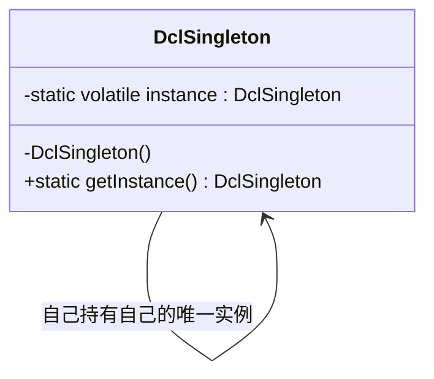

# 第3章：天下只有一个我——单例模式 (Singleton)

## 1. 小剧场：内存撑爆的配置文件管理器

周三下午，开发群里突然报警，测试环境的服务器内存占用飙升到了 99%，系统卡得连打个日志都要喘口粗气。

小白正满头大汗地盯着屏幕排查。王哥听到动静，推着转椅滑到了小白身边。

**王哥**：“怎么回事？测试环境被你搞炸了？”

**小白**（快哭了）：“王哥，我也不知道啊！我就加了一个读取 `AppConfig` 配置文件的功能。每当用户请求过来，我就去读一下配置……你看我的代码：”

```java
// 小白的配置管理器
public class AppConfigManager {
    private Properties props;

    public AppConfigManager() {
        System.out.println("正在加载庞大的配置文件到内存...");
        // 模拟极其耗时的加载和巨大的内存开销
        props = new Properties(); 
    }

    public String getConfig(String key) {
        return props.getProperty(key);
    }
}

// 业务调用代码
public class UserService {
    public void doSomething() {
        // 小白：用的时候我就 new 一个！
        AppConfigManager config = new AppConfigManager();
        String dbUrl = config.getConfig("db.url");
        // ...
    }
}
```

**王哥**一看，捂住了额头：“小白啊，你知不知道我们的系统一秒钟有多少个请求？1000 个！你这就相当于每秒钟创建了 1000 个极其庞大的配置管理器对象。系统的内存不被你撑爆才怪！”

**小白**：“啊？那怎么办？可是 `UserService`、`OrderService` 它们都需要读取配置啊，不 `new` 怎么用？”

**王哥**：“我问你，咱们公司有几个 CEO（老板）？”

**小白**：“就一个啊，天天画大饼那个。”

**王哥**：“对嘛！全公司所有部门遇到需要老板签字的事，是去找那个**唯一的**老板，还是每次都**自己重新克隆（new）一个新老板**出来签字？”

**小白**：“那当然是找同一个老板了！克隆老板犯法啊！”

**王哥**：“代码也是一样！对于这种**全局只需要一份、且创建成本很高**的对象（比如配置管理器、数据库连接池），我们就应该保证：在整个系统运行期间，它**只能被 new 一次**。这就是我们要学的第一招——**单例模式（Singleton）**。”

---

## 2. 核心概念：如何保证“天下只有一个我”？

**王哥**拿起白板笔：“要实现单例模式，核心思想只有三步：
1. **防贼先上锁**：把构造方法变成私有的（`private`），不让别人在外面随便 `new`。
2. **自己生自己**：在类内部自己 `new` 一个自己的实例。
3. **开个小窗口**：提供一个公共的静态方法，让别人只能通过这个方法拿到那个唯一的实例。”

### 1) 饿汉式：最心急的写法

**王哥**：“这是最简单的一种写法。不管你用不用，只要类一加载，我就先把它造出来。就像一个饿汉，还没开饭就把碗筷摆好了。”

```java
public class EagerSingleton {
    // 2. 自己生自己（静态常量，类加载时就创建）
    private static final EagerSingleton INSTANCE = new EagerSingleton();

    // 1. 防贼先上锁（私有构造器）
    private EagerSingleton() {
        System.out.println("饿汉式：老板已就位！");
    }

    // 3. 开个小窗口（对外提供获取实例的静态方法）
    public static EagerSingleton getInstance() {
        return INSTANCE;
    }
}
```

**小白**：“这个好懂！外面谁敢 `new EagerSingleton()` 编译器就会报错，只能乖乖调用 `getInstance()`，而且每次拿到的都是同一个 `INSTANCE`。”

**王哥**：“没错。优点是简单、绝对线程安全。缺点嘛……如果你这个对象特别大，但系统运行半天都没人用它，它就白白占着内存。这就是‘占着茅坑不拉屎’。”

### 2) 懒汉式：不见兔子不撒鹰

**小白**：“那能不能等我真正需要用的时候，再去创建它？”

**王哥**：“聪明，这就是‘懒汉式’。什么时候调用 `getInstance`，什么时候再 `new`。”

```java
public class LazySingleton {
    private static LazySingleton instance;

    private LazySingleton() {}

    public static LazySingleton getInstance() {
        if (instance == null) {
            instance = new LazySingleton(); // 只有第一次调用的才创建
        }
        return instance;
    }
}
```

**王哥**：“但是！这代码在**多线程环境**下有致命 Bug！假设有两个线程（小明和小红）同时执行到了 `if (instance == null)`，他们都发现是 `null`，于是小明 `new` 了一个，小红也 `new` 了一个。‘单例’就被破坏了，出现了两个老板！”

### 3) 双重检查锁 (Double-Checked Locking)：终极形态

**小白**：“那我在 `getInstance()` 方法上加一个 `synchronized` 锁不就行了？”

**王哥**：“加在方法上太重了，每次拿对象都要排队，性能会差到姥姥家。真正的大佬写法是这样的——**双重检查锁（DCL）**。”

```java
public class DclSingleton {
    // 加上 volatile，防止指令重排序（极其重要！）
    private static volatile DclSingleton instance;

    private DclSingleton() {}

    public static DclSingleton getInstance() {
        // 第一重检查：如果不为空，直接返回，不用去排队抢锁了（提高性能）
        if (instance == null) {
            // 如果为空，说明是第一次，大家开始排队抢锁
            synchronized (DclSingleton.class) {
                // 第二重检查：抢到锁之后再看一眼，是不是已经被前面的兄弟造出来了？
                if (instance == null) {
                    instance = new DclSingleton();
                }
            }
        }
        return instance;
    }
}
```



**小白**（倒吸一口凉气）：“嘶……这个写法有点绕啊。为什么要检查两次？”

**王哥**：“第一重检查，是为了**效率**，99%的时间里，对象已经被造出来了，大家就不用去排队加锁了，直接拿走。第二重检查，是为了**安全**，防止几个线程同时通过了第一重检查，在锁门外排队，一旦前一个兄弟造完出来了，后一个兄弟进去如果不再检查一次，就会造出一个重复的对象。”

**小白**：“那那个 `volatile` 关键字又是干嘛的？”

**王哥**：“这就是底层知识了。`instance = new DclSingleton()` 这句代码在 CPU 层面其实分了三步：
1. 分配内存空间；
2. 初始化对象；
3. 把 `instance` 变量指向那块内存。
因为 CPU 喜欢自作聪明进行‘指令重排’，如果执行顺序变成了 1 -> 3 -> 2。那么在第 3 步刚执行完，对象还没初始化呢，另一个线程突然进来执行第一重检查，发现 `instance != null`，直接拿去用了，就会导致 NullPointerException！加了 `volatile`，就是告诉 CPU：老老实实按 1-2-3 的顺序执行，别瞎捣乱！”

### 4) 终极防御：静态内部类与枚举单例

**小白**：“王哥，DCL 虽然安全，但写起来心智负担有点大，每次都要默写这一长串，有没有更省心的写法？”

**王哥**：“有，利用**类加载机制**的'静态内部类（Holder）'写法，既能延迟加载，又天生线程安全，还不用写 `synchronized`：”

```java
public class HolderSingleton {
    private HolderSingleton() {
        System.out.println("静态内部类：老板就位！");
    }

    // 静态内部类，外部类加载时它不会跟着加载
    private static class Holder {
        private static final HolderSingleton INSTANCE = new HolderSingleton();
    }

    // 第一次调用 getInstance()，才会触发 Holder 类加载，从而创建实例
    public static HolderSingleton getInstance() {
        return Holder.INSTANCE;
    }
}
```

**王哥**：“JVM 保证一个类只会被加载一次，而且加载过程本身是线程安全的。所以 `Holder.INSTANCE` 只会被创建一次，根本不需要我们手写锁。这是面试里公认的'优雅解法'。”

**小白**（突然想起）：“等等！王哥，你上次留的思考题——就算构造方法是 `private` 的，用反射是不是真能硬造出第二个实例？我刚才试了一下，还真的可以！”

```java
// 小白的破坏性实验
Constructor<DclSingleton> constructor = DclSingleton.class.getDeclaredConstructor();
constructor.setAccessible(true); // 强行打开私有构造器的大门
DclSingleton instance1 = DclSingleton.getInstance();
DclSingleton instance2 = constructor.newInstance(); // 强行 new 出第二个！

System.out.println(instance1 == instance2); // false！单例被打破了！
```

**王哥**：“被你发现了。`private` 只能挡住'正常调用'，挡不住反射这种'破门而入'的黑魔法。同理，如果这个类实现了 `Serializable`，反序列化的时候也会绕开构造方法，凭空再造出一个新对象。”

**小白**：“那……难道单例模式就是个不安全的摆设？”

**王哥**：“别慌，江湖最后还有一招杀手——**枚举单例**。《Effective Java》的作者 Joshua Bloch 明确推荐这种写法：”

```java
public enum EnumSingleton {
    INSTANCE;

    public void doSomething() {
        System.out.println("枚举单例工作中...");
    }
}

// 使用方式
EnumSingleton.INSTANCE.doSomething();
```

**小白**：“就这么短？！这也能叫单例模式？”

**王哥**：“别看代码短，它是唯一一种能从语言层面（JVM 底层）防住反射和反序列化攻击的写法：
1. **防反射**：JVM 在枚举的 `newInstance()` 实现里直接做了判断，发现是枚举类型就直接抛出 `IllegalArgumentException`，根本不让你用反射创建。
2. **防反序列化**：枚举的反序列化不会调用构造方法，而是直接通过名字 `valueOf()` 找到 JVM 里现成的那个枚举常量，不会产生新对象。
3. **写法还最简洁，线程安全由 JVM 保证。**”

**小白**：“好家伙，原来终极武器一直藏在 `enum` 里！”

**王哥**：“最后给你一张表，把今天学的几种写法做个总结：”

| 写法 | 延迟加载 | 线程安全 | 防反射/反序列化 | 推荐指数 |
| --- | --- | --- | --- | --- |
| 饿汉式 | ❌ | ✅ | ❌ | ⭐⭐ |
| 懒汉式（无锁） | ✅ | ❌ | ❌ | ⭐（别用） |
| 双重检查锁 DCL | ✅ | ✅ | ❌ | ⭐⭐⭐⭐ |
| 静态内部类 Holder | ✅ | ✅ | ❌ | ⭐⭐⭐⭐ |
| 枚举 Enum | ✅ | ✅ | ✅ | ⭐⭐⭐⭐⭐ |

**王哥**：“日常业务代码，DCL 或 Holder 足够用了；如果你的单例涉及安全敏感场景（比如权限校验器、Token签发器），枚举单例是最稳的选择。”

---

## 3. 课后总结与吐槽

在王哥的指导下，小白把 `AppConfigManager` 改成了单例模式。系统重启后，内存占用稳稳地停在了 30%，再也没有出现过问题。

**小白的笔记**：
1. **单例模式**：确保全局只有一个实例，并提供一个全局访问点。
2. 适用于：配置管理器、线程池、数据库连接池、日志对象等。
3. **饿汉式**：类加载就创建，天生线程安全，但不省内存。
4. **懒汉式（DCL写法）**：按需创建，省内存。一定要记住两层 `if`，外加一把 `synchronized` 锁，最后记得加上 `volatile`！
5. **静态内部类（Holder）**：偷懒首选，靠 JVM 类加载机制实现延迟加载 + 线程安全。
6. **枚举单例**：唯一能防住反射和反序列化攻击的写法，《Effective Java》推荐。

**王哥**（收拾电脑准备下班）：“小白，今天表现不错。不过我得提醒你一句，单例模式虽然好用，但也经常被称为**反模式 (Anti-Pattern)**。因为它隐藏了类之间的依赖关系，而且非常不利于写单元测试。”

> [!TIP]
> **王哥的思考题**
> “小白，还记得咱们聊依赖倒置原则时，那个可以塞进不同'锅'的 `ChefRobot` 吗？现在如果产品经理突然说：以后要支持 10 种锅，到底该装哪种，还得看用户的会员等级、库存情况、地区限制……一堆复杂的判断逻辑。难道要在创建 `ChefRobot` 的地方写一大堆 `if-else` 来决定 `new` 哪个 `Pan` 吗？”

（小白看着满屏即将写下的 `if-else`，陷入了沉思……）
