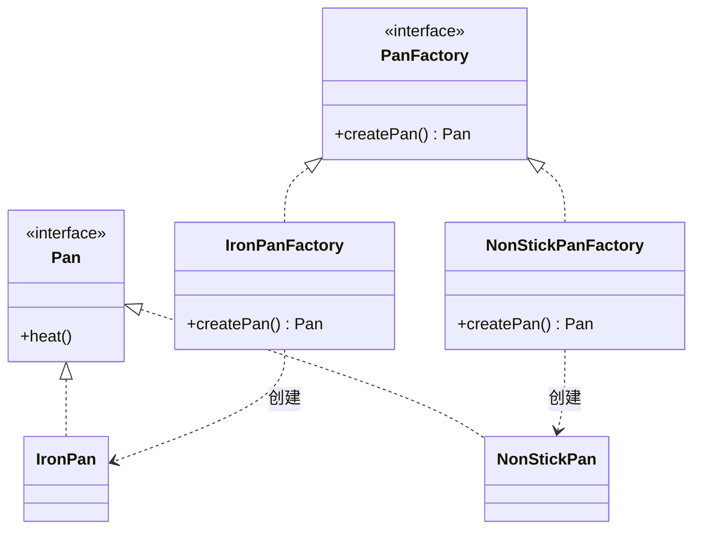

# 第4章：不要自己new，让工厂代劳——工厂模式 (Factory)

## 1. 小剧场：满屏的 if-else 锅具大战

周四上午，小白盯着屏幕，眉头拧成了一个疙瘩。王哥端着冰美式路过，瞥了一眼小白的代码，差点把咖啡喷在屏幕上。

```java
// 小白被产品经理逼出来的代码
public class ChefRobot {
    private Pan pan;

    public ChefRobot(String userLevel, int stock, String region) {
        // 根据会员等级、库存、地区决定用哪种锅
        if ("VIP".equals(userLevel) && stock > 0) {
            this.pan = new NonStickPan();
        } else if ("SVIP".equals(userLevel) && "北京".equals(region)) {
            this.pan = new GoldPan();
        } else if (stock > 100) {
            this.pan = new IronPan();
        } else if ("海外".equals(region)) {
            this.pan = new ImportedPan();
        } else {
            this.pan = new IronPan();
        }
        // 以后还要加电饭锅、空气炸锅……这里得写到天荒地老
    }
}
```

**王哥**：“小白，还记得我上次留的思考题吗？就是这玩意儿把你坑了吧。你这个 `ChefRobot` 本来是个'厨师'，结果现在一大半代码都在干'到底该买哪口锅'的活儿。”

**小白**（哀嚎）：“是啊王哥！这判断逻辑太复杂了，我只能堆 `if-else`。而且更要命的是，`OrderRobot`、`SnackRobot` 它们也都要按这套逻辑选锅，我难道把这坨 `if-else` 复制粘贴到每个机器人里？”

**王哥**：“你这就违背了**单一职责原则**——厨师只管炒菜，凭什么还要懂采购？我问你，米其林大厨做菜的时候，他会自己跑去五金店挑锅吗？”

**小白**：“当然不会，会有专门的**采购部**把锅备好送到后厨。”

**王哥**：“对喽！这个'采购部'，在代码里就叫**工厂（Factory）**。把'创建对象'这件复杂的事，从'使用对象'的地方剥离出去，交给一个专门的角色。这就是今天要学的——**工厂模式**。”

---

## 2. 核心概念：三种工厂的进化史

**王哥**在白板上画了一个三级台阶：“工厂模式其实是一个家族，按复杂度从低到高分三种：简单工厂、工厂方法、抽象工厂。咱们一级一级来。”

### 1) 简单工厂：一个万能采购员

**王哥**：“最朴素的做法，就是把那一坨 `if-else` 搬到一个专门的工厂类里。你要锅，跟工厂说一声，它给你造好。”

```java
// 锅的抽象（还记得第1章的 Pan 接口吗？）
public interface Pan {
    void heat();
}

public class IronPan implements Pan {
    public void heat() { System.out.println("铁锅加热"); }
}

public class NonStickPan implements Pan {
    public void heat() { System.out.println("不粘锅加热"); }
}

// 简单工厂：专门负责造锅
public class SimplePanFactory {
    public static Pan createPan(String type) {
        if ("iron".equals(type)) {
            return new IronPan();
        } else if ("nonstick".equals(type)) {
            return new NonStickPan();
        }
        throw new IllegalArgumentException("没有这种锅：" + type);
    }
}

// 厨师彻底解放了！
public class ChefRobot {
    private Pan pan;
    public ChefRobot(String type) {
        this.pan = SimplePanFactory.createPan(type); // 跟采购部要锅
    }
    public void cook() { pan.heat(); }
}
```

**小白**：“清爽多了！`ChefRobot` 再也不用关心锅是怎么造出来的了。”

**王哥**：“但简单工厂有个先天缺陷——你发现没有，每次新增一种锅（比如金锅），你都得**回去改 `SimplePanFactory` 的 `if-else`**。这违背了什么原则？”

**小白**（脱口而出）：“**开闭原则**！对修改关闭，但简单工厂逼着我改老代码！”

**王哥**：“孺子可教。所以严格来说，简单工厂连'正经设计模式'都算不上，GoF 都没收录它。但它简单好用，小项目里到处都是。”

### 2) 工厂方法：一种产品配一个专属工厂

**王哥**：“要解决'每次都改工厂'的问题，思路是——**别用一个工厂造所有锅，而是给每种锅配一个专属工厂**。然后把'造哪种锅'这个决定，延迟到具体的工厂子类里。”

```java
// 工厂的抽象：我承诺能造一口锅，但具体造哪种，子类说了算
public interface PanFactory {
    Pan createPan();
}

// 铁锅工厂，只造铁锅
public class IronPanFactory implements PanFactory {
    public Pan createPan() { return new IronPan(); }
}

// 不粘锅工厂，只造不粘锅
public class NonStickPanFactory implements PanFactory {
    public Pan createPan() { return new NonStickPan(); }
}

// 用的时候，想要什么锅就 new 对应的工厂
public class Kitchen {
    public void serve(PanFactory factory) {
        Pan pan = factory.createPan(); // 工厂造锅，厨房不关心细节
        pan.heat();
    }
}
```

**小白**：“我明白了！以后要加'金锅'，我只需要**新增**一个 `GoldPanFactory`，原来的工厂一个都不用动！这就符合开闭原则了！”



**王哥**：“注意看这个图，工厂和产品是**平行的两条继承线**，一一对应。代价就是——类的数量翻倍了。你有 10 种锅，就有 10 个工厂类。”

### 3) 抽象工厂：成套的产品家族

**王哥**：“最后一个最烧脑，但也最有用。想象一下，现在不只是造锅了，咱们要造**一整套厨具**：锅 + 铲子 + 刀。而且要成套——'中式套装'是铁锅+铁铲+菜刀，'西式套装'是不粘锅+硅胶铲+西餐刀。你总不能让客户中式锅配个西餐刀吧？”

**小白**：“那确实，混搭起来就乱套了。”

**王哥**：“**抽象工厂，就是负责生产'一整个产品族'的工厂**。一个工厂，一次性把成套的、互相搭配的产品都给你造齐。”

```java
// 产品族：锅 和 铲子
public interface Pan { void heat(); }
public interface Spatula { void flip(); }

// 抽象工厂：承诺能造一整套厨具
public interface KitchenwareFactory {
    Pan createPan();
    Spatula createSpatula();
}

// 中式套装工厂：保证造出来的都是中式的，绝不混搭
public class ChineseFactory implements KitchenwareFactory {
    public Pan createPan() { return new IronPan(); }
    public Spatula createSpatula() { return new IronSpatula(); }
}

// 西式套装工厂
public class WesternFactory implements KitchenwareFactory {
    public Pan createPan() { return new NonStickPan(); }
    public Spatula createSpatula() { return new SiliconeSpatula(); }
}
```

**小白**：“原来如此！我只要选定一个工厂（比如 `ChineseFactory`），它造出来的锅和铲子就**天然是配套的**，永远不会出现中式锅配西式铲的尴尬！”

**王哥**：“精髓就在这。**工厂方法管的是'一种产品'，抽象工厂管的是'一族产品'**。Spring 框架里的 `BeanFactory`、JDBC 里不同数据库的 `Connection` 体系，都是抽象工厂的影子。”

---

## 3. 模式精讲：什么时候用哪个？

**王哥**总结道：

| 类型 | 核心思想 | 优点 | 缺点 | 适用场景 |
| --- | --- | --- | --- | --- |
| 简单工厂 | 一个工厂用 if-else 造所有产品 | 简单直接 | 加产品要改工厂，违反开闭 | 产品种类少且稳定 |
| 工厂方法 | 一种产品配一个工厂子类 | 符合开闭原则 | 类爆炸 | 产品种类会扩展 |
| 抽象工厂 | 一个工厂造一整族配套产品 | 保证产品搭配一致 | 加新产品维度极麻烦 | 有多个产品族需要成套切换 |

**王哥**：“记住一句话：**工厂模式的本质，是把'变化的创建逻辑'封装起来，让调用方和具体实现解耦**。调用方只面向接口编程，至于背后到底 new 了哪个实现类，它管不着，也不该管。”

---

## 4. 课后总结与吐槽

在王哥的指导下，小白把那坨臭名昭著的选锅 `if-else` 搬进了工厂，`ChefRobot` 瞬间清爽，代码评审一次通过。

**小白的笔记**：
1. **工厂模式**：把对象的创建过程封装起来，使用方不必关心 `new` 的细节。
2. **简单工厂**：好上手，但加产品要改工厂，违反开闭原则。
3. **工厂方法**：一种产品一个工厂，符合开闭，代价是类变多。
4. **抽象工厂**：一次造一整套配套产品，保证产品族内部一致性。

**王哥**（晃了晃杯子里的冰块）：“工厂解决了'造什么'的问题。但小白，我再给你出个难题——”

> [!TIP]
> **王哥的思考题**
> “假设现在要造的不是锅，而是一份'豪华汉堡套餐'：它有面包、肉饼、生菜、酱料、要不要加芝士、要不要加培根、几片酸黄瓜……足足十几个参数，其中一大半还是可选的。如果你用构造方法来造它，`new Burger(bread, meat, true, false, null, 2, ...)` 这一长串参数，谁看得懂哪个是哪个？传错位置了都不知道。这种'参数又多又杂'的对象，该怎么优雅地创建呢？”

（小白看着那一长串 `true, false, null`，感觉眼睛都要花了……）

---
*下一章，建造者模式将登场，教小白如何像点菜一样，优雅地拼装一个复杂对象。*
