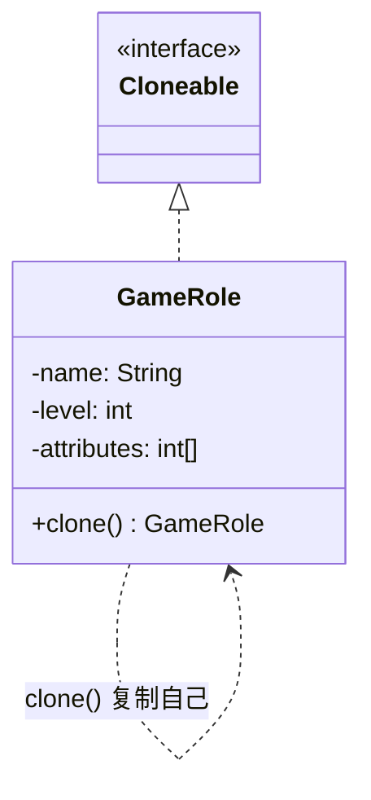

# 第6章：克隆羊多莉——原型模式 (Prototype)

## 1. 小剧场：100 个 NPC 卡爆了服务器

周一早晨，小白又遇上了麻烦。他正在做一个游戏的后端，需要在地图上刷新 100 个精英怪 NPC。

```java
// 小白的笨办法：每个 NPC 都从零建造一遍
for (int i = 0; i < 100; i++) {
    GameRole npc = new GameRole.Builder("精英哥布林")
            .level(50)
            .loadEquipment()   // 从数据库读取顶级装备，巨耗时
            .calcAttributes()  // 复杂的属性计算
            .build();          // 光这一套下来 3 秒
    npcList.add(npc);
}
// 100 个 NPC = 300 秒，玩家早就把游戏卸载了
```

**王哥**走过来看了一眼，摇摇头：“小白，这 100 个精英哥布林，是不是长得一模一样？”

**小白**：“对啊，同一种怪嘛，属性装备全一样。”

**王哥**：“那你为什么要把那套耗时 3 秒的'建造流程'重复跑 100 遍？你想想克隆羊多莉是怎么来的？科学家是让两只羊重新'生'一只吗？”

**小白**：“不是，是取了一个细胞，**直接复制**出来的！”

**王哥**：“对喽！既然你已经辛辛苦苦造好了第一个 NPC，后面 99 个，**直接拿它当母版复制**不就行了？复制一个现成对象，比从头建造快得多。这就是今天的——**原型模式（Prototype）**。”

---

## 2. 核心概念：与其重造，不如复制

**王哥**：“原型模式的思想极其简单：**用一个已经存在的对象（原型）作为模板，通过拷贝它来创建新对象**。在 Java 里，这通常通过实现 `Cloneable` 接口、重写 `clone()` 方法来实现。”

### 1) 基础版：实现 clone

```java
public class GameRole implements Cloneable {
    private String name;
    private int level;
    private int[] attributes; // 属性数组：攻击、防御、血量……

    // 重写 clone 方法
    @Override
    public GameRole clone() {
        try {
            return (GameRole) super.clone(); // 调用 Object 的本地拷贝
        } catch (CloneNotSupportedException e) {
            throw new RuntimeException(e);
        }
    }
}

// 使用：先辛苦造一个母版，后面全靠复制
GameRole prototype = createEliteGoblin(); // 耗时 3 秒，但只跑一次
for (int i = 0; i < 100; i++) {
    GameRole npc = prototype.clone(); // 瞬间复制，几乎不耗时
    npcList.add(npc);
}
```

**小白**：“漂亮！3 秒只花一次，后面 99 个全是秒出！性能直接起飞！”



### 2) 致命陷阱：浅拷贝 vs 深拷贝

**王哥**（突然严肃起来）：“但是！原型模式有个最大的坑，90% 的人都栽在这上面——**浅拷贝**。”

**小白**：“浅拷贝？听起来不太妙。”

**王哥**：“`super.clone()` 默认是**浅拷贝**。它只拷贝对象本身的字段值。对于 `int`、`String` 这种没问题。但如果字段是一个**对象引用**（比如那个 `attributes` 数组），它**只拷贝引用地址，不拷贝引用指向的内容**！”

**王哥**在白板上画了个图：“结果就是，复制出来的 100 个 NPC，它们的 `name` 是各自独立的，但 `attributes` 数组**全都指向同一块内存**！”

```java
GameRole npc1 = prototype.clone();
GameRole npc2 = prototype.clone();

npc1.getAttributes()[0] = 999; // 我只想改 npc1 的攻击力
System.out.println(npc2.getAttributes()[0]); // 结果 npc2 也变成了 999！见鬼了！
```

**小白**（倒吸凉气）：“我的天，改一个全都跟着变？这要是上线，玩家非得疯了不可！”

**王哥**：“这就是浅拷贝的恶果。解决办法是**深拷贝**——把引用类型的字段也跟着复制一份新的：”

```java
@Override
public GameRole clone() {
    try {
        GameRole copy = (GameRole) super.clone();
        // 关键：手动把数组也复制一份新的，斩断共享
        copy.attributes = this.attributes.clone();
        return copy;
    } catch (CloneNotSupportedException e) {
        throw new RuntimeException(e);
    }
}
```

**王哥**：“现在每个 NPC 都有自己独立的属性数组，井水不犯河水。对于嵌套很深的复杂对象，业界还常用**序列化**（先序列化成字节流，再反序列化回来）来实现彻底的深拷贝。”

---

## 3. 模式精讲：什么时候该用原型？

**王哥**：“原型模式适用于这几种情况：

1. **对象创建成本很高**——像 NPC 那样，初始化要查库、做复杂计算。复制比重建划算。
2. **需要大量相似对象**——它们大部分属性相同，只有少数差异。
3. **想隔离'创建逻辑'和'使用方'**——使用方拿着原型 `clone()` 即可，完全不需要知道这个对象当初是怎么 new 出来的。

| 维度 | 说明 |
| --- | --- |
| 核心动作 | `clone()` 复制一个现成对象 |
| 最大优点 | 跳过昂贵的初始化，复制比新建快 |
| 最大陷阱 | **浅拷贝**：引用类型字段被多个副本共享 |
| 正确姿势 | 对引用类型字段做**深拷贝** |

**小白**：“我懂了，原型模式的灵魂就一个字——**抄**！但要抄就抄彻底，别抄个半吊子（浅拷贝），最后引用还连着母版。”

**王哥**：“总结到位。Java 里 `ArrayList`、`HashMap` 的 `clone()`，Spring 的 `prototype` 作用域 Bean，都和这个思想沾边。”

---

## 4. 课后总结与吐槽

小白把 NPC 刷新逻辑改成了原型模式，刷 100 个怪从 300 秒降到了不到 1 秒，还顺手填了深拷贝的坑。

**小白的笔记**：
1. **原型模式**：拿一个现成对象当模板，靠 `clone()` 复制出新对象。
2. 适用于：创建成本高、需要大量相似对象的场景。
3. **浅拷贝**：只拷贝引用地址，多个副本共享同一份引用数据（危险！）。
4. **深拷贝**：连引用指向的内容也复制一份，彻底独立（安全）。

**王哥**（伸了个懒腰）：“创建型五大模式——单例、工厂、建造者、原型，咱们都过完了。'怎么把对象造出来'的问题，你算是通关了。”

**小白**：“那接下来学啥？”

> [!TIP]
> **王哥的思考题**
> “造出来只是第一步，接下来是**怎么把这些对象拼装到一起协同工作**，也就是'结构型模式'。我先给你抛个砖：你新买的 Mac 只有 Type-C 口，手里却有个老式 USB 鼠标。你既不想换鼠标，也改不了电脑接口。怎么让这两个'天生不兼容'的家伙握手言和？”

（小白摸了摸抽屉里那个吃灰的 Type-C 转接头，若有所思……）

---
*下一章进入结构型模式，第一招——适配器模式，专治各种"接口不兼容"。*
