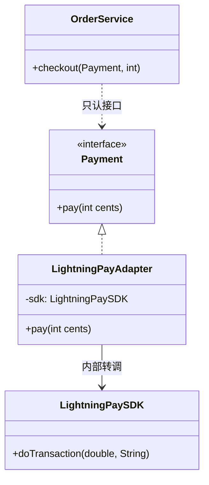

# 第7章：电源转换头——适配器模式 (Adapter)

## 1. 小剧场：对接不上的第三方支付

周二，小白接到一个任务：公司原来一直用自研的支付系统，现在要接入一个第三方的"闪电支付"SDK。小白打开对方的代码一看，傻眼了。

```java
// 我们系统里，所有支付都遵循这个统一接口
public interface Payment {
    void pay(int amountInCents); // 单位：分
}

// 我们的业务代码到处都这么调
public class OrderService {
    public void checkout(Payment payment, int cents) {
        payment.pay(cents);
    }
}

// 但第三方"闪电支付"的 SDK 长这样，方法名、参数全对不上
public class LightningPaySDK {
    // 人家的方法叫 doTransaction，单位还是"元"，还多个商户号参数
    public void doTransaction(double yuan, String merchantId) {
        System.out.println("闪电支付：" + yuan + "元，商户：" + merchantId);
    }
}
```

**小白**（抓狂）：“王哥！这第三方 SDK 的接口跟我们的 `Payment` 完全对不上！方法名不一样、参数单位一个是分一个是元、还多个商户号。难道我要把我们系统里上百处调用 `Payment.pay()` 的地方全改了去适配它？”

**王哥**：“你疯了？为了接一个支付，把自己上百处稳定代码全动一遍？这就是上次思考题的场景——**你的 Mac 是 Type-C，鼠标是 USB**。你会因为要用这个鼠标，就把电脑拆了改接口吗？”

**小白**：“当然不会，我会买个**转接头**！”

**王哥**：“对！代码里的'转接头'，就叫**适配器模式（Adapter）**。它夹在'你的系统'和'第三方 SDK'中间，**对外伪装成你系统认识的接口，对内偷偷调用第三方的真实方法**。两边一行代码都不用改。”

---

## 2. 核心概念：中间加一个"转接头"

**王哥**：“适配器的角色有三个，你记牢了：

1. **目标接口（Target）**：你的系统期望的接口，这里是 `Payment`。
2. **被适配者（Adaptee）**：那个接口对不上的第三方，这里是 `LightningPaySDK`。
3. **适配器（Adapter）**：中间的转接头，它**实现 Target 接口**，内部**持有一个 Adaptee**，负责把调用翻译过去。”

```java
// 适配器：对外是 Payment，对内握着 LightningPaySDK
public class LightningPayAdapter implements Payment {
    private LightningPaySDK sdk;       // 内部持有真正干活的第三方
    private String merchantId;

    public LightningPayAdapter(LightningPaySDK sdk, String merchantId) {
        this.sdk = sdk;
        this.merchantId = merchantId;
    }

    // 实现我们系统的 pay 方法
    @Override
    public void pay(int amountInCents) {
        // 翻译工作：分 → 元
        double yuan = amountInCents / 100.0;
        // 调用第三方真正的方法，并补上它要的商户号
        sdk.doTransaction(yuan, merchantId);
    }
}
```

**王哥**：“现在见证奇迹。你的业务代码 `OrderService` **一个字都不用改**，照样调 `Payment.pay()`，只不过这次塞给它的是一个适配器：”

```java
// 业务代码毫无感知，它以为自己用的还是普通 Payment
LightningPaySDK sdk = new LightningPaySDK();
Payment payment = new LightningPayAdapter(sdk, "MERCHANT_8888");
orderService.checkout(payment, 19900); // 内部自动转成 199.0 元调用第三方
```

**小白**（拍案）：“绝了！我的系统全程以为自己在用 `Payment`，根本不知道背后是个第三方 SDK 在干活。转接头把所有脏活累活都默默扛了！”



---

## 3. 模式精讲：适配器的两种流派 & 边界

**王哥**：“适配器有两种实现流派：

- **对象适配器**（刚才写的这种）：适配器**内部持有**被适配者的实例（组合）。这是**推荐**做法，灵活。
- **类适配器**：适配器通过**多继承**同时继承 Target 和 Adaptee。Java 不支持多继承，用得少，了解即可。

记住一句话：**适配器是'事后补救'，不是'事前设计'**。它的使命是让两个'已经定型、改不动'的东西协作起来。如果是你自己从头设计的系统，就不该需要适配器——那说明你接口没设计好。”

**小白**：“王哥，那它跟我们第2章提过的，以及'装饰器'那些'包一层'的模式，怎么区分？它们看起来都是 A 包着 B。”

**王哥**：“问到点子上了。看**意图**：

| 模式 | 意图 | 一句话 |
| --- | --- | --- |
| 适配器 | 转换接口，让不兼容的能合作 | '我把 B 的接口**改成** A 的样子' |
| 装饰器 | 不改接口，动态**增强**功能 | '我让 B 还是 B，但**更强**了' |
| 代理 | 不改接口，**控制**对 B 的访问 | '想用 B？先过我这关' |

它们结构像，但**目的天差地别**。适配器的关键词是**转换**。”

---

## 4. 课后总结与吐槽

小白用一个 `LightningPayAdapter` 搞定了第三方支付接入，主系统代码零改动，测试一次通过。

**小白的笔记**：
1. **适配器模式**：在两个接口不兼容的对象之间加一个"转接头"，让它们能协作。
2. 三角色：目标接口（Target）、被适配者（Adaptee）、适配器（Adapter）。
3. 推荐用**对象适配器**（组合持有被适配者），而非类适配器（继承）。
4. 核心意图是**转换接口**，区别于装饰器（增强）和代理（控制访问）。

> [!NOTE]
> **动手试试**
> 1. 再接入一个第三方"闪付 SDK"（方法名、参数都和你的 `Payment` 接口不一样），给它写一个 `FlashPayAdapter`。验证主系统调用 `Payment` 的代码一行都不用改。
> 2. 把本章的**对象适配器**改写成**类适配器**（用继承），然后说说：为什么 Java 单继承的限制让对象适配器（组合）通常是更好的选择？
> 3. **思考**：适配器是"事后补救"两个对不上的接口。如果在项目早期你就预见到要对接多家支付，你会怎么提前设计，让以后接新渠道时连适配器都尽量薄？（提示：联想第11章桥接。）

**王哥**：“适配器是'改造接口让人能用'。但小白，有时候我们不想改接口，只想给一个对象**不停地叠加新功能**——”

> [!TIP]
> **王哥的思考题**
> “你去星巴克点咖啡，一杯美式是基础款。你说加一份浓缩，店员加一份；你又说加奶泡、加焦糖、加肉桂粉……每加一样，价格和描述都在变，但它**始终还是一杯咖啡**。如果用代码实现，难道要为'美式+奶泡'、'美式+奶泡+焦糖'、'美式+焦糖+肉桂'……每一种组合都建一个类吗？那得建到天荒地老。有没有办法像叠 buff 一样，动态地往咖啡上'加料'？”

（小白看着手里的半杯冰美式，陷入了沉思……）

---
*下一章，装饰器模式将教小白如何给对象动态"叠 buff"。*
