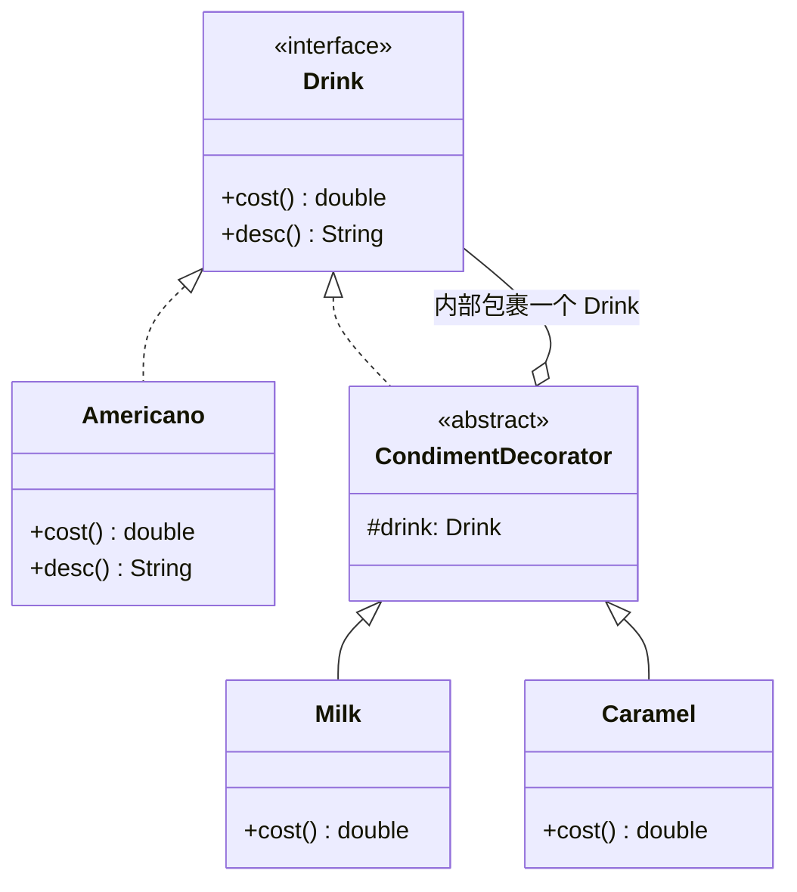

# 第8章：给代码穿上马甲——装饰器模式 (Decorator)

## 1. 小剧场：咖啡加料引发的类爆炸

周三，小白在做一个咖啡点单系统。一开始很简单，但产品经理的需求像滚雪球一样越来越大。

```java
// 小白的"继承大法"，每一种组合建一个类
public class Coffee { double cost() { return 10; } }

public class CoffeeWithMilk extends Coffee {              // 咖啡+奶
    double cost() { return super.cost() + 2; }
}
public class CoffeeWithMilkAndSugar extends Coffee {      // 咖啡+奶+糖
    double cost() { return super.cost() + 2 + 1; }
}
public class CoffeeWithMilkAndCaramel extends Coffee {    // 咖啡+奶+焦糖
    double cost() { return super.cost() + 2 + 3; }
}
public class CoffeeWithMilkSugarCaramel extends Coffee {  // 咖啡+奶+糖+焦糖
    double cost() { return super.cost() + 2 + 1 + 3; }
}
// 奶、糖、焦糖、奶泡、肉桂…… 5 种配料的自由组合 = 2^5 = 32 个类！
// 每加一种料，类的数量翻倍——这就是"类爆炸"
```

**王哥**看着这一屏的类名，倒吸一口凉气：“小白，你这是要把全宇宙的咖啡组合都写成类啊？再加一种'香草糖浆'，你这类的数量直接翻倍！”

**小白**（欲哭无泪）：“是啊王哥，这就是你上次说的问题。每多一种料，组合就指数爆炸。可我除了继承，不知道还能咋办……”

**王哥**：“你想想，星巴克的店员是怎么操作的？他会去货架上找一个叫'美式加奶加焦糖'的**现成杯子**吗？”

**小白**：“不会，他是先做一杯美式，然后**往里一样一样地加**——加奶、加焦糖，每加一样在小票上记一笔。”

**王哥**：“对喽！配料不是写死在咖啡里的，而是**一层层包裹上去**的。这就是今天的**装饰器模式（Decorator）**——不靠继承，靠'层层包装'来动态地给对象叠加功能。”

---

## 2. 核心概念：一层一层包上去

**王哥**：“装饰器的核心思路是：**装饰器和被装饰的对象，实现同一个接口；装饰器内部又持有一个该接口的对象**。这样它就能'包住'里面的对象，在调用时，先调里面的，再加上自己这一层的料。”

### 1) 先定义统一接口

```java
// 饮品接口：所有咖啡和配料都实现它
public interface Drink {
    double cost();      // 价格
    String desc();      // 描述
}

// 基础款：纯美式
public class Americano implements Drink {
    public double cost() { return 10; }
    public String desc() { return "美式咖啡"; }
}
```

### 2) 装饰器基类：它也是 Drink，但内部裹着一个 Drink

```java
// 配料装饰器的抽象基类
public abstract class CondimentDecorator implements Drink {
    protected Drink drink; // 关键：内部持有被装饰的饮品

    public CondimentDecorator(Drink drink) {
        this.drink = drink;
    }
}

// 具体配料：加奶
public class Milk extends CondimentDecorator {
    public Milk(Drink drink) { super(drink); }
    // 价格 = 里面那杯的价格 + 自己这层奶的钱
    public double cost() { return drink.cost() + 3; }
    public String desc() { return drink.desc() + " + 奶"; }
}

// 具体配料：加焦糖
public class Caramel extends CondimentDecorator {
    public Caramel(Drink drink) { super(drink); }
    public double cost() { return drink.cost() + 5; }
    public String desc() { return drink.desc() + " + 焦糖"; }
}
```

### 3) 见证"叠 buff"的快乐

```java
// 从一杯美式开始，一层层往上裹
Drink drink = new Americano();      // 美式，10块
drink = new Milk(drink);            // 包一层奶，13块
drink = new Caramel(drink);         // 再包一层焦糖，18块

System.out.println(drink.desc());   // 美式咖啡 + 奶 + 焦糖
System.out.println(drink.cost());   // 18.0
```

**小白**（豁然开朗）：“我懂了！每个装饰器都'裹'着里面的东西，调 `cost()` 的时候，它先问里面那层要价格，再加上自己的。就像剥洋葱反过来——一层层包上去！而且想加什么、加几层、什么顺序，全是运行时动态决定的，再也不用建 32 个类了！”



---

## 3. 模式精讲：装饰器 vs 继承 vs 适配器

**王哥**：“为什么装饰器能干掉继承的'类爆炸'？关键在于——**继承是编译期写死的，装饰是运行期动态组合的**。”

**小白**：“那它跟上一章的适配器，结构上不都是'A 包着 B'吗？”

**王哥**：“再强调一遍，看**意图**：
- **适配器**：B 的接口我用不了，我**改造**成能用的（**变接口**）。
- **装饰器**：B 本来就能用，我让它**功能更强**，但**接口不变**（你装饰前后都是 `Drink`）。

装饰器最经典的现实案例，就是 Java 的 **IO 流**：

```java
// 一层层装饰：文件流 → 缓冲流 → 数据流
InputStream in = new DataInputStream(
                    new BufferedInputStream(
                        new FileInputStream("data.txt")));
```

你看，`BufferedInputStream` 给文件流加了'缓冲'的 buff，`DataInputStream` 又加了'按类型读'的 buff，但它们全都还是 `InputStream`。这就是装饰器的活化石。”

| 模式 | 接口是否改变 | 目的 |
| --- | --- | --- |
| 适配器 | 改变 | 让不兼容的能用 |
| 装饰器 | **不变** | 动态增强功能 |

---

## 4. 课后总结与吐槽

小白把咖啡系统用装饰器重写，5 种配料从 32 个类缩成了 6 个类，加新配料只需再写一个装饰器，皆大欢喜。

**小白的笔记**：
1. **装饰器模式**：通过"层层包裹"动态地给对象增加功能，避免继承导致的类爆炸。
2. 关键：装饰器和被装饰者**实现同一接口**，装饰器**内部持有**一个该接口对象。
3. 优势：运行时**自由组合**，加什么、加几层、什么顺序都行。
4. 与适配器的区别：装饰器**不改接口、只增强**；适配器**改接口**。

> [!NOTE]
> **动手试试**
> 1. 给咖啡再写一个"豆浆 Soy"装饰器，然后组合出"美式 + 奶 + 焦糖 + 豆浆"，打印它的描述和总价。验证你没有新增任何组合类。
> 2. 调换装饰顺序（先焦糖后奶、先奶后焦糖），观察 `cost()` / `desc()` 的结果——体会"运行时自由组合"。
> 3. **进阶**：用 Java IO 亲手叠一次装饰器——`new BufferedReader(new InputStreamReader(new FileInputStream(file)))`，说说每一层各增强了什么。这就是 JDK 里最经典的装饰器现场。

**王哥**：“装饰器是'增强'。但有一种'包一层'，目的不是增强，而是**当门卫**——”

> [!TIP]
> **王哥的思考题**
> “大明星本人很忙，你想找他商演，不能直接打他电话，得先过他**经纪人**这一关。经纪人和明星'对外是一样的身份'（都能代表明星谈生意），但经纪人会先帮你做一堆事：判断你够不够格、谈价钱、安排档期，合适了才让你见到明星本人。这种'替身把关'的角色，在代码里该怎么实现？它和装饰器又有什么微妙的不同？”

（小白想起了昨天给爱豆打投却被粉丝后援会拦下的经历……）

---
*下一章，代理模式登场，教小白如何给对象配一个"经纪人"。*
