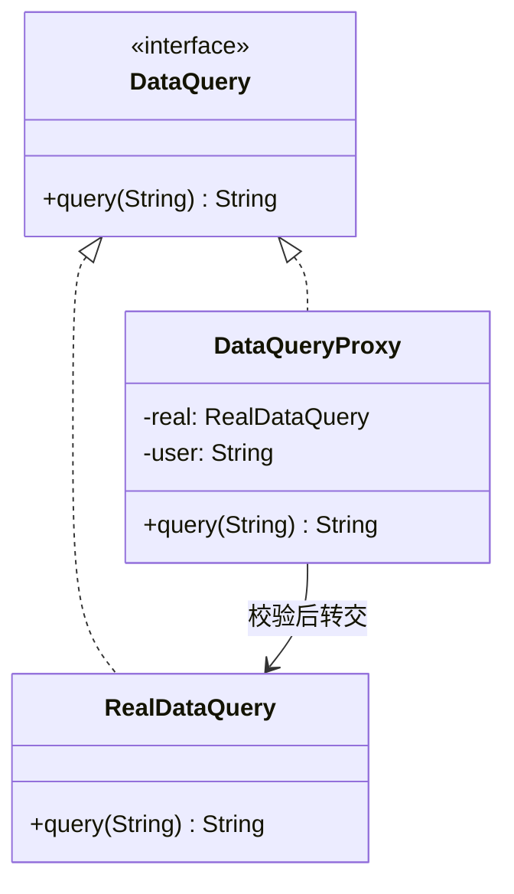

# 第9章：替身演员——代理模式 (Proxy)

## 1. 小剧场：每个方法前都要写一遍权限校验

周四，小白在维护一个数据库查询服务。安全部门下了死命令：**所有查询操作前，都要校验权限，还要记日志**。

```java
// 真正干活的查询服务
public interface DataQuery {
    String query(String sql);
}

public class RealDataQuery implements DataQuery {
    public String query(String sql) {
        System.out.println("执行查询：" + sql);
        return "查询结果";
    }
}

// 小白被迫把校验、日志一股脑塞进了核心方法
public class RealDataQuery implements DataQuery {
    public String query(String sql) {
        // 1. 权限校验
        if (!checkPermission()) throw new RuntimeException("无权限");
        // 2. 记录日志
        System.out.println("[日志] 有人在查询：" + sql);
        // 3. 真正的业务
        System.out.println("执行查询：" + sql);
        // 4. 再记一条日志
        System.out.println("[日志] 查询完成");
        return "查询结果";
    }
}
```

**王哥**：“小白，这就是上次说的'明星与经纪人'。你把'权限校验'、'记日志'这些**杂活**全塞进了 `RealDataQuery` 的核心方法里。它本来只该负责'查询'这一件事，现在却被一堆门卫工作搞得乌烟瘴气，违背了**单一职责原则**。”

**小白**：“可这些校验和日志确实得有啊，总不能不做吧？”

**王哥**：“当然要做，但不该让明星本人去做。明星只管演戏（查询），**门卫的活儿，交给经纪人**。我们造一个'替身'——它对外长得和真正的查询服务**一模一样**，但你调用它时，它会先帮你把权限、日志这些事办了，再把真正的请求转交给幕后的明星。这就是**代理模式（Proxy）**。”

---

## 2. 核心概念：找个替身把关

**王哥**：“代理模式的结构和装饰器很像——**代理类和真实类实现同一接口，代理内部持有真实对象**。但代理的目的不是'增强功能'，而是'**控制访问**'。”

### 1) 静态代理：手写一个替身

```java
// 代理类：对外是 DataQuery，内部握着真正的 RealDataQuery
public class DataQueryProxy implements DataQuery {
    private RealDataQuery real; // 持有真正的明星
    private String user;

    public DataQueryProxy(String user) {
        this.user = user;
        this.real = new RealDataQuery();
    }

    @Override
    public String query(String sql) {
        // —— 调用前：经纪人先把关 ——
        if (!checkPermission(user)) {
            throw new RuntimeException(user + " 没有查询权限！");
        }
        System.out.println("[日志] " + user + " 开始查询：" + sql);

        // —— 转交给真正的明星 ——
        String result = real.query(sql);

        // —— 调用后：收尾工作 ——
        System.out.println("[日志] 查询完成");
        return result;
    }

    private boolean checkPermission(String user) {
        return "admin".equals(user);
    }
}
```

**王哥**：“现在 `RealDataQuery` 可以回归纯净，只管查询那一件事。所有的门卫工作，都被代理接管了：”

```java
DataQuery query = new DataQueryProxy("admin");
query.query("SELECT * FROM users"); // 自动完成校验+日志+查询
```



**小白**：“清爽！明星专心演戏，经纪人专心把关，各司其职。”

### 2) 动态代理：一个经纪人代理所有明星

**王哥**：“但静态代理有个问题——**每个真实类，你都得手写一个代理类**。100 个 Service 就要写 100 个代理，累死。Java 给了我们更骚的操作——**动态代理**，运行时自动生成代理对象。”

```java
// 用 JDK 动态代理，一个 Handler 搞定所有接口
public class LogProxyHandler implements InvocationHandler {
    private Object target; // 任意真实对象

    public LogProxyHandler(Object target) { this.target = target; }

    @Override
    public Object invoke(Object proxy, Method method, Object[] args) throws Throwable {
        System.out.println("[日志] 调用方法：" + method.getName());
        Object result = method.invoke(target, args); // 转交真实对象
        System.out.println("[日志] 方法执行完毕");
        return result;
    }
}

// 一行代码，给任意对象动态生成代理
DataQuery proxy = (DataQuery) Proxy.newProxyInstance(
        target.getClass().getClassLoader(),
        new Class[]{ DataQuery.class },
        new LogProxyHandler(new RealDataQuery()));
```

**小白**（震惊）：“这也行？！一个 `Handler` 就能给所有接口加日志，不用一个个手写代理类了！”

**王哥**：“没错。这就是 **Spring AOP（面向切面编程）的底层原理**。你打的那些 `@Transactional`（事务）、`@Cacheable`（缓存）注解，背后全是动态代理在悄悄给你包一层。”

---

## 3. 模式精讲：代理 vs 装饰器,以及代理的种类

**小白**：“王哥，代理和装饰器结构几乎一样啊，到底咋区分？”

**王哥**：“看**谁来控制、目的是什么**：

| 模式 | 谁创建被包对象 | 目的 |
| --- | --- | --- |
| 装饰器 | **外部传入**，你想包几层包几层 | **增强**功能，强调灵活叠加 |
| 代理 | 通常**自己内部创建/管理** | **控制访问**，强调'把关' |

装饰器是'我要主动给你叠 buff'；代理是'想用它？先过我这关'。”

**王哥**：“代理按用途还分好几种：
- **虚拟代理**：真实对象创建成本高，先用代理顶着，等真用到了再创建（懒加载，比如图片缩略图）。
- **保护代理**：做权限控制（咱们刚写的这个）。
- **远程代理**：真实对象在另一台服务器上，代理负责网络通信（RPC 的本质）。
- **缓存代理**：把结果缓存起来，下次直接返回。”

---

## 4. 课后总结与吐槽

小白用动态代理给所有查询服务统一加上了权限校验和日志，核心业务代码恢复了清白，安全部门也满意了。

**小白的笔记**：
1. **代理模式**：给真实对象配一个"替身"来**控制访问**，代理和真实类实现同一接口。
2. **静态代理**：手写代理类，一个真实类配一个代理，繁琐。
3. **动态代理**：运行时自动生成代理，是 **Spring AOP** 的底层原理。
4. 与装饰器的区别：装饰器重在**增强**，代理重在**控制访问**。

**王哥**：“适配器、装饰器、代理，这三个'包一层'的兄弟你都见过了。但现在有个新麻烦——”

> [!TIP]
> **王哥的思考题**
> “你想在家看一场电影，得依次干这些事：打开投影仪、放下幕布、打开音响、调暗灯光、启动播放器、选好片源……整整七八个步骤，每次都要手忙脚乱操作一堆设备。有没有办法搞一个'一键观影'的按钮，我一按，它在背后自动帮我把这一长串复杂操作全做了，我根本不需要知道里面那么多设备是怎么联动的？”

（小白看了看自己桌上那堆遥控器，深有同感……）

---
*下一章，外观模式将给小白一个"一键搞定"的总开关。*
